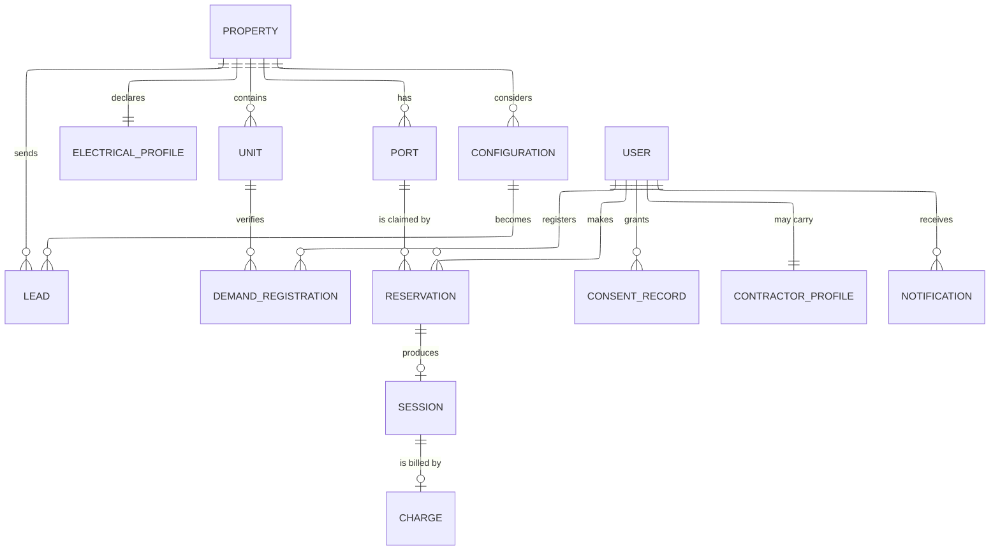
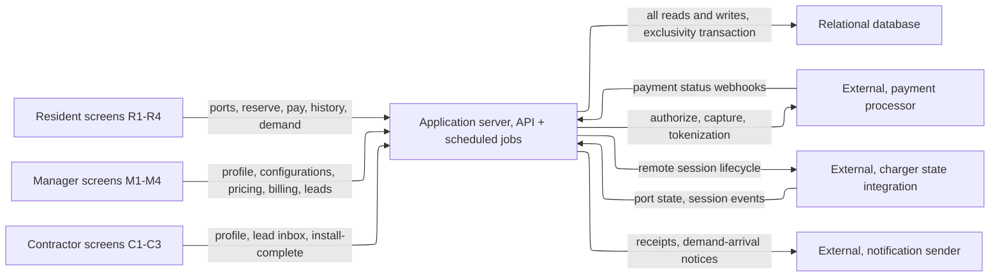
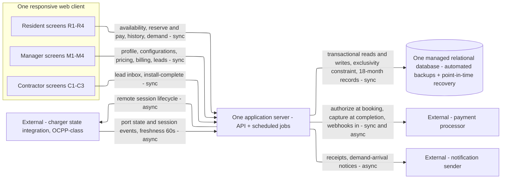

# HIGH_LEVEL_DESIGN.md — ChargeCommons

**Status:** draft · 2026-10-09 · produced autonomously as the fourth document of the document-factory run (spec art_HCphHMP5), in parallel with KEY_METRICS.md. The user is away; every point where this process would interview the user was decided from the upstream documents and logged in **Assumptions & Decisions** (§9). Every statistic carries a source tag; nothing is invented.

**Purpose.** Name the parts the ChargeCommons system has and why, sized to its real load. This document decides *kinds* of component — "a relational database", "an application server" — never products; STACK.md picks a technology for each box next. It consumes REQUIREMENTS.md (art_XpcuDDrN) and USERS.md (art_axMnz3Xs); STACK.md consumes its component list; ARCHITECTURE.md consumes its operations.

**Scope — what this document decides:** the five sizing answers (§1), the interaction table (§2), the arithmetic (§3), core entities and how they are read together (§4), API operations and who calls them (§5), the smallest component set that meets those numbers with the number that forces each (§6), and low-fidelity wireframes of the screens that call the operations (§7). **What it deliberately defers:** products, vendors, tiers, versions → STACK.md; modules inside the app, schemas, exact contracts, payloads → ARCHITECTURE.md; which numbers become tracked metrics → KEY_METRICS.md; column types, indexes, migrations, auth mechanics → stories. Documents only in this run — no code (GC-6).

**How to read a number here.** **[src …]** — taken from USERS.md (U§n), REQUIREMENTS.md (row id), the run spec, or a same-session retrieval with URL and as-of date (§10). **[derived]** — arithmetic shown inline from [src] inputs. **[assumed]** — no upstream source; the most conservative reading the documents support, logged in §9. No statistic appears here that is not in USERS.md, REQUIREMENTS.md, or this document's own tagged arithmetic.

## 0. Summary — the sentence that matters

Peak load is ≈ **55–65 requests/second** [derived §3], driven almost entirely by residents polling availability during the evening-arrival peak. **One application server and one relational database handle that with more than an order of magnitude of headroom** [§6]. Everything else in this design exists because of *correctness* requirements — reservation exclusivity (VR-1), charge↔session reconciliation (VR-2), consent-gated identity (AZ-2), no raw card data (DP-1) — not because of volume. The components: one responsive web client, one application server (API + scheduled jobs), one managed relational database, plus three external services the requirements name (payment processor, charger state integration, notification sender). Seven caches, queues, load balancers and replicas were considered and left out, each with the trigger that would add it (§6.3).

| Sizing answer at a glance | Value |
|---|---|
| Users / growth / peak | 1,000 concurrent residents, evening peak; 10× by configuration (SC-1); base 17.5M renter households in 5+ unit buildings (U§3) |
| Read/write mix | Read-heavy ≈4:1–10:1 [derived §3.2]; absolute volume small |
| Never lose | Reservations, sessions, charges, consents, verified demand registrations, electrical profiles, leads (§1.3) |
| Latency | Reserve-and-confirm ≤10 s p95 incl. payment (PF-1, KD-6); availability age ≤60 s (PF-2); unknown within 60 s of feed loss (DE-1) |
| Cost | No budget given (GC-7); infra order of $25–100/mo; usage-based processor fees dominate (§6.4) |

## 1. The five sizing answers

| # | Question | Answer | Source |
|---|---|---|---|
| 1 | **Users now, growth, peak?** | v1 floor: **1,000 residents using the app concurrently in the evening-arrival peak (≈18:00–23:00)**, scaling to **10,000 (10×) by configuration, not code**. Base population ≈ **17.5M renter households in 5+ unit buildings** (45M × 39%); 1,000 concurrent ≈ 0.006% of that base — a floor, not a forecast. Manager traffic is 1 account per property at deliberation cadence (hours–weeks); contractor traffic is minutes per lead, a handful per day. Property footprint at the horizon **[assumed]**: 100 properties, ~1,000 ports (A4). | SC-1; U§3; U§6 UC-3/UC-4 |
| 2 | **Read-heavy or write-heavy?** | **Read-heavy: ≈50 read rps vs ≈5–13 write rps at peak** (availability polling dominates reads; reservations, session events and charges are the writes, plus charger state ingest). ≈4:1–10:1 depending on charger reporting rate. | [derived §3] |
| 3 | **Which data can never be lost?** | **Never lose:** reservations (VR-1 exclusivity + audit trail), sessions (VR-2 reconciliation; CH-1 later-iteration input), charges (VR-2 — this is the money), consent records (AZ-2), unit-verified demand registrations with their verification evidence (VR-3), electrical profiles and approved configurations (KD-2 inputs), leads. **Rebuildable:** current port state (derivable from feed + reservations), demand aggregates (countable from registrations). **Disposable:** availability snapshots, raw charger-feed messages past the reconciliation window. Retention: reservations, sessions and charges queryable per port for **≥18 months** (OB-1). | VR-1/2/3; AZ-2; OB-1; CH-1; KD-2 |
| 4 | **Latency per interaction?** | **Reserve-and-confirm — port selection, price display, payment handoff, confirmation — ≤10 s at p95, one shared budget** (PF-1, KD-6). **Availability age ≤60 s with a visible timestamp** (PF-2, FR-1.1). **Feed loss → affected ports show unknown (never "free") within 60 s** (DE-1). Manager planning screens: seconds is fine — UC-3 is a deliberation of hours to weeks (U§6). Contractor lead triage: minutes available (U§6). Unit verification and charge capture: async, minutes acceptable **[assumed A8, A3]**. | PF-1; PF-2; DE-1; U§6 |
| 5 | **What may it cost?** | **No budget was given** (GC-7, U§9) — none may be assumed (GC-7). The design constraint is therefore *smallest set that meets the numbers*, and the cost check (§6.4) shows the order of magnitude: tens of USD/month of infrastructure, with usage-based payment-processor fees as the dominant per-unit cost. Exact prices are STACK.md's job. | GC-7 |

No human is present to confirm these; each gap against the documents is tagged [assumed] and logged in §9 per the skill's no-human rule.

## 2. Interaction table

One row per thing a user or the system does, from the FRs and use cases. Frequency at the SC-1 floor (1,000 concurrent residents; 100 properties / 1,000 ports [assumed A4]).

| # | Interaction | Who / trigger | R/W | Frequency at peak | Latency expected | Data touched | Can be lost? |
|---|---|---|---|---|---|---|---|
| I-1 | Open port list with availability + age timestamp | Resident arrives home (UC-1) | R | continuous on-screen; 1 req/30 s → ≈33 rps [derived §3.1, A5] | ≤1 s render; data ≤60 s old (PF-2) | Port, Reservation, Property | read of rebuildable state |
| I-2 | Pick window, see free ports + price | Resident, same moment | R | a few per visit | ≤1 s (inside PF-1 budget) | Port (price), Reservation | read |
| I-3 | Reserve specific port — conflict checked at booking time | Resident confirms (UC-1) | W | ≈1/resident/evening → ≈0.6 rps burst [derived §3.1] | sync, inside the 10 s PF-1 shared budget (KD-6) | Reservation, Port, Charge (auth) | **never lose (VR-1)** |
| I-4 | Payment handoff (authorization) | Resident, same interaction | W | 1 per reservation | sync, inside PF-1 (KD-6) | Charge (token ref; DP-1) | **never lose (VR-2)** |
| I-5 | Session start (plug-in reported) | Charger feed | W | per session | freshness ≤60 s (PF-2) | Session, Port state | **never lose (VR-2, CH-1)** |
| I-6 | Session end (unplug or window end) → port released | Charger feed / system | W | per session | prompt release; record within minutes | Session, Port state | **never lose** |
| I-7 | Charge capture + receipt | System, on session end | W | per session | async, minutes | Charge, Session | **never lose (VR-2)** |
| I-8 | View session history / receipts | Resident, occasional | R | low | ≤1 s | Session, Charge | read of never-lose |
| I-9 | Register demand (unit, frequency, willingness) | Resident, once (UC-2) | W | rare (minutes available, U§6) | seconds | DemandRegistration | **never lose (VR-3)** |
| I-10 | Unit verification processing | System, on I-9 | W | rare | async, minutes–hours [assumed A8] | verification status | **never lose (evidence)** |
| I-11 | Enter electrical profile + parking inventory | Manager, once per property (UC-3) | W | very rare | seconds fine (deliberation) | ElectricalProfile | **never lose (KD-2)** |
| I-12 | Request port-mix configurations | Manager, occasional | R/W | occasional | seconds fine (VR-4 check inside) | Configuration | drafts rebuildable; approved **never lose** |
| I-13 | Set per-port pricing; view billing vs sessions | Manager, occasional | R/W | occasional | seconds fine | Port price; Session, Charge | prices **never lose**; view derived |
| I-14 | Approve configuration, send lead | Manager (UC-4 trigger) | W | rare | seconds fine | Lead, Configuration | **never lose** |
| I-15 | Set contractor profile (area, certifications) | Contractor, once | W | once | seconds fine | ContractorProfile | **never lose** |
| I-16 | Triage lead inbox / lead detail | Contractor, daily-ish (UC-4) | R | low | ≤1 s (minutes available) | Lead (aggregate demand only, FR-4.3) | read of never-lose |
| I-17 | Record install complete → new ports bookable | Contractor | W | rare | seconds; activation async | Port, Lead status | **never lose (FR-4.4)** |
| I-18 | Charger state ingest | System, continuous | W | ≈3–10 rps [derived §3.1] | freshness ≤60 s (PF-2/DE-1) | Port state | disposable after reconcile |
| I-19 | Staleness sweep (mark unknown) | System, every ≤30 s | W | continuous | ≤60 s to unknown (DE-1) | Port state | rebuildable |
| I-20 | Daily reconciliation, charges vs sessions | System, daily | R/W | daily batch | minutes-window fine [prop VR-2 cadence] | Charge, Session | report derived; records never lose |
| I-21 | Demand-arrival notification | System, on new ports (FR-4.4) | W | rare | minutes fine | Notification | rebuildable |
| I-22 | Payment webhooks (auth/capture status) | Processor → system | W | 1–2 per reservation | async, idempotent | Charge status | **never lose (VR-2)** |

## 3. Arithmetic

### 3.1 Peak requests per second

Inputs [src]: 1,000 concurrent residents in the 18:00–23:00 peak (SC-1); availability age ≤60 s (PF-2).

- **Availability reads.** PF-2 forces a refresh at least once per minute on the port screen. Conservative reading [assumed A5]: every 30 s. 1,000 concurrent × 1 request / 30 s ≈ **33 rps**.
- **Other resident reads** (window/price lookups, history, demand status): budgeted at ≈½ the polling volume → ≈ **17 rps** [assumed A9].
- **Reservations.** Each concurrent resident makes ≈1 reservation per evening, arrivals spread over the 5-hour window: 1,000 ÷ 18,000 s ≈ 0.06 rps average; ×10 evening-clustering burst factor [assumed] → **≈0.6 rps**. Payment handoffs: 1 per reservation — same order.
- **Session events, captures, webhooks** (I-5…I-7, I-22): a few writes per session spread over hours → ≈ **1–2 rps** [derived].
- **Charger state ingest** (I-18): ~1,000 ports reporting metered updates on the order of one per 2–5 min while occupied → ≈ **3–10 rps** [derived from A4].
- **Manager + contractor traffic:** 1 manager per property at hours-to-weeks cadence; contractors triaging minutes per lead (U§6) → orders of magnitude below resident traffic; negligible.

**Total peak ≈ 55–65 rps; design to ≈100 rps with burst headroom.** At the SC-1 10× horizon (10,000 concurrent): reads ≈500 rps, ingest ≈30–100 rps [scaled ×10].

### 3.2 Read:write ratio

≈50 rps reads vs ≈5–13 rps writes (I-3…I-7 resident writes ≈2–3 rps + I-18 ingest 3–10 rps) → **read-heavy, ≈4:1–10:1** [derived]. Read-heavy systems earn caches and replicas — but the absolute volume in §3.1 sits two orders of magnitude below where those pay off [order-of-magnitude engineering estimate, not a retrieved figure]. §6.3 records the trigger instead of the box.

### 3.3 Storage, now and at the horizon

Per-record budget ~1 KB [assumed, generous]. At the SC-1 floor, per night: 1,000 reservations + 1,000 sessions + 1,000 charges ≈ 3,000 rows ≈ 3 MB.

- Per year ≈ **1.1 GB**; **18-month retention (OB-1) ≈ 1.7 GB** [derived].
- Master data at the assumed footprint (A4): 100 properties, 1,000 ports, units, users (~10⁴–10⁵ rows), configurations, leads, registrations, consents → tens of MB.
- **At the 10× SC-1 horizon:** ≈ **17 GB** retained + master data — still inside the smallest managed-database tiers [src §10 pricing pages].

No v1 FR creates files or media; nothing goes to object storage (§6.3).

### 3.4 Calls to paid external services

- **Payment processor:** 1 authorization per reservation + 1 capture per completed session [derived from FR-1.3/1.4/1.5; A3] → ≈2,000 calls/evening ≈ 0.11 rps average — trivial in count. It is the **per-transaction fee, not call volume, that dominates cost** (§6.4).
- **Charger state integration:** continuous ingest, ≈3–10 rps [§3.1].
- **Notification sender:** receipts (per session) + demand-arrival notices (rare, per property) — low thousands/month [derived].

## 4. Core entities and how they're read together

| Entity | What it is | Attributes that matter for access or size | Durability | Growth |
|---|---|---|---|---|
| **User** | One account type; role (resident / manager / contractor) decides reach | role, property link, contact details | never lose | with adoption |
| **Property** | A 5+ unit building with parking; the access boundary for residents and managers (AZ-1) | building type, unit count, state → right-to-charge flag (FR-4.2) | never lose | slow |
| **Unit** | One dwelling; anchors demand-registration verification | label, property | never lose | slow |
| **Port** | One shareable L1/L2 connector — the unit of availability | property, kind, state (free/reserved/occupied/**unknown**), state timestamp, price | current state **rebuildable**; row never lose | with installs (FR-4.4) |
| **Reservation** | Exclusive claim by one resident on one port for one window | user, port, window, status | **never lose (VR-1)** | ≈1,000/night |
| **Session** | One instance of a car charging on a port | port, user, start/end, energy where reported (CH-1) | **never lose (VR-2, CH-1)** | ≈1,000/night |
| **Charge** | Payment record, 1:1 with a session; processor token reference only — raw card data never stored (DP-1) | session, amount, processor refs, status | **never lose (VR-2)** | ≈1,000/night |
| **ConsentRecord** | Per-resident consent for any identity exposure, against everyone (AZ-2, KD-5) | user, scope, timestamp | **never lose** | rare |
| **DemandRegistration** | Resident's would-charge-and-pay statement with unit; counts in the manager aggregate **only when unit-verified** (VR-3, KD-3) | unit, frequency, willingness, verification status | **never lose** | rare |
| **ElectricalProfile** | Manager-entered panel size + spare capacity — the only capacity v1 plans from (KD-2) | panel size, spare capacity, parking inventory | **never lose** | one per property |
| **Configuration** | Candidate L1/L2 mix checked against the profile, with cost + revenue picture | property, port mix, capacity fit, cost estimate | approved **never lose**; drafts rebuildable | occasional |
| **Lead** | Contractor-facing opportunity; site context, never resident identity (FR-4.2/4.3) | property, configuration, capacity inputs, right-to-charge flag, aggregate demand | **never lose** | occasional |
| **ContractorProfile** | Service area + certifications (FR-4.1) | area, certifications | never lose | one per contractor |
| **Notification** | Platform message to residents (e.g., charging arrived at your property, FR-2.3) | user(s), event, channel | rebuildable | low |



### Access patterns — one verdict each, at this scale

| # | Pattern (from §2) | What it combines | Verdict |
|---|---|---|---|
| AP-1 | Availability for a window (I-1, I-2; PF-2) | ports of one property × reservations overlapping the window; per property ~10–50 ports and ~10–50 live reservations [derived from A4] — a join of hundreds of rows | **fine as a query** with an index on (port, window) |
| AP-2 | Exclusivity at booking (I-3; VR-1, FR-1.6) | second attempt on the same port+window must lose at the store, not in application code | **needs a relational transaction with an overlap/exclusion constraint** — the kind-of-store decision; nothing else holds it this cheaply |
| AP-3 | Billing view per port (I-13; FR-3.3, VR-2) | sessions + charges grouped by port over a period — hundreds of rows/property/month | **fine as a query** with an index |
| AP-4 | Demand aggregate (I-13/I-16; FR-2.2, VR-3) | count of unit-verified registrations per property — thousands of rows | **fine as a live count** |
| AP-5 | Lead matching (I-16; FR-4.1) | contractors filtered by service area + certifications against property state/metro | **fine as an attribute-filter query**; a geographic index only if matching later needs radius search |
| AP-6 | Resident history (I-8; FR-1.5) | sessions + charges by user, time-bounded | **fine as a query** with an index |
| AP-7 | Staleness sweep (I-19; DE-1) | ports with state timestamp older than 60 s, scoped to affected property | **fine as an indexed periodic scan** of ~1,000–10,000 rows |

No pattern at this scale needs precomputing or a different kind of store. The only kind-of-store decision the patterns force is AP-2's: **relational and transactional**.

## 5. API operations

Call map — one node per caller and server, one arrow per pair, labelled with the operation names:



The application server serves every operation below (there is no second server to group by); grouping is by surface. Route sketches only — exact contracts are ARCHITECTURE.md's job.

### 5.1 Application server — resident surface (called by R1–R4 screens)

| Operation | Called by | Input | Output | R/W | Latency class | Sync/async | Serves |
|---|---|---|---|---|---|---|---|
| `POST /session/login`, `POST /users` | sign-in screen | credentials | session | write | seconds | sync | AZ-1 precondition (§8, upstream fix) |
| `GET /properties/{id}/ports?window=…` | R1 | property, window | ports + state + **age timestamp** + price | read | ≤1 s, inside PF-1 budget | sync | FR-1.1, FR-1.2, PF-2 |
| `POST /reservations` | R2 | port, window, payment token ref | exclusive confirmation — or booking-time conflict | write | **≤10 s incl. payment authorization (PF-1, KD-6)** | sync; conflict refused before any charge | FR-1.3, FR-1.6, VR-1 |
| `POST /reservations/{id}/cancel` | R2, R3 | reservation | released window | write | ≤1 s | sync | FR-1.5 |
| `GET /users/{id}/sessions` | R3 | user, range | history with amounts charged | read | ≤1 s | sync | FR-1.5 |
| `POST /demand-registrations` | R4 | unit, frequency, willingness | registration, pending verification | write | seconds (minutes available) | sync save; verification async | FR-2.1, VR-3 |
| `GET /demand-registrations/{id}` | R4 | id | verification status | read | ≤1 s | sync | FR-2.1 |

### 5.2 Application server — manager surface (called by M1–M4 screens)

| Operation | Called by | Input | Output | R/W | Latency class | Sync/async | Serves |
|---|---|---|---|---|---|---|---|
| `PUT /properties/{id}/electrical-profile` | M1 | panel size, spare capacity, parking inventory | profile saved | write | seconds fine | sync | FR-3.1, KD-2 |
| `POST /properties/{id}/configurations` | M2 | requested port mix | candidate configurations with cost + revenue picture; **over-capacity refused, never offered (VR-4)** | write (+compute) | seconds fine | sync | FR-3.2, VR-4 |
| `PUT /ports/{id}/pricing` | M3 | per-port price | price saved | write | seconds fine | sync | FR-3.3 |
| `GET /properties/{id}/billing?period=…` | M3 | property, period | revenue vs recorded sessions, per port | read | seconds fine | sync | FR-3.3, VR-2 |
| `POST /leads` | M4 | approved configuration | lead created — site context only, no resident identity | write | seconds fine | sync | FR-3.4, FR-4.2, FR-4.3 |

### 5.3 Application server — contractor surface (called by C1–C3 screens)

| Operation | Called by | Input | Output | R/W | Latency class | Sync/async | Serves |
|---|---|---|---|---|---|---|---|
| `PUT /contractor-profile` | C1 | service area, certifications | profile saved | write | seconds fine | sync | FR-4.1 |
| `GET /leads` (matched) | C1 | contractor | matched leads; aggregate demand evidence only | read | ≤1 s | sync | FR-4.2, FR-4.3 |
| `POST /leads/{id}/status` | C2 | status | tracked | write | seconds fine | sync | FR-4.2 |
| `POST /leads/{id}/install-complete` | C3 | installed ports + kinds | ports created → **bookable in the resident flow** | write | seconds; activation async | sync save | FR-4.4 |

### 5.4 Application server — inside (no caller)

| Work | Trigger | Does | Serves |
|---|---|---|---|
| Staleness sweep | every ≤30 s [derived from DE-1's 60 s] | ports whose state timestamp exceeds 60 s become **unknown, never "free"**; scoped to affected ports only; bookings against unknown refused with an explicit message | DE-1, FR-1.1, FR-1.6 |
| Release + session close | session end / window end / unplug event | release the port for other residents; close the session record | FR-1.5 |
| Capture on completion | session end | capture payment, write the charge record 1:1 to the session, emit receipt | FR-1.4, FR-1.5, VR-2, KD-4 |
| Daily reconciliation | daily [prop — VR-2's cadence] | charges vs recorded sessions; 0 charges without a session, 0 double charges; discrepancy report | VR-2 |
| Unit verification | registration created | verify the unit at the property; only then does the registration count in the manager aggregate | FR-2.1, VR-3 |
| Demand-arrival notification | ports activated at a property (FR-4.4) | notify previously registered residents — closing the UC-2 loop | FR-2.3 |
| Payment webhook intake | processor webhook | idempotent authorization/capture status updates | FR-1.4, VR-2 |
| State-feed ingest | continuous | write port state + timestamp; raw feed disposable after the reconciliation window | PF-2, DE-1 |

### 5.5 External services (the system calls them)

| Service | Who calls it | What crosses | Latency class | Serves |
|---|---|---|---|---|
| **Payment processor** | app server (reserve flow); webhook intake back | tokenized payment method; authorize at booking; capture at completion; status webhooks. Raw card data never enters the platform (DP-1) | call ≤ a few s, **inside the PF-1 shared budget** (KD-6) | FR-1.4, VR-2, DP-1, GC-3 |
| **Charger state integration** (OCPP-class — the run spec names this payload surface) | app server (ingest + remote lifecycle); chargers push/report | port state, session start/stop, energy where reported (CH-1), new-port activation (FR-4.4) | freshness ≤60 s (PF-2, DE-1) | FR-1.1, FR-1.5, DE-1, CH-1 |
| **Notification sender** | app server (scheduled jobs) | receipts, demand-arrival notices | minutes acceptable | FR-2.3, FR-1.4 |

No CI or other out-of-band callers exist in this run (documents only, GC-6).

## 6. Components, smallest first

Start from the minimum — **client → one application server → one relational database** — and add a box only when a number demands it. None does. The set:



### 6.1 What we have

| Component | Why it exists — the number/requirement that forces it | What it holds/does | Provided by the platform? |
|---|---|---|---|
| **One responsive web client** (three role areas) | Every FR is a user at a screen (FR-1.*, FR-2.*, FR-3.*, FR-4.*); UC-1 happens standing in a garage → mobile-first | Resident R1–R4, manager M1–M4, contractor C1–C3 screens (§7) | static hosting/CDN typically bundled with app hosting [order-of-magnitude; STACK decides] |
| **One application server** (API + scheduled jobs) | Peak ≈100 rps [§3.1] — a single small instance serves that with more than an order of magnitude of headroom [order-of-magnitude engineering estimate]; §5.4's jobs need sub-minute scheduling (DE-1) | All §5 operations; §5.4 jobs run in-process on a scheduler | TLS and instance management provided by the host |
| **One managed relational database** (automated backups + point-in-time recovery) | AP-2 forces transactional exclusivity (VR-1); the never-lose entities [§1.3] force **point-in-time recovery** — a daily backup can lose a day of writes; retention ≈1.7 GB at 18 months [§3.3]; ≈50 read rps [§3.1] | All §4 entities; the overlap/exclusion constraint behind bookings | backups/PITR are managed-DB features — *provided*, not separate boxes |
| **External: payment processor** | GC-3 (commercial), FR-1.4, DP-1 (tokenized; raw card numbers never stored), KD-4 (pay-per-session) | authorize/capture/webhooks | — |
| **External: charger state integration** (OCPP-class) | PF-2 ≤60 s freshness; DE-1 unknown-within-60 s; FR-1.5 release; FR-4.4 activation; CH-1 energy capture | state feed + session lifecycle per port | — |
| **External: notification sender** | FR-2.3 demand loop; FR-1.4 receipts | email/push dispatch | — |

### 6.2 What the numbers say plainly

Peak is ~100 requests/second over tables holding thousands of rows. One small application server and one small managed relational database meet PF-1, PF-2, DE-1 and SC-1's floor with an order of magnitude of headroom [§3, order-of-magnitude engineering estimate]. The design's seven *absent* boxes below are what a big-company diagram would have added for no number this document can produce.

### 6.3 What we leave out, with the trigger that adds it

| Left out | Cheaper thing tried first | Trigger to add |
|---|---|---|
| In-memory cache | the database serves ≈50 read rps of small indexed queries [§3.1, AP-1] | availability read p95 > 1 s (10% of the PF-1 budget) sustained at peak, or DB CPU >70% at peak [trigger derived from PF-1] |
| Queue + separate workers | §5.4 jobs run in-process; their async work is minutes-tolerant [§1.4] | any §5.4 job exceeds its window (reconciliation, notification fan-out, capture backlog), or webhook bursts exceed idempotent sync intake |
| Object storage | no v1 FR has files or media [§3.3] | leads or configurations start carrying photos/documents — USERS later-#4 quoting tools is the plausible first |
| Load balancer + second app instance | one instance at ≈100 rps with >10× headroom | the SC-1 10× path: 10,000 concurrent → ≈500 read rps [§3.1 scaled] → add an instance behind a managed LB; SC-1 requires this to be configuration, not code |
| Read replica | same trigger family as the cache | DB read load at the 10× horizon |
| Persistent connections (push/websockets) | 30 s polling meets PF-2's 60 s [§3.1, A5] | PF-2 tightens below ~5 s — no requirement does |
| Search / geographic index | lead matching is attribute filters (AP-5) | matching becomes free-text or radius-based |

**Next piece** — what actually breaks first as the numbers climb: the single application instance. SC-1's own 10× clause is the trigger, and the fix (second instance + managed load balancer) is a deployment act by design. The database is not the first wall: at 10×, storage ≈17 GB [§3.3] and reads ≈500 rps, still inside entry managed tiers [§10]. Beyond that, nothing in v1 forces a further piece; if growth outruns 10×, re-run this document, not the code.

### 6.4 Cost check

Budget: **none given (GC-7)** — so the check shows order of magnitude and where unit economics bite; exact prices are STACK.md's job.

- **Our infrastructure:** small single-instance app hosting, entry tiers **$4–25/month** [src §10 pricing pages, retrieved 2026-10-09]; small managed relational database with backups, entry single-node tiers **$15–38/month** [src §10]. **Order of magnitude: $25–100/month at the v1 floor; $100–300/month at the 10× SC-1 horizon** (second instance + larger DB) [derived from those entry tiers]. Fits any plausible budget; nothing needs cutting for cost.
- **Payment processing — the real number, usage-based.** Typical US online card fee ≈ **2.9% + $0.30** (range ≈2.5–3.5% + $0.25–0.30) [src §10, retrieved 2026-10-09]. Small tickets pay disproportionately: at a $20 charge the effective rate is ≈4.4%; at $100, ≈3.2% [src §10]. Illustrative at v1 scale — **derived, not a willingness-to-pay source**: 1,000 sessions/night × 30 nights = 30,000 sessions/month; at the persona example price ($1.25/hr × 8 h ≈ $10/session — USERS §5 illustrative walk, not sourced pricing) → GMV ≈ $300k/month; fees ≈ $0.59/session → **≈$17.7k/month**, one to two orders of magnitude above the infra bill. That is a pricing and processor-choice input for STACK.md and for the human review's open willingness-to-pay question (USERS §11) — it constrains unit economics, not this design.
- **Notifications:** low thousands/month, negligible [derived §3.4].

## 7. UI wireframe (low-fidelity)

The skill's interactive-artifact step is superseded by the run spec's locked decision that this phase produces the seven documents only — no code, no deployment (GC-6). The wireframes are therefore in-document: one per screen, low-fidelity, each listing the operations it calls (§5) and its states. Screens are ordered by the user's job, most urgent first. **All numbers on screens are example data** (the $1.25/hr price is USERS §5's persona example); `[placeholders]` mark unknowns. No control is disabled without saying why on screen.

### Resident — nightly moment (UC-1)

**R1 · My building's ports** — calls `GET /properties/{id}/ports?window=…`
```
┌──────────────────────────────────────────────────┐
│ ChargeCommons        Oakview Commons (my bldg)   │
│ Ports · updated 21:02:47 — 12 s ago        [⟳]   │
├──────────────────────────────────────────────────┤
│ Level 2 · aisle A                                 │
│  ● Port 1  occupied — ends ~06:00                │
│  ● Port 2  reserved 22:00–06:00 (neighbor)       │
│  ○ Port 3  free — $1.25/hr overnight (example)   │
│  ? Port 4  state unknown — charger offline       │
│            not bookable until its state is known │
├──────────────────────────────────────────────────┤
│ Window: 10 PM – 6 AM      [ Find free ports ]    │
├──────────────────────────────────────────────────┤
│ Ports · Sessions · Demand · Account              │
└──────────────────────────────────────────────────┘
```
States: signed-out → sign-in screen; empty → "no ports at your building yet" + demand-registration CTA (UC-2 bridge); loading; error/retry; per-port state incl. **unknown** with the on-screen reason (DE-1); timestamp always visible (PF-2, FR-1.1).

**R2 · Reserve and pay** — calls `POST /reservations` (conflict check + payment authorization inside one ≤10 s budget, KD-6)
```
┌──────────────────────────────────────────────────┐
│ Reserve Port 3 · 10 PM – 6 AM                    │
│ $1.25/hr × 8 h = $10.00    ← price before confirm│
│ Card •••• 4821 (tokenized — never stored here)   │
│ [ Confirm reservation — $10.00 ]                 │
├── refused states (shown, not silent) ────────────┤
│ ⚠ Port 3 was just reserved for your window.      │
│   Free for it now: Port 5, Port 6.               │
│   (conflict at booking time — never at the port) │
│ ⚠ Port 4 is offline — cannot book until its      │
│   state is known.                                │
└──────────────────────────────────────────────────┘
```
States: normal; conflict refused **at booking time** (VR-1, FR-1.6) with free alternatives; unknown-port refused (DE-1); payment failed → retry/cancel, nothing charged without a bookable session; success → confirmation screen — exclusively yours, port 3, window (FR-1.3).

**R3 · Sessions and receipts** — calls `GET /users/{id}/sessions`
```
┌──────────────────────────────────────────────────┐
│ Your sessions                                    │
│ Mon 10PM–06AM  Port 3  8.0 h   $10.00   charged  │
│ Sun 10PM–05AM  Port 3  7.0 h    $8.75   charged  │
│ [receipt]  per session — amounts reconcile to    │
│ recorded sessions                                │
└──────────────────────────────────────────────────┘
```
States: empty ("no sessions yet"); receipt detail per row (FR-1.4, FR-1.5).

**R4 · Demand registration** — calls `POST /demand-registrations`, `GET /demand-registrations/{id}`
```
┌──────────────────────────────────────────────────┐
│ No chargers at Oakview Commons yet               │
│ Register: we'd charge here and pay for it        │
│ Unit #: [placeholder]   How often: [placeholder] │
│ What you'd expect to pay: [placeholder]          │
│ [ Register my household ]                        │
│ ── after submit ──                               │
│ ● Registered — verifying your unit…              │
│   Your building's verified demand: [placeholder] │
│   The manager sees the count only — never your   │
│   name or contact details (unless you consent).  │
│   We'll notify you when charging arrives.        │
└──────────────────────────────────────────────────┘
```
States: form; pending verification; **verified — counts in the aggregate** (VR-3); refused/invalid unit; promise discipline on screen: never promises installation (UC-2 must-never); consent controls visible (KD-5, AZ-2).

### Manager — deliberation screens (UC-3)

**M1 · Property setup** — calls `PUT /properties/{id}/electrical-profile`
```
┌──────────────────────────────────────────────────┐
│ Oakview Commons — electrical & parking           │
│ Panel size: [placeholder]   Spare capacity: […]  │
│ Units: 160 (example)   Parking spaces: [placeholder]
│ [ Save — planner uses these entered values ]     │
│ v1 plans from what you enter; no live load data. │
└──────────────────────────────────────────────────┘
```
States: empty (first run); saved; invalid input; help text naming KD-2's basis (entered, not live).

**M2 · Planner** — calls `POST /properties/{id}/configurations`
```
┌──────────────────────────────────────────────────┐
│ Configurations that fit your panel (entered)     │
│ A: 9 L2 + 45 L1  · cost ≈ $76,142 (DOE example)  │
│    est. revenue/port: [placeholder]              │
│ B: 20 L2           · cost [placeholder]          │
│ C: requested mix exceeds capacity — not offered    │
│    (planner never presents an over-capacity      │
│    configuration as viable)                      │
│ [ Approve A ]  [ Adjust mix ]                    │
└──────────────────────────────────────────────────┘
```
States: configurations listed (VR-4: over-capacity never offered); cost estimates labeled as estimates; approve → leads flow. (The $76,142 figure is the DOE 60-unit example cited in USERS §2 — illustrative anchor, not a quote for this building.)

**M3 · Pricing and billing** — calls `PUT /ports/{id}/pricing`, `GET /properties/{id}/billing?period=…`
```
┌──────────────────────────────────────────────────┐
│ Pricing per port       [ $1.25/hr overnight ]    │
│ This month (example)                             │
│ Port 3 · 24 sessions · $240.00   ↔ 24 recorded   │
│ Port 4 · 11 sessions · $110.00   ↔ 11 recorded   │
│ billing reconciles to recorded sessions          │
└──────────────────────────────────────────────────┘
```
States: per-port rows; reconciliation mismatches surfaced as a flagged count of 0 or otherwise (VR-2's observable).

**M4 · Send the plan to contractors** — calls `POST /leads`
```
┌──────────────────────────────────────────────────┐
│ Approved: configuration A (9 L2 + 45 L1)         │
│ Lead preview — what contractors see:             │
│  building type, 160 units, panel + spare capacity│
│  requested port mix, right-to-charge flag: YES   │
│  verified demand aggregate: [placeholder]        │
│  no resident names or contacts — ever            │
│ [ Send to matched contractors ]                  │
└──────────────────────────────────────────────────┘
```
States: preview (FR-4.2 fields; FR-4.3 exclusions visible); sent; nothing sent until a configuration is approved.

### Contractor — triage screens (UC-4)

**C1 · Lead inbox** — calls `GET /leads`
```
┌──────────────────────────────────────────────────┐
│ Leads in your service area (Electrician cert ✓)  │
│ Oakview Commons · 160 units · 9 L2 + 45 L1       │
│   capacity data attached · demand: [placeholder] │
│   right-to-charge state · posted 2 d ago         │
│ [ Open lead ]                                    │
└──────────────────────────────────────────────────┘
```
States: empty ("no leads in your area yet"); matched-only list (FR-4.1); aggregate demand evidence only (FR-4.3).

**C2 · Lead detail** — calls `POST /leads/{id}/status`
```
┌──────────────────────────────────────────────────┐
│ Oakview Commons — site context                   │
│ Building type · units/parking · panel + spare    │
│ capacity · requested mix · right-to-charge: YES  │
│ Aggregate demand only — no resident identities   │
│ [ Mark: bid submitted ] [ Book assessment ]      │
└──────────────────────────────────────────────────┘
```
States: triage status changes; minutes-to-triage, days-to-quote cadence (U§6).

**C3 · Record install** — calls `POST /leads/{id}/install-complete`
```
┌──────────────────────────────────────────────────┐
│ Install complete — Oakview Commons               │
│ Ports installed: 9 L2, 45 L1                     │
│ [ Submit ] → ports come online and become        │
│ bookable in the resident flow; registered        │
│ residents are notified                           │
└──────────────────────────────────────────────────┘
```
States: submit → async activation; confirms FR-4.4's closing of the UC-2 → UC-3 → UC-4 → UC-1 loop.

**State coverage across screens:** signed-out (sign-in), empty (R1, C1, M3), loading, normal, refused/invalid (R2 conflict, R2 unknown-port, R4 invalid unit), error/failed (retry states), feed-lost/unknown (R1 — DE-1's observable), limit/capacity refused (M2 — VR-4's observable).

## 8. Upstream fixes and open questions

**Upstream fixes for REQUIREMENTS.md** (the wireframe and design surfaced these; REQUIREMENTS owns the IDs, so nothing is numbered here):

1. **Authentication has no FR row.** AZ-1's authorization matrix presupposes authenticated users, and every screen begins at sign-in — but no functional requirement states authentication and session management. Proposed upstream row under AZ-1's umbrella.
2. **FR-1.5's release mechanism splits by port type.** For ports with a state feed, "unplug" release works as written; for feed-less ports (e.g., plain L1 outlets), v1 can only auto-close at window end and show reservation-derived availability (A10). If the human review wants unplug-release everywhere, those ports need reporting hardware — a USERS §7 later-iteration candidate.

**Open questions** (a running system, STACK.md, or the human review answers them):

3. **Notification channel** — in-app + email assumed (A7); no FR mandates SMS.
4. **Charge timing** — authorize at booking, capture on completion (A3); STACK.md must confirm the processor supports the split inside PF-1's budget.
5. **KEY_METRICS.md** (running in parallel) consumes §3's numbers; the run's Layer-3 consistency check reconciles the two.
6. **Willingness to pay** — unchanged from USERS §11; §6.4's fee arithmetic makes it material at small ticket sizes.

## 9. Assumptions & Decisions (user-interview substitute)

- **A1 — Autonomy.** The user is away; every interview point was decided from the pinned documents and the evidence base, tagged here and in-line. Silence-equivalent acceptance applies at the human review task (spec art_HCphHMP5).
- **A2 — Wireframes in-document.** The skill prefers a published interactive wireframe; the run spec's locked scope (documents only, no code or deployment — GC-6) supersedes it. §7 satisfies the criterion in-document.
- **A3 — Payment lifecycle: authorize at booking, capture on completion.** Reading of FR-1.3 (pay in the app, inside PF-1), FR-1.4 (receipt for the *completed* session) and FR-1.5 (amount charged appears on the completed session). Keeps VR-2's 1:1 reconciliation meaningful for partial/failed sessions.
- **A4 — v1 footprint for sizing: 100 properties, ~1,000 ports** (≈10/property, spanning smaller buildings to the 160-unit persona building). Not sourced — chosen generously so storage and ingest math scale linearly and stay small [§3.3]. The SC-1 concurrency floor, not property count, anchors the design.
- **A5 — Availability polling every 30 s** — twice as tight as PF-2's 60 s bar, i.e., conservative toward load [§3.1].
- **A6 — No persistent connections.** Polling satisfies PF-2/DE-1; push/websockets added only if PF-2 tightens below ~5 s [§6.3].
- **A7 — Notification channel: in-app first + email via an external sender; no SMS in v1** — no FR requires it.
- **A8 — Unit verification is async** (minutes–hours); the registration is saved immediately but counts in the manager aggregate only after verification (VR-3). UC-2's "a few minutes, once" makes the delay immaterial to the user.
- **A9 — Non-polling resident reads budgeted at ≈17 rps** (≈½ of polling volume) — generous [§3.1].
- **A10 — Feed-less ports** (e.g., plain L1 outlets without reporting chargers): availability derives from reservations; sessions close at window end; the unknown-state path applies on missed confirmations. Surfaced by the wireframe; upstream fix §8.2.
- **A11 — One responsive web client with three role areas**, not three apps. No FR requires native apps; UC-1's garage moment is met by mobile-first web. STACK.md owns the client technology.
- **A12 — Cost figures are order-of-magnitude** from retrieved entry-tier pricing pages [§10, 2026-10-09]; STACK.md prices exactly, including the processor-fee arithmetic of §6.4.
- **A13 — Burst factors.** ×10 evening-clustering burst on reservations [§3.1] — chosen without a source; even ×100 leaves the design unchanged, so the assumption cannot be picked to fit an answer.

## 10. References

**Upstream artifacts (pinned):**
1. Spec — ChargeCommons document-factory run, art_HCphHMP5 (scope, locked decisions, OCPP payload surface, verification layers).
2. USERS.md — ChargeCommons, art_axMnz3Xs (U§3 17.5M households, EV market; U§5 persona example price; U§6 cadences and must-nevers; U§7 minimum product; U§9 constraints; U§11 evidence limits).
3. REQUIREMENTS.md — ChargeCommons, art_XpcuDDrN (all FR/VR/PF/DE/SC/OB/CH/DP/AZ/GC rows cited in-line; KD-1…KD-6).
4. Research findings — multifamily EV charging (evidence base), art_WNcJRIdX (all statistics retrieved 2026-10-09; not re-cited here — no market number enters this document except via USERS/REQUIREMENTS).

**Same-session retrievals (2026-10-09) — this document only:**

5. US online card-not-present processing ≈2.5–3.5% + $0.25–0.30 per transaction; flat-rate commonly 2.9% + 30¢; effective-cost examples: $20 charge → ≈4.4%, $100 charge → ≈3.2%. Sources: https://www.swipesum.com/insights/the-true-cost-of-credit-card-processing-in-2025-a-merchants-guide (2026-06-17); https://stripe.com/resources/more/credit-card-terminal-rates (2025-07-18); corroborating https://www.nerdwallet.com/article/small-business/credit-card-processing-fees.
6. Entry-tier hosting price points (entry prices, not production estimates; single-node DB tiers are not high-availability): small managed single-node Postgres-class database $15/mo — https://docs.digitalocean.com/products/databases/postgresql/details/pricing/; $25/mo — https://supabase.com/solutions/hosted-postgres; $38/mo — https://fly.io/pricing/. Small app hosting/VM $4–7/mo — https://www.digitalocean.com/products/droplets; ~$7/mo PaaS and $25/mo conventional dyno — https://www.qovery.com/blog/git-push-deploy-platforms-cheaper-than-heroku (2026-09-28).
