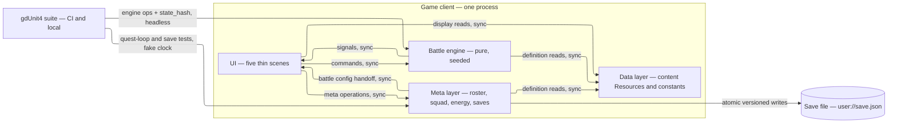
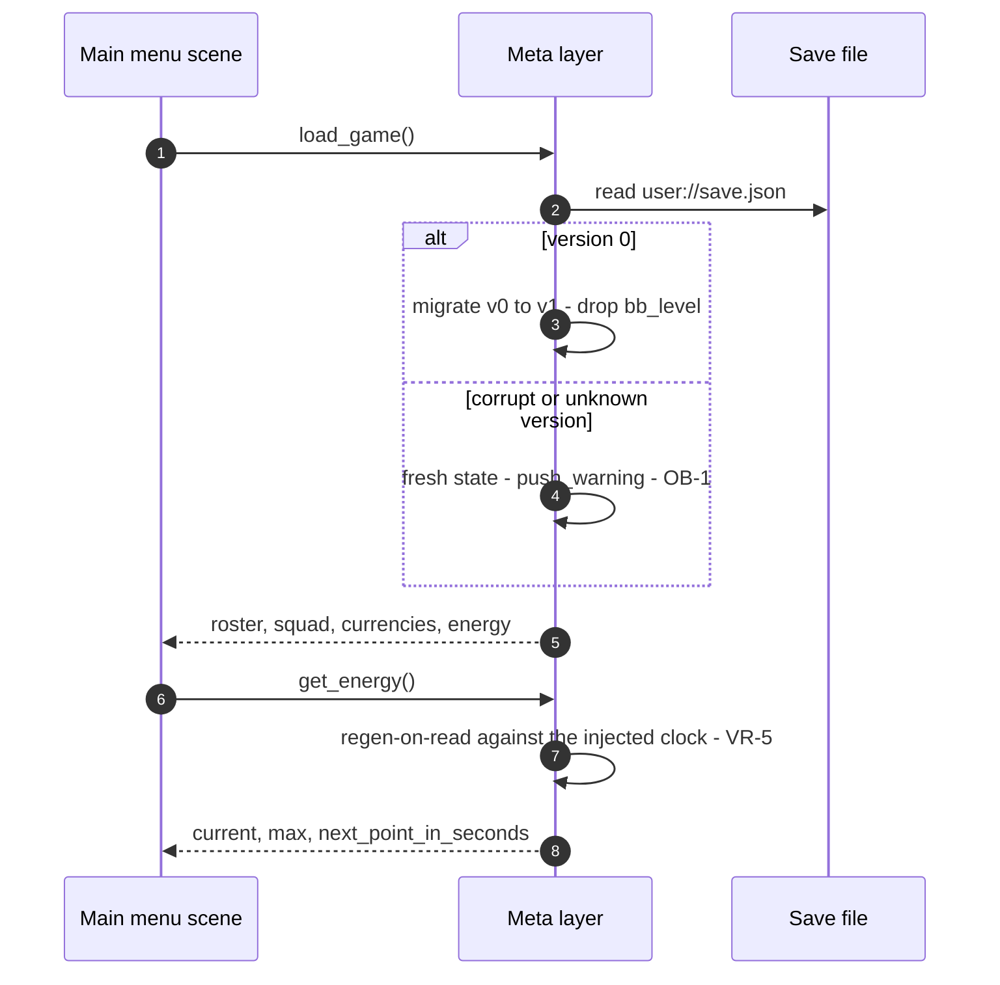
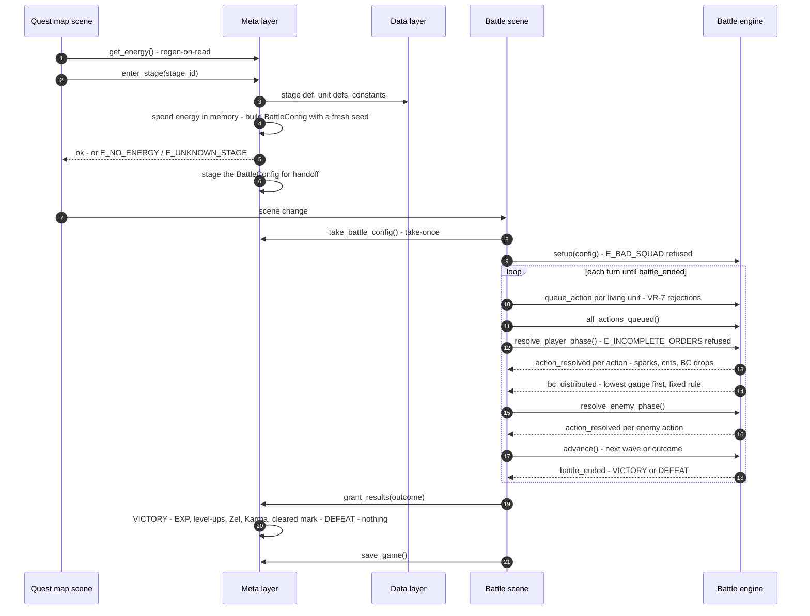
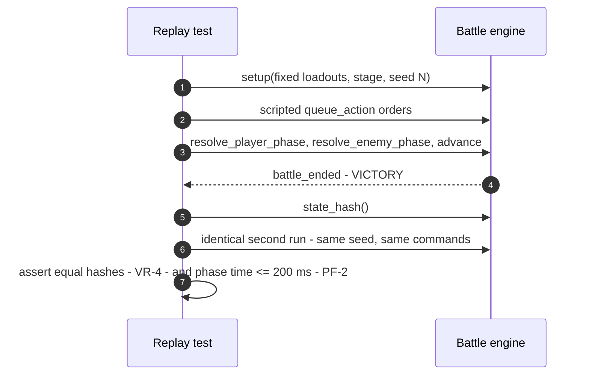

# ARCHITECTURE.md — Brave Frontier vertical slice in Godot 4

**Status:** stage 6 of the documentation pipeline. Written from [`USERS.md`](USERS.md), [`USERS_handoff.md`](USERS_handoff.md), [`REQUIREMENTS.md`](REQUIREMENTS.md), [`KEY_METRICS.md`](KEY_METRICS.md), [`HIGH_LEVEL_DESIGN.md`](HIGH_LEVEL_DESIGN.md), [`STACK.md`](STACK.md), and the committed spec (*Brave Frontier vertical slice in Godot 4*, Blueprint art_zmUVyeNW — cited as "spec"). **Inheritance is binding:** HLD §8 fixes the module list (the four layers of one client) and rules out any backend; STACK's handoff fixes the single-place version constants, `SaveManager`'s ownership of schema version / migration chain / corrupt-file fallback, and the repo-committed asset rule. Reader: story-writer (stage 7), then story-planner per story.

**This document decides:** every contract that crosses a boundary — the content Resource schemas, the versioned save JSON schema and its migration chain, the in-process method contracts (signatures, inputs, outputs, exact rejection values) formalized from HLD §4, the engine→UI signal contracts, each module's must-hold invariants, the end-to-end data flows, and where the system plugs into a greenfield repo. **It does not decide:** anything inside a module that no other module sees (helpers, internal resolution order, per-story file layout), which components exist (HLD §5), which technologies fill them (STACK.md), or build order and acceptance criteria (story-writer).

**System shape:** one desktop game client — a single process, no server, no database, no external service of any kind (GC-8, KD-6). There is no HTTP, no network code, and no hosting anywhere in this design.

**Standing on** (per the skill's load-bearing-assumption rule): USERS.md open question 1's default (this is the vertical slice, and this repo is its home), KD-6's no-scalability ruling, and Michael as the sole feel-judge. If any of those falls, this document is rewritten, not patched.

**Greenfield.** The repo holds only `README.md` and `docs/` — no code, no engine project, no prior schema to inherit (verified this session: repo root listing and `git log` through `a6c5521`). Every entity below is **new**; nothing is marked *exists* or *extend*. Where the system plugs in is §8.

## 1. Modules — the HLD's four layers, by the data each owns

The HLD boxes are fixed; each layer is one module. Ownership is a rule about code, not storage — there is one data source set and one save file, and a module is the only writer of the state it owns.



| Module | Owns (the only writer of) | Never touches |
|---|---|---|
| **Data layer** — `src/data/` | Nothing mutable at runtime. It defines and serves content: unit/burst/leader-skill definitions, stage and wave definitions, the element chart, the tunable-constants record, the level curve. Load-time content checks (unique ids, chart completeness) run at catalog build. | Battle state, roster state, the save file, scenes, engine internals |
| **Battle engine** — `src/battle/` | `BattleState` — unit and enemy instances, HP, gauges, the BC pool, wave/turn counters, outcome — and the seeded RNG driving it. Created per battle by the battle scene or the suite; never a global. | Scenes, nodes, UI classes, the save file, roster/currency/energy state |
| **Meta layer** — `src/meta/` | The save-file state: roster rows (levels/EXP), committed squad + leader, Zel/Karma balances, the energy pool, cleared stages — in memory and in `user://save.json`. Owns schema version, the migration chain, and the corrupt-file fallback (STACK Module 4 handoff). | Battle internals — it never reads or writes `BattleState`, and the engine never calls it |
| **UI** — `src/ui/` | Nothing persistent. Each scene holds only ephemeral presentation state (current selection, last ack). | Rules of any kind — no damage math, no element lookups, no BC math in any scene |

Grouping choices made without a human present (listed for review, per the skill): the HLD's "meta layer" ships as **one** module rather than separate SaveManager/EnergySystem/RosterManager modules — they write the same tables (the save-file state) and nothing outside the meta layer depends on their split; the names survive as internal classes. The data layer is a module despite owning nothing mutable because every other module and the suite depend on its schemas.

## 2. Storage schemas

There is no database. The system's durable stores are (a) content Resources versioned in the repo and (b) one versioned save JSON file in `user://`. Schemas are written in GDScript terms.

### 2a. Content Resources — the data layer's schemas

Every schema below is a `class_name`'d `Resource` (`extends Resource`, `@export` fields), authored as `.tres` files under `res://src/data/content/`. Field names and types are the contract; internal helper methods are not.

**`UnitData`** — one original unit definition (8 ship in the slice). Owning module: data.

| Field | Type | Meaning |
|---|---|---|
| `id` | `StringName` | Stable identifier, e.g. `"ignar"`. Unique across all UnitData — asserted at catalog build. |
| `display_name` | `String` | Original name — never a gumi character (GC-3). |
| `element` | `ElementChart.Element` | One of FIRE, WATER, EARTH, THUNDER, LIGHT, DARK. |
| `base_hp`, `base_atk`, `base_def`, `base_rec` | `int` | Level-1 stats. ATK drives damage, DEF mitigates, REC drives heal potency and turn-end regen. |
| `hit_count` | `int` = 2 | Hits per normal attack — the unit's BC potential. |
| `crit_chance` | `float` = 0.1 | Per-unit crit probability, 0.0–1.0. |
| `role` | `StringName` | Display role tag — `"healer"`, `"tank"`, `"support-burst"`, `"attacker"` — read by squad select (FR-Squad.3). Pure display data; no rules read it. |
| `bb` | `BbData` | The unit's Brave Burst (below). |
| `leader_skill` | `LeaderSkillData` | Applied only while this unit is the squad leader (below). |

**`BbData`** — a unit's Brave Burst definition. Read by the engine (resolution rules) and the UI (effect shown before commit — FR-Burst.3), so every field it displays is a boundary field.

| Field | Type | Meaning |
|---|---|---|
| `gauge_cost` | `int` | BC needed to fill this unit's gauge; the gauge's maximum. Full means `bb_gauge == gauge_cost` (FR-Burst.2). |
| `effect` | `enum {DAMAGE, HEAL, BUFF}` | The burst's kind. |
| `multiplier` | `float` | Scales the effect — ATK for DAMAGE, REC for HEAL [assumed derivations; see Open questions]. |
| `target` | `enum {ENEMY_SINGLE, ENEMY_ALL, SELF, ALLY_SINGLE, ALLY_ALL}` | Who the burst acts on. |
| `buff_stat` | `StringName` = `""` | For BUFF only: `"atk"` or `"def"`. Empty for DAMAGE/HEAL. |
| `buff_pct` | `float` = 0.0 | For BUFF only: the percentage the stat is raised by. |

**`LeaderSkillData`** — a leader skill. Flat % buff only (spec: "leader skills (flat % buffs)").

| Field | Type | Meaning |
|---|---|---|
| `buff_stat` | `enum {ATK, DEF, HP, REC}` | Which stat the skill raises. |
| `bonus_pct` | `float` | e.g. `15.0` for "+15% squad ATK while leader". Applies to all six squad units — nothing else (FR-Squad.1). |

**`StageData`** — one quest stage. 3 ship, each 2 waves (FR-Content.2).

| Field | Type | Meaning |
|---|---|---|
| `id` | `StringName` | Stable identifier, e.g. `"grove-path"`. Unique across stages. |
| `display_name` | `String` | Shown on the quest map. |
| `area_id` | `StringName` | `"elrune-grove"` — the slice's one area. |
| `energy_cost` | `int` = 10 | Entry cost, checked against the energy pool (FR-Quest.1). |
| `waves` | `Array[WaveDef]` | Sequential — cleared in order; the last cleared ends the battle in victory (FR-Quest.2). |
| `rewards` | `StageRewards` | Granted on victory only (FR-Quest.4, FR-Quest.5). |

**`StageRewards`**

| Field | Type | Meaning |
|---|---|---|
| `unit_exp` | `int` | Granted to each committed squad unit on victory; level-ups apply at results via the level curve [assumed: all six squad units receive it, including units KO'd at battle end — see Open questions]. |
| `zel`, `karma` | `int` | Currency deltas on victory. |

**`WaveDef`** — one wave of a stage.

| Field | Type | Meaning |
|---|---|---|
| `spawns` | `Array[EnemySpawn]` | The enemies the wave starts with. |

**`EnemySpawn`** — self-contained per HLD §3 (enemy type, stats, count): each entry fully specifies the enemies it spawns.

| Field | Type | Meaning |
|---|---|---|
| `enemy_id` | `StringName` | e.g. `"grove-wisp"` — the slice's three enemy types are three id conventions across spawns (FR-Content.2). |
| `display_name` | `String` | Original name (GC-3). |
| `element` | `ElementChart.Element` | Drives the element multipliers against squad units. |
| `hp`, `atk`, `def`, `rec` | `int` | The spawned enemy's stats. |
| `hit_count` | `int` = 2 | Hits per enemy attack. |
| `crit_chance` | `float` = 0.1 | |
| `count` | `int` | How many of this enemy the wave spawns. |

An internal refactor to a shared per-type `EnemyDef` resource would avoid duplicated stats across the six waves; it changes nothing outside the data layer and is the story-planner's call, not a boundary change.

**`ElementChart`** — the six-element affinity as a data table (VR-1). The chart is data with its own test, never code.

| Field / interface | Type | Meaning |
|---|---|---|
| `Element` | `enum {FIRE, WATER, EARTH, THUNDER, LIGHT, DARK}` | The six elements. |
| `advantage` | `Dictionary` | Directed pairs: FIRE→EARTH, EARTH→THUNDER, THUNDER→WATER, WATER→FIRE (the cycle), LIGHT⇄DARK both ways. |
| `get_multiplier(attacker, defender) -> float` | static | ×1.5 on an advantage edge, ×0.5 on the reverse of one, 1.0 otherwise. Every directed pair of the six elements has a defined answer — no element is unbeatable (VR-1). |

**`TunableConstants`** — one Resource holding every value the playtest may retune without code changes (CH-1, KD-3). Shipped as data; the suite pins current values so a retune that breaks a test is visible.

| Field | Type | Default | Meaning |
|---|---|---|---|
| `energy_regen_seconds` | `int` = 180 | 1 point per 3 real minutes — +20 per simulated 60 (VR-5, KD-2). |
| `energy_max` | `int` = 50 | The pool's cap. |
| `bc_drop_chance` | `float` | Per-hit BC drop probability. |
| `bc_drop_cap` | `int` | Max BC drops per single attack. |
| `spark_bc_bonus` | `float` | Added to `bc_drop_chance` on spark hits [assumed additive form]. |
| `rec_regen_pct` | `float` | REC fraction regained at turn end (FR-Quest.8 — tunable, may be retuned or dropped). |
| `spirit_ward_def_pct` | `float` | Spirit Ward's DEF raise (tunable, may be retuned or dropped — CH-1). |

The spec-pinned damage multipliers are **not** tunable data and do not live here: element ×1.5/×0.5, spark ×1.5, crit ×1.5, guard ×0.5, variance ±10%, damage floor 1 are spec constants whose tests are VR-1/VR-2. They stay in `DamageCalculator` as named constants. The two fixed-rule *shapes* — spark = same-target-same-phase, BC distribution = lowest gauge first — are engine logic whose shape changes only with a spec revision (KD-3); their numeric parameters above are data.

**`LevelCurve`** — the EXP-to-level table and per-level stat growth the meta layer reads to apply results [assumed shape; tunable content].

| Field | Type | Meaning |
|---|---|---|
| `exp_to_level` | `Array[int]` | Cumulative EXP required per level, index 0 = level 1. |
| `stat_growth` | `{hp, atk, def, rec: float}` | Per-level multiplier or addend applied to base stats [assumed: multiplier]. |

**Data-layer interface** — what the other modules and the suite call. A static catalog, no instance state, built once at launch from the `.tres` files:

- `get_unit(id: StringName) -> UnitData`, `get_stage(id: StringName) -> StageData`, `get_items() -> Array[ItemData]`, `get_element_multiplier(attacker: Element, defender: Element) -> float`, `get_constants() -> TunableConstants`, `get_level_curve() -> LevelCurve`.
- **`ItemData`** — the three battle items (FR-Recovery.1): `id` (StringName — `"heal-potion"`, `"revive-light"`, `"spirit-ward"`), `display_name`, `kind` (`enum {HEAL, REVIVE, BUFF_DEF}`), `potency_pct` (float — heal % of caster REC / revive at 50% HP / DEF buff pct from TunableConstants), `start_count` (int — the count each battle starts with [assumed]). Item counts during battle are engine state, not data.
- Catalog-build checks (data layer must-holds): unique unit, stage and item ids; every directed element pair resolves; every stage's waves are non-empty; every UnitData's `bb` and `leader_skill` are set.

### 2b. The save file schema — versioned JSON in `user://`

One file: **`user://save.json`** [assumed filename]. Key names, types and the version constant are the contract. Current schema version: **1**.

```json
{
  "version": 1,
  "roster": [{ "unit_id": "ignar", "level": 12, "exp": 340 }],
  "squad": { "unit_ids": ["ignar", "mera", "thal", "vexa", "lumis", "nox"], "leader_id": "ignar" },
  "progress": { "cleared_stages": ["grove-path"] },
  "currency": { "zel": 48200, "karma": 1300 },
  "energy": { "current": 38, "max": 50, "last_regen_unix": 1791686400 }
}
```

| Key | Type | Constraints |
|---|---|---|
| `version` | `int` | `1` in current files. `0` triggers migration (below). Any other value takes the corrupt path. |
| `roster[]` | array of objects | Each: `unit_id` String (must exist in the catalog), `level` int ≥ 1, `exp` int ≥ 0. At most 8 rows (FR-Content.1); duplicate `unit_id` is corrupt. |
| `squad` | object | `unit_ids`: exactly 6 distinct strings, each in the roster, or `[]` before the first commit; `leader_id`: a member of `unit_ids`, or `""` when `unit_ids` is empty. |
| `progress.cleared_stages` | array of String | Each a known stage id. |
| `currency.zel`, `currency.karma` | int | ≥ 0. |
| `energy.current` | int | 0 ≤ current ≤ max. |
| `energy.max` | int | Matches the shipped `TunableConstants.energy_max` on load; a mismatch updates to the shipped value without discarding the file (the max is tunable data, KD-2). |
| `energy.last_regen_unix` | int | Unix seconds of the last regen accounting point. |

**Ownership:** `SaveManager` alone knows this schema, owns the `SCHEMA_VERSION` constant, the migration chain, and the corrupt-file fallback (STACK Module 4 handoff). No other module parses save JSON. Version constants here are a separate domain from the repo's engine/test version constants (§10) — they are never merged into one file.

**Migration chain:** one step, `v0 → v1`: the spec's example save shape carried a `bb_level` per roster row; BB leveling is out of the slice's scope (spec progression table), so migration **drops `bb_level`** and keeps every other field. The chain grows by one function per future version; each function maps its predecessor's shape to the next. This migration is exactly what VR-6's v0-shaped fixture exercises — the spec's example save is the fixture's shape.

**Corrupt-file fallback:** any of — JSON parse failure, a missing or wrong-typed key, a violated constraint above, an unknown future `version` — loads as a **fresh state with a logged warning** (`push_warning`), never a crash (VR-6, OB-1). Fresh state: all 8 units owned at level 1 with 0 EXP, squad empty, cleared stages empty, Zel/Karma 0, energy full [assumed]. No discarded data goes unlogged (OB-1).

**Write protocol (RL-1, Gate):** every save is **atomic** — serialize to `user://save.json.tmp`, flush, then rename over `user://save.json`. A write that fails partway leaves the previous save loadable. The failure-injection test writes through a deliberately failing final step and asserts the old save still loads.

### 2c. Assets — storage rule

Only files committed to the repo ship: PNGs under `res://assets/art/`, WAVs under `res://assets/audio/`, loaded as Resources (STACK Module 3). Nothing loads from outside the repo, and the game performs no network fetches. A provenance note (source, tooling, license, batch date) is committed beside each asset batch — per the STACK asset rule.

## 3. Shared types

Types that cross more than one boundary. Everything here is plain data — no Nodes.

| Type | Fields | Crosses |
|---|---|---|
| `Element` | enum in `ElementChart`: FIRE, WATER, EARTH, THUNDER, LIGHT, DARK | data → engine, meta, UI |
| `Phase` | enum in `BattleEngine`: WAVE_START, COMMAND, RESOLUTION, ENEMY_TURN, BATTLE_END | engine → UI |
| `Outcome` | enum in `BattleEngine`: NONE, VICTORY, DEFEAT | engine → UI, engine → meta (as `grant_results` input) |
| `PlayerAction` | `action`: enum `{ATTACK, BB, GUARD, ITEM}` · `target_instance_id`: StringName (`""` when the action needs none — GUARD) · `item_id`: StringName (ITEM only) | UI → engine |
| `Hit` | `target_instance_id` · `kind`: enum `{DAMAGE, HEAL, REVIVE, BUFF}` · `damage: int` · `heal: int` · `stat: StringName` (BUFF) · `is_spark: bool` · `is_crit: bool` · `target_hp_after: int` · `target_down: bool` | engine → UI (inside ActionResolution) |
| `ActionResolution` | `actor_instance_id` · `action` (as PlayerAction.action) · `item_id` · `hits: Array[Hit]` in resolution order · `bc_dropped: int` (the attack's total drops) | engine → UI via `action_resolved`, and returned by both resolve methods |
| `UnitLoadout` | `unit_id`, `display_name`, `element`, `max_hp`, `atk`, `def`, `rec`, `hit_count`, `crit_chance`, `bb: BbData`, `leader_skill: LeaderSkillData` — the **leveled** read-only stats of one squad member | meta → engine (inside BattleConfig) |
| `BattleConfig` | `loadouts: Array[UnitLoadout]` (1–6, distinct unit ids) · `leader_id: StringName` (a member) · `stage: StageData` · `seed: int` | meta → UI → engine (`setup` input) |
| `InstanceView` | `instance_id` · `def_id` · `display_name` · `element` · `hp` · `max_hp` · `bb_gauge` · `bb_gauge_max` · `is_ko` (player views carry the gauge pair; enemy views carry gauge 0/0) | engine → UI via `get_state` |
| `BattleStateSnapshot` | `phase: Phase` · `wave_index: int` (1-based) · `turn_number: int` · `outcome: Outcome` · `bc_pool: int` (pending BC this phase, zeroed at distribution) · `units: Array[InstanceView]` (squad order) · `enemies: Array[InstanceView]` | engine → UI via `get_state` |
| `Clock` | anything exposing `now() -> int` (unix seconds). Default: a thin wrapper over Godot's time; the suite injects a fake | test → meta |
| `ResultsDelta` | `unit_exp: int`, `zel: int`, `karma: int`, `levelups: Array[StringName]`, `cleared: bool` — zeroed/empty on DEFEAT | meta → UI |
| `EnergyView` | `current: int`, `max: int`, `next_point_in_seconds: int` | meta → UI |
| Rejection codes | StringNames: `E_BAD_SQUAD`, `E_UNIT_DOWN`, `E_GAUGE_SHORT`, `E_INCOMPLETE_ORDERS`, `E_NOT_IN_BATTLE`, `E_WRONG_PHASE`, `E_UNKNOWN_TARGET`, `E_ITEM_DEPLETED`, `E_NO_ENERGY`, `E_UNKNOWN_STAGE`, `E_NOT_SIX`, `E_DUPLICATE`, `E_LEADER_NOT_IN_SQUAD` | engine and meta → callers |

**Rejection convention** [assumed]: operations that can reject return a `StringName` — the rejection code, or `""` on success. Exception: the two `resolve_*` methods return `Variant` — an `Array[ActionResolution]` on success, or the rejection `StringName` on failure. Tests assert exact codes, one per invalid-command class (VR-7). Instance ids (`instance_id`) are stable for the battle's duration and meaningless across battles.

## 4. Method contracts

In-process method calls — one process, one caller shape; no HTTP, no routes, no payload versioning (HLD §4). **Rejections are returned values, not exceptions.** Both tables are the complete public surface of their module — anything not listed here is internal.

### Battle engine (`BattleEngine`, per-battle instance — never an autoload)

| Operation | Signature | Input | Output / returns | Rejections | Sync | Serves |
|---|---|---|---|---|---|---|
| `setup` | `setup(config: BattleConfig) -> StringName` | BattleConfig: 1–6 distinct leveled loadouts, leader in squad, a StageData, an int seed | `""` — wave 1 spawned, phase WAVE_START then COMMAND | `E_BAD_SQUAD` (empty, over-six, or duplicate loadouts; leader not in squad) | sync | FR-Quest.1, VR-4 |
| `queue_action` | `queue_action(instance_id: StringName, action: PlayerAction) -> StringName` | a living player unit's id + one action | `""` — order recorded | `E_UNIT_DOWN` (KO'd unit) · `E_GAUGE_SHORT` (BB, gauge not full) · `E_UNKNOWN_TARGET` (target not a legal target for the action) · `E_ITEM_DEPLETED` (item count at zero) · `E_NOT_IN_BATTLE` (unknown instance) · `E_WRONG_PHASE` (not in COMMAND; or battle over) | sync — in-memory, inside PF-1's budget | FR-Quest.3, FR-Burst.2, FR-Recovery.3, VR-7 |
| `all_actions_queued` | `all_actions_queued() -> bool` | — | true when every living player unit has an order | — | sync | FR-Quest.3 |
| `resolve_player_phase` | `resolve_player_phase() -> Array[ActionResolution]` | — | resolutions in queue order; BC dropped per hit, pool distributed at phase end (lowest gauge first — fixed rule, KD-3); REC regen applied (tunable) | `E_INCOMPLETE_ORDERS` (a living unit lacks an order) · `E_WRONG_PHASE` | sync — within PF-2's budget | FR-Burst.1, VR-3, FR-Quest.8, PF-2 |
| `resolve_enemy_phase` | `resolve_enemy_phase() -> Array[ActionResolution]` | — | enemy resolutions in order | `E_WRONG_PHASE` | sync — within PF-2's budget | FR-Quest.2 |
| `advance` | `advance() -> StringName` | — | `""` — next wave spawned (WAVE_START), or battle over: outcome set and `battle_ended` emitted exactly once | `E_WRONG_PHASE` | sync | FR-Quest.2, FR-Recovery.4 |
| `get_state` | `get_state() -> BattleStateSnapshot` | — | full snapshot (§3) | — | sync | FR-Burst.4, FR-Recovery.3 |
| `state_hash` | `state_hash() -> String` | — | digest of the full engine state | — | sync | VR-4, FR-Verify.3 |

**Inside the engine (no caller):** per-hit BC drop rolls under the cap; phase-end distribution — lowest gauge first, KO'd units' gauges persist and compete [assumed], and distribution stops when every gauge is full — leftover BC are lost [assumed]; spark detection — same-target-same-phase within the player phase (fixed rule, KD-3); crit rolls; guard's half-damage window (the coming enemy phase); enemy targeting — random, finishes lowest HP; re-queueing — a living unit queued again replaces its previous order, until resolve [assumed]; KO/wipe checks — outcome DEFEAT is set the moment the last player unit falls, `battle_ended` still emitted from `advance()` [assumed]; state-hash computation; leader-skill application at setup from `BattleConfig.leader_id`.

**`state_hash` field list** [assumed — the equality contract is what VR-4 tests]: phase, wave index, turn number, outcome, every unit's and enemy's hp / bb gauge / KO flag, the BC pool, and the RNG's internal state. Anything a test could miss must be in the hash.

### Meta layer (one autoload, `Meta`)

| Operation | Signature | Input | Output / returns | Rejections | Sync | Serves |
|---|---|---|---|---|---|---|
| `load_game` | `load_game() -> StringName` | — | `""`; populates roster, squad, currencies, energy. Corrupt/absent → fresh state + warning, `""` either way (VR-6, OB-1) | never rejects | sync — ≤1 s class | FR-Squad.2, VR-6, OB-1 |
| `save_game` | `save_game() -> StringName` | — | `""` on write; atomic — temp file, then rename (RL-1) | never rejects; a failed write leaves the previous file loadable and logs | sync — ≤1 s class | VR-6, RL-1 |
| `get_roster` | `get_roster() -> Array` | — | the 8 owned units with levels and EXP, joined to UnitData display fields | — | sync — ≤100 ms | FR-Squad.3, FR-Squad.4 |
| `commit_squad` | `commit_squad(unit_ids: Array[StringName], leader_id: StringName) -> StringName` | exactly 6 distinct owned ids; leader among them | `""` — squad + leader set in memory | `E_NOT_SIX` · `E_DUPLICATE` · `E_LEADER_NOT_IN_SQUAD` | sync — ≤100 ms | FR-Squad.1 |
| `get_energy` | `get_energy() -> EnergyView` | — | current/max + next-point countdown — **computed after applying regen against the injected clock** (VR-5) | — | sync — ≤100 ms | FR-Quest.1, VR-5 |
| `enter_stage` | `enter_stage(stage_id: StringName) -> StringName` | a stage id | `""` — energy spent (in memory), a BattleConfig staged for handoff (§8) | `E_UNKNOWN_STAGE` · `E_NO_ENERGY` (cost not covered) · `E_NOT_SIX` (defensive — the squad must be a committed six) | sync — ≤100 ms | FR-Quest.1 |
| `grant_results` | `grant_results(outcome: Outcome) -> ResultsDelta` | VICTORY or DEFEAT | VICTORY: stage rewards — EXP to the six squad units, level-ups via the level curve, Zel/Karma, the cleared mark. DEFEAT (and retreat): a zeroed delta — nothing granted, stage uncleared (FR-Quest.5, Gate) | never rejects | sync — ≤1 s | FR-Quest.4, FR-Quest.5 |
| `take_battle_config` | `take_battle_config() -> BattleConfig` | — | the staged BattleConfig from `enter_stage`, clearing it — `null` if none is staged | — (null instead of a rejection) | sync | FR-Quest.1 |

**Inside the meta layer (no caller):** energy regen accounting — `pending = floor((now − last_regen_unix) / energy_regen_seconds)`, current clamped to max, `last_regen_unix += pending × energy_regen_seconds`; when the pool reaches max, `last_regen_unix` resets to now so a long-full period never back-fills [assumed]. The injected clock is set at construction — the default wraps Godot time, the suite injects a fake (VR-5). Migration and the corrupt fallback (§2b). The EXP→level application via `LevelCurve`. Battle-state knowledge: none — the meta layer never reads the engine (HLD §4's seam).

## 5. Signal contracts — the engine→UI boundary

The engine reports through four signals; the UI binds to them and never polls mid-call. Signals are emitted **synchronously, in this order, before the resolving call returns**.

| Signal | Payload | Emitted when | Ordered after |
|---|---|---|---|
| `phase_changed(phase: Phase)` | the new phase | every phase transition — wave start, command open, resolution begin, enemy turn, battle end | — |
| `action_resolved(res: ActionResolution)` | one action's per-hit rows | once per action as it resolves, in queue order | previous `action_resolved` |
| `bc_distributed(assignments: Dictionary)` | unit instance id → BC gained | once, at player-phase end, after all `action_resolved` of the phase | all of the phase's `action_resolved` |
| `battle_ended(outcome: Outcome)` | VICTORY or DEFEAT | exactly once, from `advance()` | the final `action_resolved` |

A turn's full emission order: `phase_changed` → `action_resolved`×N (player) → `bc_distributed` → `phase_changed` (enemy turn) → `action_resolved`×N (enemy) → `phase_changed` (wave start or battle end) → `battle_ended`. The UI renders from these; it never recomputes rule outcomes from `BattleConfig` data.

## 6. Must-holds — what each module must never break

**Data layer**
- Never mutates at runtime — the catalog is built once, then read-only.
- Every combat value the engine or meta uses is read from here — no rules constants in engine or meta code beyond the spec-pinned damage multipliers (CH-1, KD-3).
- The chart answers every directed element pair; no element is unbeatable (VR-1).
- Catalog build fails loudly on duplicate ids, an empty wave set, or a unit missing `bb`/`leader_skill`.

**Battle engine**
- No scene, node, or UI access of any kind — the engine runs headless (spec's organizing rule; VR-4's replay, PF-2's timing, and the suite's CI run all ride this seam).
- All combat values come from the data layer; the spec-pinned damage multipliers are the only literals, in `DamageCalculator` (§2a).
- Deterministic under seed: the same `BattleConfig` and the same command script produce the same `state_hash` (VR-4, Gate).
- Refuses every VR-7 class with its exact code — the UI cannot corrupt state (E_UNIT_DOWN, E_GAUGE_SHORT, E_INCOMPLETE_ORDERS, plus §4's full set).
- A phase with a living unit lacking an order never resolves (FR-Quest.3).
- A KO'd unit never acts and never heals back — only a Revive Light returns it (FR-Recovery.2, Gate).
- One full phase computes in ≤ 200 ms headless (PF-2).
- BC distribution fills the lowest gauge first; a burst spends and resets a full gauge (VR-3; the rule shape is fixed per KD-3).
- `battle_ended` fires exactly once per battle.

**Meta layer**
- Every save write is atomic — a failed write never destroys or corrupts the previous save (RL-1, Gate).
- Every energy read applies regen against the injected clock (VR-5) — +20 per simulated 60 minutes at the shipped rate.
- Migration never crashes; a corrupt or unknown-version file loads as fresh state with a logged warning (VR-6, OB-1).
- Only `SaveManager` knows the save schema version and the migration chain (STACK Module 4 handoff).
- Defeat and retreat grant nothing; the entry energy stays spent (FR-Quest.5, Gate).
- Fixed rules and tunable data stay in their lanes (KD-3/CH-1) — tunable values are read from `TunableConstants`, never hardcoded.
- The meta layer never touches battle state; the engine never calls meta operations.

**UI**
- Thin skins only — scenes read engine state, bind the four signals, and send commands; no damage math, element lookups, or BC math in any scene (spec's organizing rule).
- Mouse + keyboard at 1280×720 (GC-2); every command input is visibly acknowledged within 100 ms (PF-1) — the order's return value updates the unit card immediately.
- The phase never resolves in the UI flow while a living unit lacks an order — the flow enforces it; the engine re-validates it (FR-Quest.3).
- Item counts and gauge fills render from engine state; a depleted item and a short gauge are visibly disabled (FR-Burst.4, FR-Recovery.3).
- Every screen can reach the main menu (FR-Quest.6).

## 7. Data flows

Every flow below is traced through modules; each hop lands on a contract from §2–§5. Flows inside one module and one store are one row.

| Flow | Path | Contracts exercised |
|---|---|---|
| Squad select → commit → persist | squad-select scene → `get_roster` → UI render (data-layer display reads) → `commit_squad` → `save_game` (atomic) | meta table; RL-1 |
| Quit → persist | any screen → menu → `save_game` → `user://save.json` | RL-1 |
| Retreat | battle scene pauses → player abandons → UI tears the battle down (engine discarded) → `grant_results(DEFEAT)` → quest map [assumed: no engine operation — retreat is UI teardown] | FR-Quest.5 |
| Wipe → defeat | last player unit falls during enemy phase → outcome set → `advance()` → `battle_ended(DEFEAT)` → results → `grant_results(DEFEAT)` → `save_game` | FR-Recovery.4, FR-Quest.5 |
| Save failure | `save_game` → temp write → failing rename (injected) → previous file still loads | RL-1's test path |
| Corrupt load | `load_game` → parse/schema failure → fresh state + `push_warning` | VR-6, OB-1 |

The three flows that cross every module:

### 7a. Launch → load → map (and the energy-regen-on-read flow)



Regen-on-read is the meta layer's only time-dependent behavior: every `get_energy` (and `enter_stage`'s affordability check) first advances the pool against the injected clock — the seam that lets the suite simulate an hour in microseconds (VR-5, KD-2).

### 7b. Enter stage → battle loop → results → save



The handoff seam: `enter_stage` stages the BattleConfig on the meta layer; the battle scene takes it once on ready (take-once read — `take_battle_config() -> BattleConfig`, clearing it) [assumed mechanism — Godot has no native scene-argument passing]. The seed is generated by the meta layer at entry; the suite never uses this path — it calls `setup` directly with a fixed seed.

### 7c. The suite's seeded replay flow (headless)



Variance is disabled (`allow_variance = false`) in suite runs and enabled in play (spec's damage contract); determinism is asserted with it off and re-checked by hash equality with it on.

## 8. Where the system plugs in — greenfield

The repo is empty of code (verified this session). The first build stories create:

- **Project root** — `project.godot` at the repo root, Godot 4.7.2 (versions.env, §10), main scene `res://src/ui/main_menu.tscn`; window 1280×720, mouse + keyboard (GC-2). Directory tree: `src/data/` (schemas under `src/data/`, content `.tres` under `src/data/content/`), `src/battle/`, `src/meta/`, `src/ui/` (one scene per screen, five total), `assets/art/`, `assets/audio/` with per-batch provenance notes, `tests/` (§10's rule-area layout), `addons/gdUnit4/` (v6.2.2 — vendoring method is the CI story's), `.github/workflows/ci.yml`, `versions.env`.
- **Scene-tree wiring** — screens switch with `change_scene_to_file`; exactly **one autoload: `Meta`** (the meta layer), because roster/squad/energy must survive scene switches and the suite must reach it headless [assumed — no autoload is the alternative, at the price of threading instances through every scene]. `BattleEngine` is never an autoload: one instance per battle, created by the battle scene or the suite, discarded after. The data layer is a static catalog — no instance to wire.
- **CI entry point** — `.github/workflows/ci.yml`, which the first CI story builds: reads `versions.env`, runs `ubuntu-latest` with the pinned `gdUnit4-action` (`godot-version: 4.7.2`, gdUnit4 `v6.2.2`), headless, green-gating every merge (DE-1, FR-Verify.1). The exact Linux asset filename is confirmed against the release page by the same story [verify — STACK Module 1].
- **What already exists to plug into** — nothing: no legacy schema, no existing database, no service to integrate. §2's schemas are the first state the repo has ever held.

## 9. Measurement — where each key metric's data comes from

No dashboards are asked for; every tracked number is read from one of three existing sources, and no new table or event is created.

| KEY_METRICS row | Data source | Produced by |
|---|---|---|
| 1 — CI green on every push | The GitHub Actions job result | The CI workflow (§8) |
| 2 — Replay determinism | The replay test's assertion, in suite output | §7c's flow (VR-4) |
| 3 — Saves never lose or corrupt silently | Round-trip, migration, corrupt-fixture, and failure-injection tests, in suite output | §2b's contracts (VR-6, RL-1, OB-1) |
| 4 — Energy regen matches shipped data | Quest-loop integration test with the fake clock, asserting against `TunableConstants` — never a hardcoded rate (CH-1) | §7a's flow (VR-5) |
| 5 — Input ack ≤ 100 ms | Headless UI test timing input → visible ack | UI must-holds (PF-1) |
| 6 — Phase compute ≤ 200 ms | Timing assertion in the replay test | Engine must-holds (PF-2) |
| Success + supporting metrics 1–3 | The playtest record — a written verdict and session notes, committed under `docs/playtest/` [assumed location] | The human demo gate (V8) — never automated (EV-2, GC-10) |

FR-Verify.2's "failure names the broken rule area" is met by suite organization (§10): each rule area owns its test directory, so a red run names the area.

## 10. System-wide contracts

- **Version constants live in exactly one place** (STACK handoff): `versions.env` at the repo root, holding `GODOT_VERSION=4.7.2` and `GDUNIT4_VERSION=v6.2.2`. The CI workflow and the dev install script consume it; no workflow, script, or doc re-states the versions. The save schema version is a separate domain — `SaveManager`'s constant, never merged here (§2b).
- **Suite layout names the rule area** (FR-Verify.2): `tests/element_chart/`, `tests/damage/`, `tests/bc_economy/`, `tests/engine_rejections/`, `tests/replay/`, `tests/meta_quest_loop/`, `tests/saves/`, `tests/ui_ack/` — one red run says which area broke.
- **Identical command locally and in CI** (DE-1): the runner invocation is the same string, sourced from `versions.env`.
- **Logging convention** (OB-1): recoverable degradations log via `push_warning`, fatal ones via `push_error`; the corrupt-save fallback always warns. No other logging convention ships.
- **Determinism convention**: seeded RNG passes through a single injectable generator; no module calls global randomness.
- **No network, ever** (GC-8, KD-6): no module uses HTTP, multiplayer, or any external process. **External payloads: none** — the game's only out-of-band caller is the CI suite, which calls the same in-process operations headless.
- **Assets** (STACK handoff): only repo-committed PNG/WAV files ship, provenance noted per batch (§2c).

## 11. Open questions and assumptions

**Open questions carried from upstream (unresolved, none block a contract):**

1. **gdUnit4 ↔ Godot 4.7.2 compatibility** — the verified table names 4.7/4.7.1 for gdUnit4 v6.2.x, not 4.7.2. **First CI-story verification: run the suite against 4.7.2; on incompatibility, fall back to 4.7.1** (versions.env is the only file that changes). [verify — STACK Module 1 / OQ3]
2. USERS.md OQ1–OQ4 — slice reading and repo home, playtest-gate ownership, licensing posture, deadline/spend. This document stands on OQ1's default.
3. Web export, audio pipeline, replay log format — unchanged defaults; none adds a module or a contract.

**Assumptions made here (each marks a contract; an answer against one changes that contract, not the modules):**

1. Rejections return `StringName` codes, `""` on success (§3).
2. `BbData` HEAL scales off REC × `multiplier`; BUFF raises `buff_stat` by `buff_pct` (§2a).
3. Stage EXP goes to all six committed squad units, including units KO'd at battle end — the meta layer never reads battle state, so survivor tracking would cross the engine→meta boundary the slice avoids (§2a, §4). The alternative (the engine reports survivors) is priced at one new shared type.
4. `state_hash` covers the field list in §4.
5. KO'd units' gauges persist and compete in BC distribution; distribution stops when every gauge is full — leftover BC are lost (§4, engine internals).
6. REC regen = `floor(rec × rec_regen_pct)` at player-phase end, after BC distribution, capped at max HP, KO'd excluded (§2a, §4).
7. Spirit Ward applies to the using unit until battle end (§2a) — tunable, may be dropped at the playtest.
8. Fresh state after a corrupt load: 8 units at level 1, empty squad, 0 currencies, full energy (§2b).
9. Save filename `user://save.json`; regen accounting resets `last_regen_unix` to now when the pool hits max (§2b).
10. Retreat is UI teardown with `grant_results(DEFEAT)` — no engine operation (§7).
11. The seed is generated by the meta layer at entry; the suite injects its own (§7b).
12. One autoload (`Meta`); the data layer is a static catalog (§8).
13. The playtest record lives under `docs/playtest/` (§9).
14. Re-queueing replaces a unit's previous order until resolve (§4); item starting counts are data (`ItemData.start_count`, §2a).

## 12. Upstream fixes

- **Spec save example vs. spec scope table:** the spec's example save carries `bb_level` per roster row, but BB leveling is deliberately out of the slice. Resolved here without editing the spec: `bb_level`'s shape is v0; the v0→v1 migration drops it (§2b). The spec's example is the migration fixture.
- **HLD §4 `setup(squad, stage, seed)` names "≤6 UnitData"** — levels raise stats (FR-Quest.4), so the battle input must be **leveled** stats. Refined as `UnitLoadout` inside `BattleConfig` (§3): the meta layer computes the level join; the engine receives final stats, and the three HLD arguments consolidate into the one config object — `setup(config: BattleConfig)`. No HLD change beyond this refinement; no new operation.
- **HLD §3 `EnemySpawn` (enemy type, stats, count)** is kept self-contained; a shared `EnemyDef` is flagged as an internal refactor for story-planner (§2a), not a boundary change.
- **No requirement rows added or proposed** — every contract traces to an existing FR/VR/RL/PF/DE/OB/EV/CH row; no new capability surfaced during tracing.

## 13. Traceability — contract → requirement

| Contract group | Requirements served |
|---|---|
| ElementChart schema + catalog checks (§2a) | VR-1, FR-Quest.7 |
| TunableConstants + spec-pinned split (§2a) | CH-1, KD-2, KD-3, VR-5, FR-Quest.8, FR-Recovery.1 |
| Save JSON schema, migration chain, corrupt fallback, atomic write (§2b) | VR-6, RL-1, OB-1, FR-Squad.2 |
| Asset storage rule (§2c) | GC-3, GC-7, STACK Module 3 |
| PlayerAction / rejections / engine must-holds (§3–§6) | VR-7, FR-Quest.3, FR-Burst.2, FR-Recovery.2, FR-Recovery.3 |
| Engine ops + signals (§4–§5) | FR-Quest.2, FR-Burst.1/3/4, FR-Recovery.4, VR-2, VR-3, VR-4, PF-2 |
| UnitLoadout / BattleConfig (§3) | FR-Quest.4, FR-Squad.1, VR-4 |
| Meta ops (§4) | FR-Quest.1/4/5/6, FR-Squad.1/2/4, VR-5, RL-1 |
| Data flows (§7) | VR-4, VR-5, FR-Verify.3, PF-2 |
| Plug-in point (§8) | GC-1, GC-2, DE-1, DE-2, FR-Verify.1 |
| Measurement (§9) | EV-1, EV-2, GC-10, FR-Verify.2, KEY_METRICS 1–6 |
| System-wide (§10) | DE-1, GC-8, KD-6, CH-1, STACK handoff (version constants, asset rule) |
