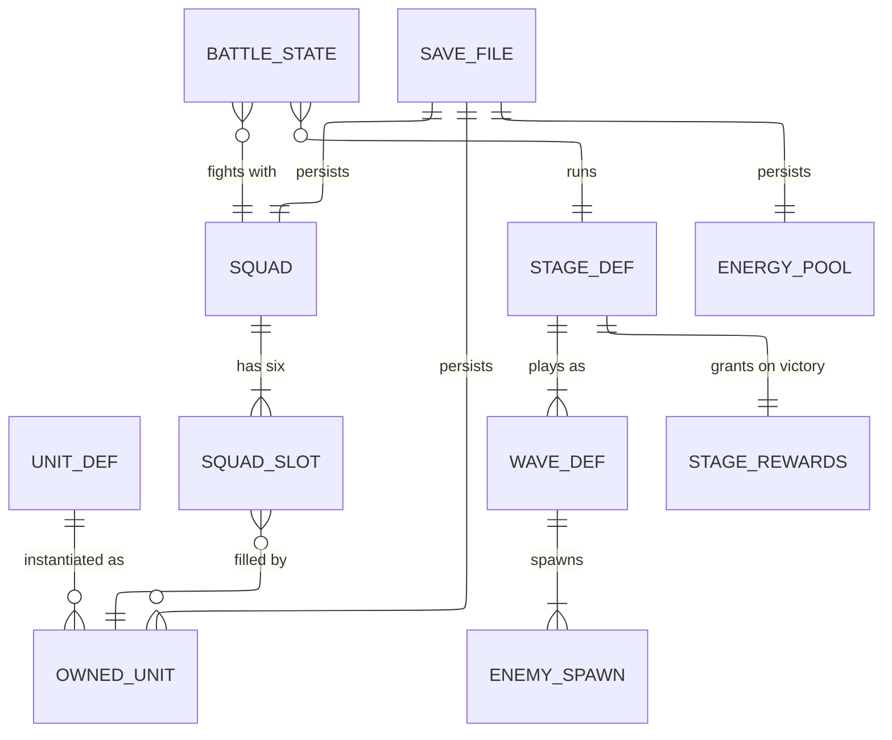
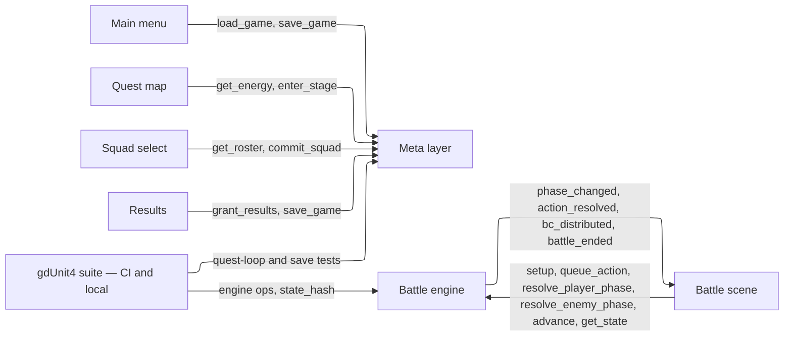
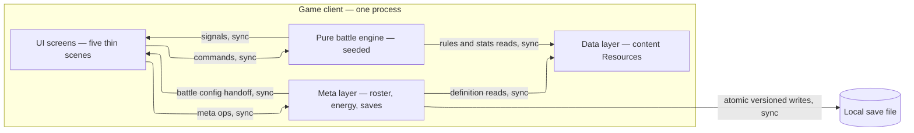

# HIGH_LEVEL_DESIGN.md — Brave Frontier vertical slice in Godot 4

**Status:** stage 4 of the documentation pipeline. Written from [`USERS.md`](USERS.md), [`USERS_handoff.md`](USERS_handoff.md), [`REQUIREMENTS.md`](REQUIREMENTS.md), [`KEY_METRICS.md`](KEY_METRICS.md), and the committed spec (*Brave Frontier vertical slice in Godot 4*, Blueprint art_zmUVyeNW — cited as "spec"). **Inheritance is binding:** stage 3's numbers — the six guarantee thresholds and the three playtest pacing targets (KEY_METRICS.md) — are carried below wherever they size a component. Reader: choose-stack (stage 5), then architecture (stage 6).

## 0. Summary

| | |
|---|---|
| **System shape** | One game client — a single desktop process. No server, no database, no cache, no queue, no CDN, no accounts. KD-6 ruled out scalability requirements; the absence of every server-side component is a finding of this design, not a gap. |
| **Components** | The client's four layers, and nothing else: data (content Resources), pure battle engine, UI scenes, meta layer over one local save file. §5. |
| **The sentence that sizes it** | Peak load is one small phase computation every few tens of seconds, for one player, on one machine — no number in the requirements forces a fifth component. |
| **The two load-bearing seams** | PF-2's ≤200 ms phase-compute budget is what shapes the engine/UI seam: a pure, headless-callable engine whose scenes are thin skins. KD-2's energy rate (1 per 3 real minutes) is what makes the injected-clock seam load-bearing: real-time regen the suite can simulate without waiting. |
| **Wireframe** | *HLD Wireframe — Brave Frontier Slice* — project folio artifact **art_TKgCP0MJ** (open from the project workspace). Five screens, per-screen states, clickable. §6. |
| **Cost** | $0/month at current load and at the horizon (§5 cost check). |

**What this document stands on** (per the skill's load-bearing-assumption rule): USERS.md open question 1's default — this is the vertical slice and the test repo is its home — plus KD-6's no-scalability ruling, plus USERS.md open question 2's default (Michael is the sole feel-judge). If any of those falls, this document is rewritten, not patched; nothing downstream should build on it without that flag in view.

## 1. The five sizing answers

Every answer below is pulled from the upstream documents or resolved by a stage-2 decision — none is invented load, and none is left as a gap.

| # | Question | Answer | Source |
|---|---|---|---|
| 1 | Users now, growth, peak | **One player** (Michael) plus the engineering team reading test output. **Growth: none inside the slice** — single-player, desktop, no accounts. Peak is one evening session, one battle at a time. | USERS.md target user; KD-6 |
| 2 | Read-heavy or write-heavy | **Reads dominate.** Every frame reads engine state; every screen reads definitions. Writes are rare and small: a handful of file saves per session (squad commit, results, quit). | FR-Squad.2, FR-Quest.4, FR-Verify.1 |
| 3 | Data that can never be lost | **The local save file:** squad + leader, unit levels/EXP, Zel/Karma balances, cleared stages, energy. Battle state is disposable — replayable from a seed (VR-4). Content definitions are versioned in the repo. | spec save schema; VR-6, RL-1 |
| 4 | Latency per interaction | Input acknowledgment **≤100 ms** (PF-1); full phase compute **≤200 ms headless** (PF-2); six orders **≤30 s**, judged by feel (PF-3); quest loop **10–20 min** menu→results; squad select **~2 min**. | KD-4 / PF-1..3; USERS.md §workflow walk |
| 5 | Cost | **None stated.** Runs on one desktop the project already has; CI runs in the existing GitHub repo. | GC-6 |

## 2. What the numbers come to

Working shown inline so a reader can check it.

- **Phase compute.** Worst case per phase: 6 player units × (spec default `hit_count` 2, plus a possible burst) + 3 enemies × ~2 hits ≈ **~20 damage rolls and ~20 BC-drop rolls** — a few thousand floating-point operations. Against PF-2's 200 ms budget that is orders of magnitude of headroom on any modern desktop CPU: single-threaded, unoptimized, no worker threads. The number forces nothing.
- **Input rate.** PF-3's pacing (six orders in ≤30 s) is a peak of **~0.2 orders/second**, each acknowledged within PF-1's 100 ms. No queueing, no batching — the engine's command queue is a list, not infrastructure.
- **Data at load.** 8 unit Resources + 1 area (3 stages × 2 waves) + the element chart + 3 items — **tens of KB**, loaded once at launch. Well inside the 100 ms ack budget even on cold start.
- **Storage.** One save file, **<10 KB** now and at any horizon the slice allows (8 roster rows, 3 cleared stages, counters). Content lives in the repo, not in player storage.
- **External paid services.** **Zero calls.** The game touches nothing off-device (GC-8, KD-6).
- **Read:write.** Effectively all reads at frame rate; writes are ~2–5 atomic file saves per session. One process, one user — no concurrent writers anywhere.

**The sentence:** peak is one small computation every few tens of seconds; nothing here justifies a single second component beyond the game client itself.

### 2a. Interaction table

One row per thing a user (or the system) does. Sources in every cell; no gaps remain.

| # | Interaction | R/W | Frequency | Latency expected | Data touched | Can it be lost? | Source |
|---|---|---|---|---|---|---|---|
| 1 | Launch → load save | R | every session | ≤1 s (instant band) | save file | no — never lose | FR-Squad.2, VR-6 |
| 2 | View quest map + energy | R | every session | ≤100 ms ack | energy pool, stage defs | rebuildable | FR-Quest.1 |
| 3 | Enter a stage | W | 1–2 per session | ≤100 ms ack | energy (−10, KD-2), stage def | entry-energy delta persists at the next save point; a crash mid-battle loses at most the entry cost — accepted | FR-Quest.1 |
| 4 | Order a unit | W (in-memory) | ~every 5 s during a command phase | ≤100 ms ack (PF-1) | battle state | yes — disposable, replayable from seed (VR-4) | PF-1, PF-3 |
| 5 | Resolve a phase | C | once per turn | ≤200 ms headless (PF-2) | battle state, element chart, BC rules, BB defs | yes — disposable | PF-2, VR-2, VR-3 |
| 6 | Fire a BB / use an item | W (in-memory) | occasional | ≤100 ms ack (PF-1) | battle state, item counts | yes — disposable | FR-Burst.2, FR-Recovery.1 |
| 7 | Battle ends → results | R+W | once per battle | ≤1 s | stage rewards → roster, currencies, cleared marks | no — persisted at the results save | FR-Quest.4, FR-Quest.5 |
| 8 | Commit a squad | W | ~once per session (~2 min screen budget) | ≤100 ms ack | roster, squad, leader | no — persisted | FR-Squad.1, FR-Squad.2 |
| 9 | Quit → save | W | every session | ≤1 s | save file | no — atomic write (RL-1) | VR-6, RL-1 |
| 10 | Energy regeneration | W (computed) | continuous; applied on read and at save | n/a — background | energy pool | tunable data (KD-2), not player labor | VR-5 |
| 11 | CI suite run | R | every push | minutes | all combat rules, headless | n/a | FR-Verify.1, DE-1 |
| 12 | Human playtest | all | once per milestone | 10–20 min session | everything | verdict recorded in the playtest record, not stored by the game | V8, EV-2 |

## 3. Core entities and how they are read together

| Entity | What it is | Attributes that matter | Durability | Growth |
|---|---|---|---|---|
| UnitData | a unit definition (in-repo Resource) | id, display_name, element, base HP/ATK/DEF/REC, hit_count, crit_chance, BB, leader skill | rebuildable — versioned in git | static at 8; more later = more data files |
| BbData / LeaderSkillData | sub-definitions a UnitData carries | gauge_cost, effect (damage/heal/buff), multiplier, target; leader % buff | rebuildable | static |
| OwnedUnit | a roster row: a unit the player owns | unit_id, level, exp, bb_level | **never lose** | capped at 8 in the slice |
| Squad | the committed six + leader | 6 unit_ids, leader_id | **never lose** | fixed size 6 |
| StageData | quest content: one stage | area, waves (enemy compositions), energy cost, EXP/Zel/Karma rewards | rebuildable | static: 3 stages × 2 waves |
| EnemySpawn | per-wave enemy composition | enemy type, stats, count | rebuildable | static: 3 enemy types |
| BattleState | one battle's runtime state | phase, wave, turn, HP + gauge per unit, BC pool, RNG seed + state, outcome | **disposable** — replayable from seed + commands (VR-4) | one per battle |
| SaveFile | the persistence envelope | version, roster, squad, progress, currency, energy | **never lose** | one file |
| EnergyPool | the energy resource | current, max (50 — KD-2), last_regen_unix | **never lose** (inside SaveFile) | fixed |

### Access patterns

| Read | Combines | Verdict at this scale |
|---|---|---|
| Squad select screen | OwnedUnit × UnitData (8 rows) | fine as a direct read — 8 records need no index |
| Battle setup | Squad × UnitData × StageData | fine — an in-memory join over ~15 records |
| Phase resolution | BattleState × ElementChart × BB defs | fine — pure function calls, trivially inside PF-2's 200 ms |
| Stage entry check | EnergyPool × StageData cost | O(1) |
| Results grant | StageData rewards → OwnedUnit, currencies | fine — 6–8 records written once per battle |
| Launch load | SaveFile → roster, squad, energy | fine — one file |

No access pattern needs an index, precomputation, or a different kind of store — at 8 units, 3 stages, and one save file, nothing does. One seam note: the engine/UI split means scenes read the engine's exposed state and never reach past it; the engine never reads scenes (spec's organizing rule).

## 4. API operations

These are in-process method calls, not HTTP — one process, one caller shape. The "route sketch" here is the method signature; there are deliberately no versions, status codes, or payload formats (altitude table). **Errors are rejections the operation returns, not exceptions to recover from** — the engine refuses invalid commands so the UI cannot corrupt state (VR-7). The engine has **no save/load of its own**: battle state is disposable (VR-4 replays it from a seed); persistence is the meta layer's job.

### Battle engine (serves)

| Operation | Called by | Input | Output | Read/write | Latency class | Sync / async | Serves |
|---|---|---|---|---|---|---|---|
| `setup(squad, stage, seed)` | Battle scene, suite | ≤6 UnitData + StageData + int seed | initial BattleState, wave 1 spawned | write (in-memory) | instant | sync | FR-Quest.1, VR-4 |
| `queue_action(unit, action)` | Battle scene | UnitInstance + PlayerAction{ATTACK/BB/GUARD/ITEM, target, item_id} | ack — order accepted or rejected | write | ≤100 ms (PF-1) | sync | FR-Quest.3, VR-7 |
| `all_actions_queued()` | Battle scene | — | bool | read | ≤100 ms | sync | FR-Quest.3 |
| `resolve_player_phase()` | Battle scene, suite | — | Array[ActionResolution] — per-hit damage, sparks, crits, KO | write | ≤200 ms combined with enemy phase (PF-2) | sync | PF-2, FR-Burst.1, VR-3 |
| `resolve_enemy_phase()` | Battle scene, suite | — | Array[ActionResolution] | write | ≤200 ms combined (PF-2) | sync | FR-Quest.2 |
| `advance()` | Battle scene | — | next wave, or `battle_ended(VICTORY\|DEFEAT)` | write | ≤100 ms | sync | FR-Quest.2, FR-Recovery.4 |
| `get_state()` + signals | Battle scene | — | phase, HP + gauges, BC pool, outcome | read | ≤100 ms | sync | FR-Burst.4, FR-Recovery.3 |
| `state_hash()` | suite (replay test) | — | digest of full engine state | read | ≤100 ms | sync | VR-4, FR-Verify.3 |

**Rejected commands** (the invalid-command classes VR-7 names, plus their setup cousins): `E_UNIT_DOWN` (order for a KO'd unit), `E_GAUGE_SHORT` (BB before full — FR-Burst.2), `E_INCOMPLETE_ORDERS` (resolving while a living unit lacks an order — FR-Quest.3), `E_NOT_IN_BATTLE` (unknown unit), `E_WRONG_PHASE` (resolve/advance out of turn), `E_UNKNOWN_TARGET`, `E_ITEM_DEPLETED` (count at zero — FR-Recovery.3), and at setup `E_BAD_SQUAD` (empty or over-six squad).

**Inside (no caller):** per-hit BC drop rolls with the per-attack cap; phase-end BC distribution, lowest gauge first (fixed rule — KD-3); enemy targeting (random, finishes lowest HP); REC-driven turn-end regen (tunable — CH-1); KO/wipe checks; state-hash computation.

### Meta layer (serves)

| Operation | Called by | Input | Output | Read/write | Latency class | Sync / async | Serves |
|---|---|---|---|---|---|---|---|
| `load_game()` | Main menu (launch) | — | save state, or fresh state + logged warning | read | ≤1 s | sync | FR-Squad.2, VR-6, OB-1 |
| `save_game()` | Results, Squad select, quit path | full state | write confirmation | write | ≤1 s | sync — **atomic** (temp file, then rename, RL-1) | VR-6, RL-1 |
| `get_roster()` | Squad select | — | 8 owned units with levels | read | ≤100 ms | sync | FR-Squad.3, FR-Squad.4 |
| `commit_squad(unit_ids, leader_id)` | Squad select | exactly 6 distinct ids + leader | ack | write | ≤100 ms | sync | FR-Squad.1 |
| `get_energy()` | Quest map | — | current/max + next-point time | read (applies regen since last timestamp) | ≤100 ms | sync | FR-Quest.1, VR-5 |
| `enter_stage(stage_id)` | Quest map | stage id | battle config (squad + stage + seed) | write (spends energy) | ≤100 ms | sync | FR-Quest.1 |
| `grant_results(outcome)` | Results | VICTORY / DEFEAT | EXP/Zel/Karma delta + cleared mark, or nothing | write | ≤1 s | sync | FR-Quest.4, FR-Quest.5 |

**Rejected:** `E_NO_ENERGY` (entry cost not covered), `E_UNKNOWN_STAGE`, `E_NOT_SIX` / `E_DUPLICATE` / `E_LEADER_NOT_IN_SQUAD` at commit. Corrupt and prior-version saves are **handled, not refused** — migration or fresh-state fallback (VR-6, OB-1).

**Inside (no caller):** energy regeneration against the **injected clock** — +20 per simulated 60 minutes (VR-5); the seam that makes real-time regen testable without waiting. Save migration (prior version → current) and the corrupt-file fallback to a fresh state with a logged warning (VR-6, OB-1). Atomic writes so a failed save leaves the previous file loadable (RL-1, Gate).

### Callers (the screens, one line each)

- **Main menu** — `load_game()`, `save_game()` on quit.
- **Quest map** — `get_energy()`, `enter_stage()`.
- **Squad select** — `get_roster()`, `commit_squad()`.
- **Battle scene** — the engine surface: `setup()` through `advance()`; binds the four signals.
- **Results** — `grant_results()`, `save_game()`.

### External services

None. The game makes no network calls (GC-8, KD-6). The one out-of-band caller is **the suite itself** (CI on every push, FR-Verify.1, DE-1): it drives the same two components headless, and the replay test asserts `state_hash()` equality across two runs (VR-4, FR-Verify.3). GDUnit4 is spec-locked as the test framework, so it is named here as a constraint, not a stack choice.

## 5. Components, smallest first

The minimum shape for this load is **not** client → app server → database; it is one game client. The client's four layers are the entire component list — each exists because a specific number forces it:

| Component | Why it exists (the forcing number) | What it holds / does |
|---|---|---|
| **Data layer — content as Resources** | CH-1 (KD-3): the four our-rule constants ship as data values the playtest can retune without code changes; VR-1: the element chart is a data table with its own test | 8 unit defs, 1 area × 3 stages × 2 waves, 3 enemy types, 3 items, the 6-element chart, tunable constants |
| **Battle logic — pure engine, seeded RNG** | VR-4 (Gate): same seed → identical state hash, asserted twice per suite run; PF-2: ≤200 ms headless phase compute; FR-Verify.1: the suite runs headless in CI. All three ride the **no-scene-dependencies seam** | BattleEngine state machine, DamageCalculator, BC drop/distribution, BB effects |
| **UI — five thin scenes** | GC-2: 1280×720 desktop window, mouse + keyboard; PF-1: ≤100 ms input ack; PF-3: ≤30 s to order six units. A skin that binds signals and sends commands keeps machine time out of the feel budget | menu, quest map, squad select, battle, results |
| **Meta — progression and saves** | FR-Squad.2: squad/levels/currency/cleared/energy persist across sessions; VR-5: +20 energy per simulated 60 min against an injected clock; VR-6/RL-1/OB-1: round-trip, migration, corrupt→fresh+warning, atomic writes | SaveManager (versioned JSON in user://), EnergySystem (injected clock), RosterManager, currencies |

**Deliberately absent — each with the number that would add it:**

| Absent component | The number that would add it |
|---|---|
| Server / accounts / sync | A second device or a second player. None exists (KD-6, GC-8); the playtest is one person on one machine |
| Database | Player state outgrowing one <10 KB JSON file. It cannot in this slice |
| Cache | A repeated expensive read. There is none: definitions load once, state is in memory |
| Queue / background jobs | Work exceeding a latency class. Nothing is async — PF-2 computes inline |
| CDN / web distribution | Web export — default out (spec open questions); it forces asset/UI audits first, not a new server |
| Worker threads | Phase compute exceeding 200 ms. Headroom is orders of magnitude (§2) |

**Next piece growth would call for:**

| Trigger | What it adds |
|---|---|
| Content breadth — more areas, units, enemies | More data files. **Zero new components** — content is data (spec's organizing rule) |
| A second device or player (accounts/sync) | A server + a store + a new use case — a new stage of design, not an extension of this one |

At the slice's cap — one player, 8 units, 3 stages — growth stays far inside the design's headroom; nothing else is listed.

**Cost check.** $0/month at current load and at the horizon: the desktop is already owned and CI runs in the existing GitHub repo — no part of this design reaches a paid tier. Nothing to cut, and nothing would get cheaper with fewer boxes.

## 6. UI wireframe

Interactive artifact: **HLD Wireframe — Brave Frontier Slice** — project folio **art_TKgCP0MJ** (open it from the project workspace; it is a low-fidelity, grayscale, clickable sketch). The battle screen's readouts follow the spec's battle-screen mock. Screens, one line each:

- **Main menu** — load the save at launch; states: save exists / first launch (Continue disabled, reason on screen).
- **Quest map** — Elrune Grove's 3 stages at 10 energy each against a live energy bar and a next-point countdown; states: entry affordable / too low (disabled buttons say when entry opens).
- **Squad select** — 8 owned units, 6 slots, one leader, bench visible; states: complete (commit enabled) / incomplete (commit disabled, rule stated).
- **Battle** — wave/turn header, enemy cards, squad cards with HP + BB gauges, action tray, BC pool note, pause/retreat; states: command phase (with a clickable ordering flow), BB ready (gauge lit, burst target marked), unit down (KO card hatched, revive in the item tray), wipe (defeat overlay: energy spent, nothing granted).
- **Results** — victory (per-unit EXP with a level-up tick, Zel/Karma gains, cleared mark, auto-save note) / defeat (no rewards, stage uncleared, energy stays spent).

The wireframe decides what each screen shows and which operations it calls — never visual design, copy, or component choices (stack and stories). Every number on it is example data.

**What the wireframe changed in this design:** one refinement, recorded in §7 — the quest map gained the next-regen countdown so the player can price waiting. Everything else survived contact.

## 7. Upstream fixes and open questions

**Upstream fix for REQUIREMENTS.md (one, additive):**
- FR-Quest.1's map read gains one element from the wireframe: the energy bar shows a **next-regen countdown** ("next +1 in mm:ss"). It refines "sees the entry costs against the current energy" — the visible half of KD-2's rate. No new requirement row needed.

**Open questions inherited, unresolved — none sizes anything in this design:**
1. USERS.md OQ1–OQ4 (slice reading, playtest-gate ownership, licensing, deadline/spend) — unchanged; this design stands on OQ1's default and says so in §0.
2. Energy rate at the playtest (KD-2) — the rate lives in data; retuning it updates VR-5's pinned test and KEY_METRICS guarantee 4, not this document.
3. Web export, audio, replay log format (spec open questions) — unchanged defaults; none adds a component.

## 8. Handoff — what stage 5 (stack) inherits

The module list to fill is the **four layers of one client**. Three technology commitments arrive as given constraints, not choices: the engine (Godot 4.7.x stable, GDScript — GC-1), the test framework (GDUnit4 headless in Actions — spec locked decisions, DE-1), and the save format (versioned JSON in user:// — spec). What stack genuinely chooses: CI runner shape and version pinning, tooling for original assets and audio feedback, and any schema conveniences around the save format. Nothing in this design needs a backend, database, or hosting product of any kind — a stack review that proposes one is misreading the load.
