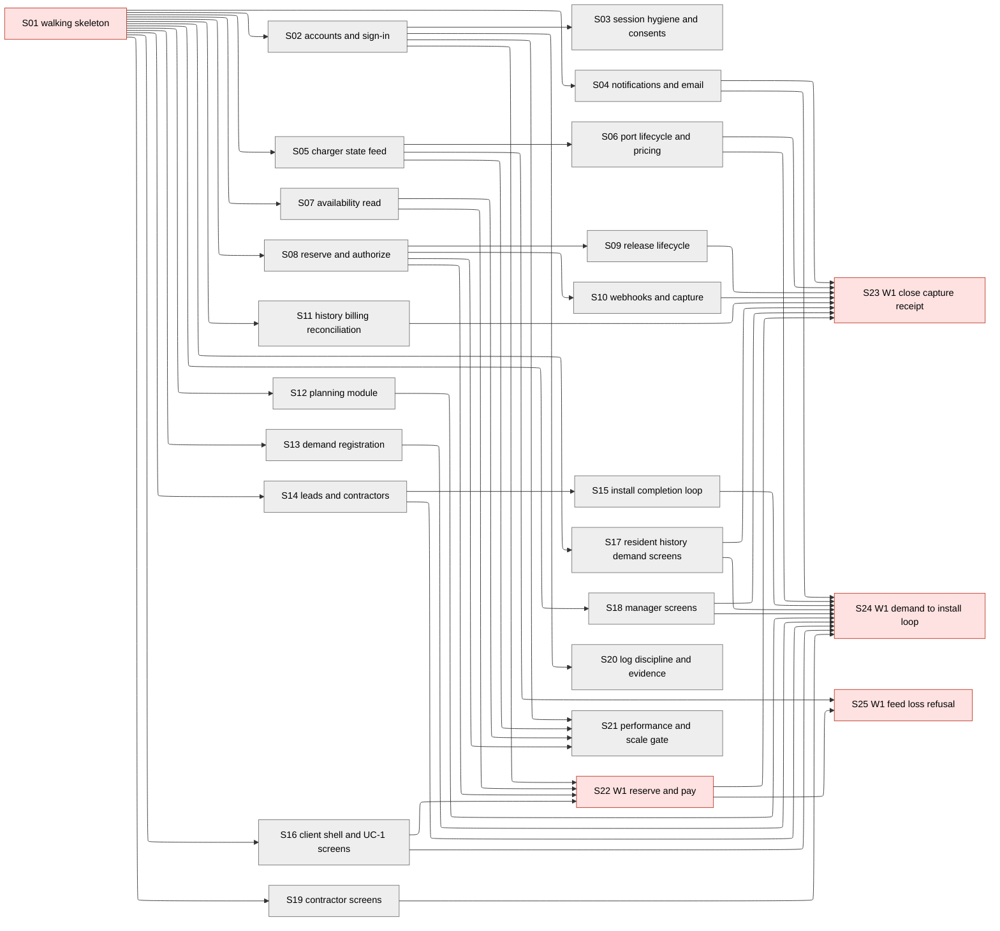

# STORIES.md — ChargeCommons

**Status:** draft · 2026-10-09 · produced autonomously as the seventh and final document of the document-factory run (spec art_HCphHMP5), consuming ARCHITECTURE.md (art_tFDPD9yq), STACK.md (art_8pB40W1f), HIGH_LEVEL_DESIGN.md (art_VTIrwKMR), REQUIREMENTS.md (art_XpcuDDrN), KEY_METRICS.md (art_ulMpVcI4), and USERS.md (art_axMnz3Xs). The user is away; every point where this process would present the plan to the user for decisions was resolved from the documents and logged in **Assumptions & Decisions** (§16).

**How this document is organized.** The story-writer skill writes one file per story plus an index; this run publishes documents only, so the set is consolidated here in one document: the story map and index tables first (§1–§15), then the 25 stories (§17, one `###` section each — the `###` heading becomes the issue title when the loop imports them). Story numbering `S<nn>` is used exactly as the architecture names elements.

**No deadline was given** (REQUIREMENTS GC-1, USERS §9, ARCHITECTURE GC-1). Every duration below is an estimate in agent build time and human demo reviews; no calendar deadline exists, so no "will we make the date" analysis or design tradeoff was performed (§16 A3, §7).

**Markers carried over:** **[src]** (source named — an upstream document section or a retrieval recorded there), **[derived]**, **[prop]**, **[assumed]**, **[verify]**. Architecture contracts are reused **by reference** (§ numbers of ARCHITECTURE.md); nothing here restates or renumbers a contract. No new statistic and no new number enters this document: all thresholds quoted in coverage tables are copied from REQUIREMENTS.md with their row ids and their original [src]/[prop] tags.

## 1. Story map

Arrows point from a story to the stories it unblocks; every `Blocked by` entry is exactly one arrow, and the map, the Order table (§3), and the story files (§17) agree. Red = human demo (S01 and the four wiring stories); grey = module story checked by agents.

**Demo order:** S01 (deployed skeleton, gate, empty dashboard) → S22 (W1: reserve and pay) → S23 (W1: session close, capture, receipt, billing) together with S25 (W1: feed-loss refusal — unblocked by S22 alone; the two share one demo window) → S24 (W1: demand → plan → lead → install → notify; the full loop).

## 2. How the set was cut (skill Phases 1–2, result)

**Element inventory.** Every element ARCHITECTURE.md names was listed one line at a time before any story was cut: **22 routes** (§5.1–§5.6), **9 jobs** (§6), **18 tables** (§3), **6 module interfaces** (§5.8), **3 external-service contracts** (§7.1–§7.3) plus one deliberately absent (§7.4), **13 client surfaces** (the §2 client box instantiated by HLD §7's wireframes and ARCHITECTURE §5.1's notification read), **7 system-wide contracts** (§10), **9 measurement records** (§11), **23 Must holds** (§9.1), plus 4 infrastructure elements the skill requires (deployment, regression gate, metrics dashboard, scheduler scaffold). The complete element→owner mapping is the Architecture coverage table (§8); nothing was left off for looking small.

**Two passes.** Pass 1 assigned every element to exactly one module story, grouped by the six ARCHITECTURE §2 modules and split by groups of operations where criteria exceeded about 8 (Charging → S05/S06/S07; Booking → S08/S09/S10/S11; Demand & Leads → S13/S14/S15; Access → S02/S03; client → S16–S19). Pass 2 gave each of §8's four sequence diagrams one wiring story (S22–S25) and attached every functional requirement to the wiring story whose demo shows it. Forward check: every element has one owner (§8), every §8 flow has a wiring story (§9), every FR is shown in some wiring demo (§10). Reverse check: every story's work traces to elements, flows, or requirements — no story invents capability (verified in §15).

**Chains are only shared write paths.** Module stories run in parallel against S01's contract stubs. The only `Blocked by` edges between module stories are the skill's sanctioned exception — extending an element another story owns: S03→S02 and S20→S02 (auth_sessions/users write paths and logs), S06→S05 (ports/charging_sessions write paths), S09→S08 and S10→S08 (reservations/charges write paths), S15→S14 (leads write path), S21→S02/S05/S07/S08 (the routes it loads), and the client stories' edges into wiring stories (screens join flows). Everything else is story 1 plus a stub.

**Scoping of ARCHITECTURE §13's proposed requirement rows** (decided per the run instruction; logged in §16 A5/A6): ARCHITECTURE wrote contracts for five of the seven proposed rows — sign-up/sign-in (§5.1, in S02), notification read (§5.1, in S04), property onboarding (§5.4, in S12), demand summary (§5.4, in S13), code re-entry (§5.3, in S13) — and this story set covers those contracts because the elements exist and would otherwise be unowned. The other two proposed rows have **no contract and get no story**: **sign-out** (ARCHITECTURE §13.2 — no contract written; kept out of v1 scope; sessions expire per ARCHITECTURE A5's 30-day TTL; if the human review approves the row, a story is added then) and **consent management** (no v1 route writes `consents` — ARCHITECTURE §3.1; the table and its constraint are built as substrate by S03; AZ-2 is held structurally). Both are logged in Blockers (§4) for the human review task.

## 3. Order

| # | Story | Kind | Blocked by | Review gate | Size | Checked by |
|---|---|---|---|---|---|---|
| S01 | Walking skeleton: deploy, tables, stubs, gate, dashboard | skeleton | none | human demo | L | Demo: deployed URL, stub answers, gate green, 9 empty panels |
| S02 | Sign-up, sign-in, sessions (Access core) | module | S01 | agents | M | Route requests + responses; restart check for A-2 |
| S03 | Session hygiene and the consents substrate | module | S02 | agents | S | J-9 run output; constraint violation; audit query |
| S04 | Notifications: enqueue, in-app feed, email dispatch | module | S01 | agents | L | J-7 run output; Postmark test double; dedupe check |
| S05 | Charger state feed: ingest, staleness, retention | module | S01 | agents | L | CSMS test double poll; fault-injection sweep; retention run |
| S06 | Port lifecycle: close, stop, create, price | module | S05 | agents | M | Interface calls and outputs against seeded rows |
| S07 | Availability read with the honest unknown | module | S01 | agents | M | Route request/response per PortView; scope refusals |
| S08 | Reserve and pay: exclusivity + Stripe authorization | module | S01 | agents | L | Racing-reservation test; Stripe test double outcomes |
| S09 | Release lifecycle: cancel and window-end close | module | S08 | agents | M | Cancel route; J-3 run output; hold-release check |
| S10 | Payment settlement: webhooks and capture | module | S08 | agents | M | Signed/replayed webhook runs; partial-capture run |
| S11 | History, billing view, daily reconciliation | module | S01 | agents | M | Seeded 18-month query; J-5 run output; flaggedCount |
| S12 | Planning: onboarding, profile, configurations | module | S01 | agents | M | Onboard route; planner fit/over-capacity responses |
| S13 | Demand registration and unit verification | module | S01 | agents | M | Register with code; summary counts-verified-only |
| S14 | Leads, contractor profiles, triage | module | S01 | agents | M | Lead create/read/status responses; match filter |
| S15 | Install completion loop | module | S14 | agents | S | Install-complete run; createPorts + enqueue contracts |
| S16 | Client: shell, sign-in, resident UC-1 screens | module | S01 | agents | M | Screens rendered from stubbed data per HLD §7 states |
| S17 | Client: resident R3–R4 and notifications view | module | S01 | agents | M | Screens rendered from stubbed data per HLD §7 states |
| S18 | Client: manager screens M1–M4 | module | S01 | agents | M | Screens rendered from stubbed data per HLD §7 states |
| S19 | Client: contractor screens C1–C3 | module | S01 | agents | M | Screens rendered from stubbed data per HLD §7 states |
| S20 | Log discipline, DP-1 scan, G-5 evidence, AZ-1 matrix | module | S02 | agents | M | Scrubbed-log inspection; CI scan run; matrix run |
| S21 | Performance and scale gate: PF-1 and SC-1 | module | S02, S05, S07, S08 | agents | M | Harness outputs: p95, load-test degradation, 10× review |
| S22 | W1: resident reserves and pays for tonight | wiring | S02, S07, S08, S16 | human demo | M | Demo: R1→R2 on real data, real Stripe test-mode authorize |
| S23 | W1: session close, capture, receipt, billing reconcile | wiring | S22, S04, S06, S09, S10, S11, S17, S18 | human demo | M | Demo: unplug→capture→receipt→R3→M3 on real data |
| S24 | W1: demand → plan → lead → install → notify | wiring | S04, S06, S12, S13, S14, S15, S16, S17, S18, S19 | human demo | M | Demo: full UC-2→UC-3→UC-4→UC-1 loop on real data |
| S25 | W1: feed loss shows unknown and refuses booking | wiring | S22, S05 | human demo | M | Demo: fault injection → unknown on R1 → refusal on R2 |

## 4. Blockers

| # | Blocks stories | What is needed | Who decides | Source |
|---|---|---|---|---|
| 1 | Real-feed verification for S05/S25 and go-live (not the module builds — they run on ARCHITECTURE §7.2's scripted CSMS fake) | AMPECO commercial engagement: API credentials, auth header format, response field names, rate limits, pricing | Human/business (STACK §9.1 engagement) | ARCHITECTURE §12.1, §7.2; STACK §9.1 |
| 2 | Any story for sign-out | A proposed REQUIREMENTS row (ARCHITECTURE §13.2) approved — no contract exists today, so no story was written | Human review task | ARCHITECTURE §13.2; this doc §16 A5 |
| 3 | Any story for consent management | A feature that actually exposes resident identity — none exists in v1; `consents` substrate is built by S03 | Human review task | ARCHITECTURE §3.1, §13.7; §16 A6 |
| 4 | Go-live for real charges and real email | Stripe account activation/business verification; Postmark sending domain with DKIM/SPF/DMARC | Human (vendor onboarding) | STACK §7 items 1–2 |
| 5 | Date-fit analysis | A deadline — none was given anywhere upstream, so none is assumed | n/a | REQUIREMENTS GC-1; §16 A3 |

None of these stops any story in this set from being planned or built: S05/S25 build and demo against the contract fake; vendor accounts are test-mode-unblocked (§14).

## 5. Timeline

**No deadline was given** (REQUIREMENTS GC-1; USERS §9: "Deadline: none was given, for the product or this run"). Everything below is an estimate in the skill's two clocks; no calendar commitment exists or is implied.

**Capacity:** 3 factory agents building at once [assumed — the skill's default; not stated in any document]; human demo windows: one per day [assumed — no availability stated]; start: when the human approves this set.

**Clock 1 — agent build time** (skill size table: S 5–10, M 10–20, L 20–45 agent minutes, likely – high; the high figure allows one review-and-fix loop):

| Kind | Count | Agent minutes |
|---|---|---|
| S | 3 (S03, S15, S17) | 15 – 30 |
| M | 18 | 180 – 360 |
| L | 4 (S01, S04, S05, S08) | 80 – 180 |
| **Total** | **25 stories** | **275 – 570 min ≈ 4.6 – 9.5 hours** |

Wave 1 (after S01's demo): S02–S20 in parallel slots ≈ 85–175 min of wall clock at 3 agents. S21 follows S02/S05/S07/S08. The wiring chain (S22 → S23 ∥ S25 → S24) paces everything after.

**Clock 2 — human demo reviews.** **5 demos**, one per review gate: S01, S22, S23, S25, S24 (S23 and S25 can share a window). About 10 minutes each ≈ **50–60 minutes of human time**, spread over **4 demo windows** [assumed cadence]: window 1 = S01; window 2 = S22; window 3 = S23 + S25; window 4 = S24. With one window a day, the last required demo lands in window 4 — **the dates move with the human's availability, and no deadline is missed or met against them because none was given.**

| # | Story | Agent min (likely–high) | Built by (likely–high, from set approval) | Demoed in window | Needed for |
|---|---|---|---|---|---|
| S01 | Walking skeleton | 20–45 | 0.5–1 h | 1 | everything |
| S02 | Accounts and sign-in | 10–20 | wave 1 | — | S03, S20, S21, S22 |
| S03 | Session hygiene, consents | 5–10 | wave 1 (after S02) | — | S24 (transitively) |
| S04 | Notifications + email | 20–45 | wave 1 | — | S23, S24 |
| S05 | Charger state feed | 20–45 | wave 1 | — | S06, S21, S25 |
| S06 | Port lifecycle, pricing | 10–20 | wave 1 (after S05) | — | S23, S24 |
| S07 | Availability read | 10–20 | wave 1 | — | S21, S22 |
| S08 | Reserve and authorize | 20–45 | wave 1 | — | S09, S10, S21, S22 |
| S09 | Release lifecycle | 10–20 | wave 1 (after S08) | — | S23 |
| S10 | Webhooks and capture | 10–20 | wave 1 (after S08) | — | S23 |
| S11 | History, billing, reconciliation | 10–20 | wave 1 | — | S23 |
| S12 | Planning module | 10–20 | wave 1 | — | S24 |
| S13 | Demand registration | 10–20 | wave 1 | — | S24 |
| S14 | Leads and contractors | 10–20 | wave 1 | — | S15, S24 |
| S15 | Install completion loop | 5–10 | wave 1 (after S14) | — | S24 |
| S16 | Client shell + UC-1 screens | 10–20 | wave 1 | — | S22, S24 |
| S17 | Resident R3–R4, notifications view | 10–20 | wave 1 | — | S23, S24 |
| S18 | Manager screens | 10–20 | wave 1 | — | S23, S24 |
| S19 | Contractor screens | 10–20 | wave 1 | — | S24 |
| S20 | Log discipline and evidence | 10–20 | wave 1 (after S02) | — | G-5 evidence |
| S21 | Performance and scale gate | 10–20 | after S02/S05/S07/S08 | — | PF-1, SC-1 checks |
| S22 | W1 reserve and pay | 10–20 | after S22's blockers merge | 2 | S23, S25 |
| S23 | W1 close/capture/receipt/billing | 10–20 | after S23's blockers | 3 | last W1 flow |
| S24 | W1 demand→install loop | 10–20 | after S24's blockers | 4 | closes the set |
| S25 | W1 feed-loss refusal | 10–20 | after S22, S05 | 3 | DE-1 proof |

| External wait | Needed by | Lead time | Start by |
|---|---|---|---|
| AMPECO commercial engagement + credentials | real-feed verification, go-live (not any build or demo — the §7.2 fake covers those) | unknown, no self-serve path [src STACK §9.1] | before go-live |
| Stripe account activation | live charges (test mode unblocks every story/demo) | standard onboarding [prop, STACK §7] | before go-live |
| Postmark sending domain (DKIM/SPF/DMARC) | first real receipt (test token unblocks demos) | domain setup | before go-live |

| Deadline | Date | Requires | Stories | Done by (high) | Status |
|---|---|---|---|---|---|
| None given | — | — | — | — | **No deadline exists upstream (GC-1); no date-fit analysis possible or performed** |

## 6. Story 1 (what the skeleton must contain)

S01 creates: the deployment (STACK §4.5 — one DigitalOcean droplet serving the Next.js client bundle and the Fastify API, DO Managed PostgreSQL 17 with `btree_gist` enabled [src STACK §11.4]); **all 18 tables** of ARCHITECTURE §3 including the `reservations_exclusive_per_port_window` exclusion constraint; **all 22 routes** as contract stubs taking §5's inputs and returning contract-shaped synthetic data or §10's error envelope; **all 9 job schedules** registered on the node-cron scaffold as no-ops (§6's cadences, `noOverlap`, `CRON_LEADER` on exactly one instance — the scaffold is owned here once so no module story chains on it); **the regression gate** whose first case is VR-1's store-level check; **the metrics dashboard** with nine panels reading from §11's sources (G-1…G-5, success, three supporting — empty at first); and the system-wide conventions §10 names (error envelope, integer cents/USD, UTC storage). PITR is verified by a restore drill. Creating tables and stubs makes S01 the owner of none of them: the owner is the story that makes each real.

## 7. Design tradeoffs

**None needed — and none possible.** Every deadline status is "no deadline given" (GC-1), so the skill's fit-the-deadline machinery (order, trims, tradeoffs) has nothing to act on. Per the run instruction, no tradeoff was applied and none is proposed; the design ships as the documents state it. If a deadline is later given, §5's per-story estimates are the inputs for that analysis.

## 8. Architecture coverage — every element has exactly one owner

Criterion references point at the story's acceptance-criteria numbers in §17. "Ext" = later stories that extend the element; the owner is always the first that makes it work.

**Routes (ARCHITECTURE §5)**

| Element | § | Owner | Criterion | Ext |
|---|---|---|---|---|
| POST /users | 5.1 | S02 | S02.AC1–3 | — |
| POST /session/login | 5.1 | S02 | S02.AC4–6 | — |
| GET /users/me/notifications | 5.1 | S04 | S04.AC7 | — |
| GET /properties/:id/ports | 5.2 | S07 | S07.AC1–7 | — |
| POST /reservations | 5.2 | S08 | S08.AC1–8 | — |
| POST /reservations/:id/cancel | 5.2 | S09 | S09.AC1–3 | — |
| GET /users/:id/sessions | 5.2 | S11 | S11.AC4 | — |
| POST /demand-registrations | 5.3 | S13 | S13.AC1–5 | — |
| GET /demand-registrations/:id | 5.3 | S13 | S13.AC6 | — |
| PATCH /demand-registrations/:id | 5.3 | S13 | S13.AC7 | — |
| POST /properties | 5.4 | S12 | S12.AC1–3 | — |
| PUT /properties/:id/electrical-profile | 5.4 | S12 | S12.AC4 | — |
| POST /properties/:id/configurations | 5.4 | S12 | S12.AC5–8 | — |
| PUT /ports/:id/pricing | 5.4 | S06 | S06.AC5 | — |
| GET /properties/:id/billing | 5.4 | S11 | S11.AC5–6 | — |
| GET /properties/:id/demand-summary | 5.4 | S13 | S13.AC8–9 | — |
| POST /leads | 5.4 | S14 | S14.AC1–4 | — |
| PUT /contractor-profile | 5.5 | S14 | S14.AC5 | — |
| GET /leads | 5.5 | S14 | S14.AC6–7 | — |
| POST /leads/:id/status | 5.5 | S14 | S14.AC8 | — |
| POST /leads/:id/install-complete | 5.5 | S15 | S15.AC1–4 | — |
| POST /webhooks/stripe | 5.6 | S10 | S10.AC1–4 | — |

**Jobs (§6)**

| Element | § | Owner | Criterion | Ext |
|---|---|---|---|---|
| J-1 state-feed-ingest (30 s) | 6 | S05 | S05.AC1–5 | — |
| J-2 staleness-sweep (30 s) | 6 | S05 | S05.AC6–7 | — |
| J-3 release-and-close (60 s) | 6 | S09 | S09.AC4–6 | — |
| J-4 capture-on-completion (60 s) | 6 | S10 | S10.AC5–6 | — |
| J-5 daily-reconciliation (04:00 UTC) | 6 | S11 | S11.AC1–3 | — |
| J-6 webhook-process (event + 60 s) | 6 | S10 | S10.AC2–4 | — |
| J-7 email-dispatch (60 s) | 6 | S04 | S04.AC3–6 | — |
| J-8 port-state-cleanup (05:00 UTC) | 6 | S05 | S05.AC8 | — |
| J-9 session-cleanup (05:00 UTC) | 6 | S03 | S03.AC1 | — |

Unit verification is **not** a job (synchronous code match in POST/PATCH /demand-registrations — §6's note, S13); demand-arrival enqueue is **not** a job (inside install-complete, S15; J-7 sends).

**Tables (§3 — schema created in S01; owner = the write path)**

| Element | § | Owner | Criterion | Ext |
|---|---|---|---|---|
| users | 3.1 | S02 | S02.AC1 | S03 (J-9 on auth_sessions' sibling) |
| auth_sessions | 3.1 | S02 | S02.AC7 | S03 (J-9 delete path) |
| consents | 3.1 | S03 | S03.AC2–3 | — (no v1 writer, by design) |
| reservations | 3.2 | S08 | S08.AC1 | S09 (status transitions), S10 (J-6 cancel) |
| charges | 3.2 | S08 | S08.AC1, AC6 | S10 (capture/webhook transitions) |
| webhook_events | 3.2 | S10 | S10.AC1–3 | — |
| ports | 3.3 | S05 | S05.AC1 | S06 (price write, createPorts INSERT) |
| charging_sessions | 3.3 | S05 | S05.AC3–4 | — |
| port_state_events | 3.3 | S05 | S05.AC1, AC8 | — |
| properties | 3.4 | S12 | S12.AC1 | — |
| units | 3.4 | S12 | S12.AC1 | — |
| electrical_profiles | 3.4 | S12 | S12.AC4 | — |
| configurations | 3.4 | S12 | S12.AC5 | — |
| demand_registrations | 3.5 | S13 | S13.AC1 | — |
| verification_codes | 3.5 | S13 | S13.AC2 | — |
| leads | 3.5 | S14 | S14.AC1 | S15 (install-complete status) |
| contractor_profiles | 3.5 | S14 | S14.AC5 | — |
| notifications | 3.6 | S04 | S04.AC1 | — |

**Module interfaces (§5.8)**

| Element | § | Owner | Criterion | Called by (stub until) |
|---|---|---|---|---|
| Access.authenticate | 5.8 | S02 | S02.AC7 | every module — real from S02 |
| Charging.closeSession | 5.8 | S05 | S05.AC4 | S09's J-3 (stub → S23) |
| Charging.setPortPrice | 5.8 | S06 | S06.AC4 | S06's own route (intra-module, real at S06) |
| Charging.createPorts | 5.8 | S06 | S06.AC1 | S15 (stub → S24) |
| Charging.remoteStop | 5.8 | S06 | S06.AC2–3 | S09's J-3 overstay (stub → S23) |
| Notifications.enqueue | 5.8 | S04 | S04.AC1–2 | S10 (receipts, stub → S23); S15 (arrival, stub → S24) |

**External and storage contracts (§7)**

| Element | § | Owner | Criterion | Ext |
|---|---|---|---|---|
| Stripe — PaymentIntent create/confirm, manual capture | 7.1 | S08 | S08.AC1–5 | S10 (capture, cancel-auth, webhooks) |
| AMPECO — status/sessions reads, remote stop | 7.2 | S05 | S05.AC1–2, S06.AC2–3 | — |
| Postmark — POST /email | 7.3 | S04 | S04.AC3–6 | — |
| Utility incentive programs | 7.4 | none | **deliberately absent** — no v1 box, no payload, no story (§7.4's own answer; icebox §13) | — |

**Client surfaces (client box §2; HLD §7 wireframes; ARCHITECTURE §5.1 read surface)**

| Element | Named at | Owner | Criterion |
|---|---|---|---|
| Sign-in screen | HLD §7 state coverage | S16 | S16.AC1 |
| R1 · My building's ports | HLD §7 | S16 | S16.AC2–3 |
| R2 · Reserve and pay | HLD §7 | S16 | S16.AC4–7 |
| R3 · Sessions and receipts | HLD §7 | S17 | S17.AC1–2 |
| R4 · Demand registration | HLD §7 | S17 | S17.AC3–6 |
| In-app notifications view | ARCHITECTURE §5.1 route surface | S17 | S17.AC7 |
| M1 · Property setup | HLD §7 | S18 | S18.AC1–2 |
| M2 · Planner | HLD §7 | S18 | S18.AC3–4 |
| M3 · Pricing and billing | HLD §7 | S18 | S18.AC5–6 |
| M4 · Send the plan | HLD §7 | S18 | S18.AC7–8 |
| C1 · Lead inbox | HLD §7 | S19 | S19.AC1–2 |
| C2 · Lead detail | HLD §7 | S19 | S19.AC3–4 |
| C3 · Record install | HLD §7 | S19 | S19.AC5–6 |

**System-wide contracts (§10) and infrastructure**

| Element | § | Owner | Criterion | Ext |
|---|---|---|---|---|
| Error envelope | 10 | S01 | S01.AC3, AC9 | — |
| Authentication convention (cc_session cookie) | 10 | S02 | S02.AC4 | — |
| Log discipline (scrub + scope-decision logging) | 10 | S20 | S20.AC1–2 | — |
| Money and time (integer cents, USD, UTC) | 10 | S01 | S01.AC3 (conventions in every stub) | S16 (property-local render) |
| Backups and restore (PITR, vendor-operated) | 10 | S01 | S01.AC7 | — |
| Configuration (env secrets, CRON_LEADER) | 10 | S01 | S01.AC6, AC8 | S21 (leader verification at 2 instances) |
| Reconciliation surfaced count (flaggedCount) | 10 | S11 | S11.AC3, AC6 | — |
| Deployment (STACK §4.5 droplet + client bundle) | STACK 4.5 | S01 | S01.AC1 | S21 (10× second instance as configuration) |
| Regression gate | skill; S01 | S01 | S01.AC4–5 | every story adds cases |
| Metrics dashboard (9 panels per §11) | 11 | S01 | S01.AC6 | wiring demos show real numbers |
| node-cron scaffold + leader flag | 6 preamble | S01 | S01.AC6 | S05, S04, S09, S10, S11, S03 register their real jobs |

**Measurement records (§11)**

| Metric | Records/queries built by | Panel | Real-data demo |
|---|---|---|---|
| G-1 double-bookings query | S11 (AC2) | S01 | S22 (0 after the race) |
| G-2 billing-mismatch counts | S11 (AC1–3) | S01 | S23 |
| G-3 reserve-and-confirm p95 | S20 (log records), S21 (harness) | S01 | S22 |
| G-4 staleness/time-to-unknown | S05 (state_observed_at, events), S25 (fault injection) | S01 | S25 |
| G-5 privacy/boundary counts | S20 (logs, scan, matrix) | S01 | S23 (panel shows 0s) |
| Success: paid overnight sessions (30 d) | S11 (query AC7) | S01 | S23 (panel shows 1) |
| Supporting: first-time reservers | S11 (query AC7) | S01 | S23 |
| Supporting: verified demand per property | S13 (records) | S01 | S24 |
| Supporting: ports bookable | S06 (createPorts records) | S01 | S24 |

**Must holds (§9.1) — each has a criterion or a gate case**

| Hold | Owner (criterion) | Ext |
|---|---|---|
| A-1 zero cross-boundary successes | S02 (S02.AC8 matrix harness) + S20 (AC4 runs it) | every module story adds its routes' cases; S22–S25 prove on real data |
| A-2 no in-memory sessions | S02 (S02.AC9) | S21 (second-instance check) |
| A-3 password material never logged | S02 (S02.AC10) | S20 (scrub belt) |
| A-4 consent-gated exposures | S03 (S03.AC3 — structural in v1) | — |
| B-1 at most 1 confirmed reservation | S08 (S08.AC2) | S22 (real race demo) |
| B-2 0 charges without session / 0 double charges | S10 (S10.AC5–6) | S11 (J-5 verifies), S23 (demo) |
| B-3 webhook intake order + idempotence | S10 (S10.AC1–4) | — |
| B-4 authorize/capture/cancel lifecycle | S08 (S08.AC1) | S09 (cancel leg), S10 (capture leg) |
| B-5 reservation rows never deleted | S09 (S09.AC6) | — |
| B-6 no PAN anywhere | S08 (S08.AC6) | S20 (CI scan AC3) |
| C-1 unknown within 60 s, blast radius confined | S05 (S05.AC6–7) | S07 (display), S08 (refusal), S25 (real-data proof) |
| C-2 observed-at on every state write | S05 (S05.AC1) | — |
| C-3 single-writer state machine | S05 (S05.AC6–7) | — |
| C-4 pricing authority single-sourced | S05 (S05.AC5) | — |
| C-5 feed-less window-end close | S05 (S05.AC4), S06 (S06.AC1) | S07 (display) |
| P-1 planner uses entered data only | S12 (S12.AC5) | — |
| P-2 zero over-capacity offered | S12 (S12.AC6–7) | — |
| D-1 verified-only aggregate | S13 (S13.AC8) | — |
| D-2 no identity on leads | S14 (S14.AC4) | — |
| D-3 approved configurations only | S14 (S14.AC2) | — |
| N-1 one send per event | S04 (S04.AC2, AC5) | — |
| N-2 outbound stream | S04 (S04.AC7) | — |
| N-3 recipient's own data only | S04 (S04.AC8) | — |

## 9. Flow coverage — the four §8 sequence diagrams

| Data flow (ARCHITECTURE §8) | Wiring story | Stubs it removes | Integration cases added to the gate |
|---|---|---|---|
| UC-1 reserve and pay (I-1…I-4) | S22 | Access.authenticate (client→server seam), GET ports real, POST /reservations real, Stripe authorize real, R1/R2 against real API | real sign-in→availability; real race (exactly 1 success); real authorize inside the budget; real conflict-with-alternatives; real 402 path |
| UC-1 session close, capture, receipt (I-5…I-8 + billing read I-13) | S23 | Charging.closeSession → J-3, Notifications.enqueue → receipts, J-4 → real Stripe capture, J-7 → real Postmark, R3 and M3 against real API | real unplug→close→completed; real partial capture; real receipt send; real billing flaggedCount 0; overstay→remoteStop |
| UC-2 → UC-3 → UC-4 loop (I-9…I-17, I-21) | S24 | Notifications.enqueue → arrival notices, Charging.createPorts → real install, R4/M1–M4/C1–C3 against real API | real registration+verification; real verified-only aggregate; real lead snapshot; real matched inbox; real install→ports→notice |
| Feed loss (I-18, I-19 + refusal) | S25 | none — exercises seams already wired, under fault injection | time-to-unknown ≤ 60 s; 0 "free" mislabels; unknown-port booking refused; blast radius confined |

No stub survives the set: every interface stub a module story built against is removed by the wiring story of its flow (S22: client↔Access/Charging/Booking/Stripe; S23: Booking↔Charging close, Booking↔Notifications receipt, Booking↔Stripe capture, Notifications↔Postmark; S24: Demand&Leads↔Charging createPorts, Demand&Leads↔Notifications arrival, Notifications↔Postmark arrival; S25 removes none).

## 10. Requirement coverage

Functional requirements — each maps to the wiring story whose demo shows it on the screen where the user sees the result:

| Requirement | Threshold / content (quoted with id) | Wiring demo | Criterion |
|---|---|---|---|
| FR-1.1 | "real-time availability for the ports at **their own property only**, with a visible timestamp" | S22 (R1) | S22.AC1 |
| FR-1.2 | "specifies the time window… sees which… are free in that window, at the price that will be charged" | S22 (R1) | S22.AC1 |
| FR-1.3 | "reserves a specific port… confirmation that is exclusively theirs… one interaction" | S22 (R2) | S22.AC2 |
| FR-1.4 | "sees the price before confirming, pays in the app, and receives a receipt" | S22 (pay), S23 (receipt) | S22.AC2, S23.AC3 |
| FR-1.5 | "window ends or they unplug, the port is released… history… with the amount charged" | S23 (R3) | S23.AC2 |
| FR-1.6 | "not bookable by another resident… told the conflict at booking time… No payment… unless a bookable session exists" (Gate) | S22 (R2) | S22.AC3–4 |
| FR-2.1 | "registers demand with their unit number, how often… what they would expect to pay; counts… only after unit-verification" | S24 (R4) | S24.AC1 |
| FR-2.2 | "manager sees the demand aggregate only… not exposed… without that resident's consent" (Gate) | S24 (M-screen) | S24.AC2 |
| FR-2.3 | "when charging arrives… previously registered residents hear from the platform" | S24 (notice) | S24.AC6 |
| FR-3.1 | "manager enters the building's electrical service details… planner works from these entered values" | S24 (M1) | S24.AC3 |
| FR-3.2 | "sees candidate port configurations… with a cost estimate and the billing/revenue picture" | S24 (M2) | S24.AC3 |
| FR-3.3 | "sets per-port pricing and sees a billing view that reconciles revenue to recorded sessions" | S23 (M3) | S23.AC5 |
| FR-3.4 | "approves a configuration and sends the plan out as a lead" | S24 (M4) | S24.AC4 |
| FR-4.1 | "contractor sets their service area and certifications once; leads are matched against them" | S24 (C1) | S24.AC5 |
| FR-4.2 | "each lead carries enough site context to price a truck roll" | S24 (C2) | S24.AC5 |
| FR-4.3 | "the contractor sees aggregate demand evidence only… no resident identity" (Gate) | S24 (C1/C2) | S24.AC5 |
| FR-4.4 | "after the contractor records the completed install… the new ports become bookable in the resident flow" | S24 (C3→R1) | S24.AC7 |

Non-functional requirements — each maps to a story and a criterion or gate case:

| Requirement | Threshold (quoted with id and tag) | Story / check |
|---|---|---|
| AZ-1 (Gate) | "Of all cross-boundary access attempts, 0 succeed" | S02.AC8 builds the matrix; S20.AC4 runs it; every module story adds its routes' cases; S22–S25 prove on real data |
| AZ-2 (Gate) | "0 [exposures] occur without [a consent record]" | S03.AC3 (structural audit — no v1 exposure path) |
| VR-1 (Gate) | "at most 1 reservation is confirmed… exactly 1 succeeds" under N≥2 racing attempts | S08.AC2 (gate case from S01.AC4), S22.AC3 |
| VR-2 (Gate) | "0 charges without a recorded session, 0 sessions charged more than once", daily check | S10.AC5–6 (discipline), S11.AC1–3 (J-5), S23.AC5 (demo) |
| VR-3 | "100% of counted registrations have a verified unit" | S13.AC8, S24.AC2 |
| VR-4 | "0 over-capacity configurations are offered or accepted" | S12.AC6–7, S18.AC4 (M2 state) |
| PF-1 | "≤ 10 s at p95… [prop]" (KD-6 shared budget) | S21.AC1 (harness, 20+ throttled trials), S22.AC5 |
| PF-2 | "age ≤ 60 s [prop]… visible timestamp" | S07.AC6 (display), S05.AC1 (freshness writes), S25.AC2 |
| DE-1 | "unknown… within 60 s of the feed loss [prop]… refused with an explicit message… confined to the affected ports" | S05.AC6–7 (mechanism), S25 (fault-injection proof) |
| SC-1 | "at least 1,000 residents… concurrently… degrading no more than 2×… 10× that load requires configuration [prop]" | S21.AC2–3 |
| OB-1 | "recorded and queryable per port for at least 18 months [prop]" | S11.AC7 (seeded-range per-port query; no delete paths) |
| CH-1 | "per-port session records include start and end timestamps and energy… queryable per port" | S05.AC9 |
| DP-1 (Gate) | "Raw payment-card numbers are never stored in or logged… 0 occurrences" | S08.AC6 (no PAN column; display fields only), S20.AC3 (CI scan) |

Given constraints: **GC-1** (no deadline) → Timeline §5; **GC-2** (software-only) → hardware stays in the icebox (§13); **GC-3** (commercial) → S08/S10 build the payment flows; **GC-4** (US-only) → S01 conventions (currency 'usd'), S12 (US state list for right-to-charge); **GC-5** (working title) → no work; **GC-6** (documents only) → this run's scope note; **GC-7** (not-givens) → no row assumes team, budget, vendors, or hardware in hand. KD-1…KD-6 are decisions, not rows; each is honored by the stories above (KD-1→S08, KD-2→S12, KD-3→S13, KD-4→S08/S10, KD-5→S13/S14, KD-6→S21/S22).

## 11. Metric coverage

| Metric | Data it needs | Story that records it | Dashboard panel (S01) | Wiring demo that shows it with real data |
|---|---|---|---|---|
| G-1 double-bookings | confirmed reservations by port+window | S11 (query) | panel 1, empty at S01 | S22 — 0 after the real race |
| G-2 billing mismatches | charges vs sessions | S11 (J-5) | panel 2 | S23 — flaggedCount 0 on the demo's captured session |
| G-3 reserve-and-confirm p95 | request-log timestamp pairs, X-Request-Id | S20 (log records), S21 (harness) | panel 3 | S22 — the interaction under the harness |
| G-4 availability staleness | state_observed_at, port_state_events, time-to-unknown | S05 (records), S25 (fault injection) | panel 4 | S25 — measured time-to-unknown |
| G-5 privacy/boundary violations | access-log scope decisions, consents, card-pattern scan | S20 | panel 5 | S23 — panel shows 0 / 0 / 0 |
| Success: renters charging at home overnight (trailing 30 days) | charging_sessions ⋈ charges ⋈ reservations | S11 (query) | panel 6 | S23 — panel shows 1 after the capture |
| Supporting: first-time reservers | first completed paid session per resident | S11 (query) | panel 7 | S23 |
| Supporting: verified demand per property | verified registrations | S13 (records) | panel 8 | S24 |
| Supporting: ports bookable | ports per property | S06 (createPorts records) | panel 9 | S24 |

## 12. Assumptions

- **A1 — Autonomy.** The user is away (run spec). Every step of the skill that would interview or present to the user was decided from the pinned documents and the task instruction, and is logged here and in §2/§4. Silence-equivalent acceptance applies at the human review task.
- **A2 — Fresh-agent check substituted.** The skill's Phase 6 fresh review agent does not exist on this thread; per the run's autonomy override it is replaced by the same-session systematic pass recorded in §15 (owner-uniqueness per element, §3–§9 contract coverage, criteria→REQUIREMENTS trace, map/order/files arrow agreement). The run's **Layer-3 cross-document consistency check** remains the independent review of this set.
- **A3 — No deadline.** GC-1/USERS §9 state none; §5 estimates in agent minutes + demo counts; no "met/at risk/missed" statuses, no tradeoff analysis (§7).
- **A4 — Capacity and demo cadence.** 3 concurrent agents and one human demo window per day are [assumed] — neither is stated in any document; the calendar moves with the human's actual windows.
- **A5 — Sign-out stays out of v1.** ARCHITECTURE §13.2's proposed row has no contract; no story was written (task instruction option "keep it out of v1 scope" chosen). Sessions end by their 30-day TTL (ARCHITECTURE A5); J-9 cleans rows (S03). Blockers §4 row 2.
- **A6 — Consent management gets no story.** No v1 route writes `consents` (ARCHITECTURE §3.1, §13.7); S03 builds the table and its constraint as substrate so the first exposure feature inherits them. Blockers §4 row 3.
- **A7 — Wiring demos run on vendor test modes and the contract fake.** Stripe test mode and a Postmark test token are self-serve; AMPECO has no self-serve path (STACK §9.1), so S05/S23/S25 exercise the scripted CSMS fake ARCHITECTURE §7.2 pins ("real data" = real modules, real database, real flows). The real AMPECO feed is the go-live external wait (§4 row 1).
- **A8 — Fixtures are seeded rows.** Wiring demos use seeded property/port/unit rows in the real database (standard for a system whose first real property cannot exist before launch); S24's install-complete creates real ports end-to-end.
- **A9 — In-app notifications view.** HLD §7 draws no notification screen; ARCHITECTURE §5.1's `GET /users/me/notifications` names the surface. S17 builds it as a simple own-rows feed (R4's copy already carries the notification promise). Not treated as an architectural defect — the contract exists; only the wireframe is absent.
- **A10 — Capture rounding.** "Ceil to the next minute" for the capture amount (ARCHITECTURE A12) is a story-level configuration value — S10 pins it in its criteria as ARCHITECTURE states it, inventing no number.

## 13. Icebox

Only what the documents themselves put out of scope:

- Utility incentive-program integration (USERS §7 later-#2; ARCHITECTURE §7.4 — no v1 box, no payload).
- Live load-management integration (USERS §7 later-#1; REQUIREMENTS KD-2, CH-1 keeps the records).
- Monthly plans / recurring billing (USERS §7 later-#3; REQUIREMENTS KD-4).
- Contractor quoting tools (USERS §7 later-#4).
- Public-charger roaming (USERS §7 later-#5).
- En-route charging, single-family homes, DCFC sites, V2G, general amenity booking (USERS §8, carried to REQUIREMENTS §1a).
- Hardware ownership/installation (GC-2 — software-only; installs happen through UC-4).
- Sign-out and consent management are **not** icebox (no document puts them out of scope) — they sit in Blockers §4 pending the human review's decision on ARCHITECTURE §13's proposed rows.

## 14. Feasibility checks

What was checked, and how (all document-level; the build-time feasibility facts come from STACK.md's same-session retrievals of 2026-10-09, cited there):

- **Stripe can do the demo flow** — manual capture, 7-day card-not-present windows, partial capture, signed webhooks, tokenized intake: STACK §8 C-4…C-6 [src STACK §11.10–11.12]; test mode is self-serve → S08/S10/S22/S23 are buildable and demoable now.
- **AMPECO cannot be exercised live yet** — no public pricing, no self-serve credentials (STACK §9.1 [src §11.20]); the status endpoint's path/params/errors are documented [src ARCHITECTURE §7.2] but response field names are [verify] → all AMPECO-touching stories build against ARCHITECTURE §7.2's scripted fake; real-feed verification is Blocker 1. ChargeLab is the named fallback.
- **Postmark is self-serve** — API key + sending domain with DKIM/SPF/DMARC (STACK §7.2 [src §11.13]); a test token unblocks S04 and the receipt demos.
- **DigitalOcean pieces are self-serve** — droplet, managed PostgreSQL 17, `btree_gist` confirmed available, PITR included (STACK §8 C-2/C-3 [src §11.4, §11.7]) → S01's deploy and restore drill are unblocked.
- **The runtime versions are stable** — Node 24 LTS (EOL 2028-04-30), Next.js 16.4.0, Fastify 5.12.5, node-cron 4.6.0 (STACK §8 C-7/C-8/C-12 [src §11.15–11.18]) → no feasibility gap in the stack.
- **Every demo is screen-backed** — each FR's demo maps to a wireframe HLD §7 drew (R1–R4, M1–M4, C1–C3) or to ARCHITECTURE §5.1's notifications surface (§12 A9); no requirement is met by an unrendered object.

## 15. Self-verification — the systematic pass (autonomy override for skill Phase 6)

Per the run instruction, the skill's fresh-agent review is replaced by this same-session systematic pass; the run's Layer-3 consistency check is the independent review. Results:

1. **Exactly one owner per element.** All 22 routes (§8 Routes), 9 jobs (§8 Jobs), 18 tables (§8 Tables), 6 interfaces (§8 Interfaces), 3 external contracts (§8 External), 13 client surfaces (§8 Client), 7 system-wide contracts + 4 infrastructure elements, 9 measurement records, and 23 Must holds were checked line-by-line against the 25 story sections: each appears exactly once in an owner column; extensions are marked and never create second owners. No element has two owners; no element has none.
2. **Every ARCHITECTURE contract §3–§9 is owned by some story.** §3 tables → S01 schema + write-path owners; §4 shared types → realized by the route stories that return them (PortView S07, ReservationView S08, SessionView S11, DemandSummary S13, LeadView S14, CardDisplay S08, ApiError S01, AvailabilityWindow S08); §5 routes → per-table above; §5.8 interfaces → six owners; §6 jobs → nine owners (and the two "not a job" notes are honored — S13 synchronous verification, S15 event-time enqueue); §7 externals → three owners + the deliberate absence; §8 flows → four wiring stories (§9); §9 Must holds → per-table above. Nothing in §3–§9 is unowned; nothing outside §3–§9 was invented as scope.
3. **Every story's acceptance criteria trace to REQUIREMENTS rows/Gates and ARCHITECTURE sections.** Each story's **Requirements/Guards** fields name the rows (§10 tables give the full trace); each **Builds/Wires** field names ARCHITECTURE sections. Stories with no functional row (S01, S20, S21) trace to Gates/NFRs (AZ-1/AZ-2/DP-1; PF-1/SC-1) — the skill's sanctioned non-functional mapping. Reverse check: no story lists work that traces to no element, flow, or requirement.
4. **Map, Order table, and story files agree.** Every `Blocked by` appears exactly once as an arrow in §1's graph; the Order table (§3) reproduces them; no story is unreachable from S01 and no story unblocks nothing that needs it (S24 is the sink).
5. **No deadline invented.** The Timeline (§5) and every story carry estimates only; the deadline table's single row records the absence (GC-1).
6. **No invented numbers.** All thresholds quoted in §8/§10 are copied from REQUIREMENTS.md with their ids and original [src]/[prop] tags; agent minutes come from the skill's size table; concurrency and demo cadence are marked [assumed]; no statistic, price, or market figure appears anywhere in this document.
7. **Scoping decisions stated.** §2 states which proposed rows became stories (five, via their contracts) and which did not (sign-out, consent management) — per the task instruction and logged as A5/A6.

Findings from the pass that changed the draft: S06 was split from S05 (13 criteria exceeded the size bar) and S14/S15 were split (10 criteria); the J-1/J-3 closeSession double-claim was resolved by making S05 the interface's owner (J-1 closes sessions internally) — all three fixes are already reflected in §8.

## 16. Assumptions & Decisions (user-interview substitute)

A1–A10 above are this document's decisions log. Two further process decisions:

- **A11 — One document, not 26 files.** The skill writes `docs/stories/S<nn>-*.md` + `docs/stories/INDEX.md`; the run publishes document artifacts, and the task instruction names one `STORIES.md`. The consolidation preserves every skill section (map, order, timeline, coverage tables, assumptions, icebox, feasibility, issues) and the per-story format; the `###` headings remain import-ready.
- **A12 — Story numbering starts at S01** for the skeleton and runs S02–S25 with two digits; wiring stories are numbered in expected demo order (S22–S25) even though S25 could demo in the same window as S23.

## 17. The stories

---

### S01 — Walking skeleton: deployed ChargeCommons with every contract answerable

**Kind:** skeleton
**Blocked by:** none
**Review gate:** human demo
**Size:** L — deploy + all tables + 22 route stubs + 9 job registrations + gate + dashboard
**Builds:** the deployment (STACK §4.5: droplet serving the Next.js client bundle and Fastify API; DO Managed PostgreSQL 17 with `btree_gist` [src STACK §11.4]); all 18 tables of ARCHITECTURE §3 including `reservations_exclusive_per_port_window` (§3.2); all 22 routes as contract stubs per §5 (§4 shared types, §10 error envelope); the 9 job schedules of §6 as no-ops on the node-cron scaffold (`noOverlap`, `CRON_LEADER` on one instance); the regression gate; the metrics dashboard (9 panels per §11); §10's money/time and configuration conventions; PITR verification
**Stubs:** none (this story creates the stubs) — every stub is removed by S22 (client↔API seams), S23 (close/enqueue/capture/Postmark), or S24 (createPorts/arrival)
**Requirements:** none delivered directly — establishes the schema and conventions that VR-1, VR-2, OB-1, CH-1, DP-1 are checked against; GC-3/GC-4 conventions
**Guards:** none (substrate for all)

#### Why
Everything later runs in parallel against this: real tables, answerable contracts, a gate that fails when a checkable guarantee breaks, and a dashboard that exists before any data does.

#### How it's checked
Human demo: 1. open the deployed URL — the client bundle loads; 2. call any stubbed route (e.g. `GET /properties/1/ports?window=…`) — contract-shaped synthetic data or an envelope error returns; 3. run the gate — green; the dashboard shows its nine empty panels.

#### Acceptance criteria
1. Deployed
   Given the set is approved
   When the deployed URL is opened
   Then the ChargeCommons client loads and the API answers on the same host
2. Schema complete
   Given the migration has run
   When the 18 tables of §3 are listed
   Then all exist with their §3 constraints, including `reservations_exclusive_per_port_window` requiring `btree_gist`
3. Stubs answer per contract
   Given any §5 route
   When it is called with a §5-shaped request
   Then it returns that contract's response shape or a §10 error envelope — never a crash
4. Gate exists and runs
   Given the regression gate
   When it runs on the skeleton
   Then it is green and contains at least the VR-1 store case
5. Gate fails when the guarantee breaks
   Given a scratch schema without the exclusion constraint
   When the gate's VR-1 case runs against it
   Then the gate reports failure (two overlapping confirmed reservations exist)
6. Dashboard present
   Given KEY_METRICS §1–§3
   When the dashboard is opened
   Then nine panels (G-1…G-5, success, three supporting) render from §11's named sources, all empty
7. PITR verified
   Given DO Managed PostgreSQL
   When a point-in-time restore is drilled on a scratch instance
   Then a restore to a chosen minute succeeds and is recorded
8. Secrets configured
   Given §10's configuration contract
   When the instance env is inspected
   Then `STRIPE_WEBHOOK_SECRET`, Postmark token, AMPECO token, and session secret are env-injected and absent from the repo
9. Envelope everywhere
   Given any stub's error path
   When an error is returned
   Then the body is exactly `{ "error": { "code", "message", "details"? } }`

#### Not in this story
- Every stub's real behaviour — picked up by the module stories S02–S19
- Real gate cases beyond the VR-1 store case — every later story adds its own

---

### S02 — Sign-up, sign-in, and server-side sessions (Access core)

**Kind:** module
**Blocked by:** S01
**Review gate:** agents
**Size:** M — one module's core operations with its tables
**Builds:** ARCHITECTURE §3.1 `users`, `auth_sessions` write paths; routes POST /users, POST /session/login (§5.1); the `Access.authenticate` interface (§5.8); the cc_session cookie convention (§10); the login throttle; Must holds A-2, A-3 (§9.1); the AZ-1 authorization-matrix harness (§9.1 A-1 — its own routes' cases)
**Stubs:** Notifications.enqueue not used here; Access.authenticate real from this story — module stories after S02 build against it (removed nowhere — it is real infrastructure)
**Requirements:** none directly — delivers the identity substrate AZ-1 (Gate) tests; covers the contract ARCHITECTURE wrote for the proposed auth FR row (§13.1, pending human approval)
**Guards:** AZ-1, AZ-2, DP-1 (no secret material in logs)

#### Why
Nobody can do anything until someone is who they say they are; AZ-1's whole matrix hangs on this module being right.

#### How it's checked
Agents run the routes with real requests against the test database and inspect responses, cookies, and rows; the matrix harness runs Access-route scope cases.

#### Acceptance criteria
1. Sign-up creates an account
   Given a new email, a ≥8-char password, role `resident`, and a property id
   When POST /users is called
   Then the response is `201` with `{ id, email, displayName, role, propertyId }` and a `users` row exists
2. Duplicate email refused
   Given an existing email
   When POST /users is called with it
   Then the response is `409 EMAIL_TAKEN`
3. Weak password refused
   Given a password under 8 characters
   When POST /users is called
   Then the response is `422 VALIDATION_INVALID`
4. Sign-in sets the session cookie
   Given valid credentials
   When POST /session/login is called
   Then the response is `200` and `Set-Cookie: cc_session=…` is HttpOnly, Secure, SameSite=Lax
5. Bad credentials indistinguishable
   Given a wrong password for an existing email, then an unknown email
   When POST /session/login is called for each
   Then both return `401 UNAUTHENTICATED` with the same error code
6. Login throttled
   Given 5 failed attempts for one email+IP in 15 minutes
   When a 6th attempt is made
   Then the response is `429 RATE_LIMITED`
7. Authenticate resolves identity
   Given a valid session cookie
   When Access.authenticate processes a request
   Then it returns `SessionUser { id, role, propertyId }`; with a missing/expired cookie it raises `401 UNAUTHENTICATED`
8. Matrix harness runs Access cases
   Given the AZ-1 matrix harness
   When it runs the sign-in/sign-up scope cases
   Then 0 cross-boundary attempts succeed and each refusal is logged with its scope decision
9. Sessions survive restart (A-2)
   Given an authenticated session
   When the server process is stopped and restarted and the same cookie is presented
   Then the request still authenticates (session state lives in `auth_sessions`, not memory)
10. No password material in logs (A-3)
   Given a failed sign-in with a known password
   When the request logs are inspected
   Then the password and its hash appear nowhere

#### Not in this story
- Session-expiry cleanup (J-9) — picked up by S03
- The `consents` substrate — picked up by S03

---

### S03 — Session hygiene and the consents substrate

**Kind:** module
**Blocked by:** S02
**Review gate:** agents
**Size:** S — small operations on tables S02 owns
**Builds:** ARCHITECTURE §3.1 `consents` (partial unique index, no v1 writer — §3.1's structural argument); job J-9 session-cleanup (§6); the AZ-2 structural audit; Must holds A-4 (§9.1)
**Stubs:** none — all work is on S02-owned tables (extended)
**Requirements:** AZ-2 (Gate)
**Guards:** AZ-2

#### Why
Expired sessions must not accumulate, and AZ-2's promise is kept the cheapest way possible: v1 builds no path that could violate it, and the constraint waits ready for the first feature that needs one.

#### How it's checked
Agents run J-9, attempt a constraint-violating consent insert, and run the §9.1/§11 audit query.

#### Acceptance criteria
1. Expired sessions cleaned
   Given `auth_sessions` rows with `expires_at` in the past
   When J-9 runs at its 05:00 UTC schedule
   Then exactly those rows are deleted and live rows remain
2. Consent constraint holds
   Given one live consent row for (user, scope)
   When a second live row for the same pair is inserted
   Then the insert fails on the partial unique index
3. Exposure audit is clean (A-4, AZ-2)
   Given the §11 audit query over exposure surfaces
   When it runs
   Then the count of exposures without a consent record is 0 (v1 has no exposure path)

#### Not in this story
- Any route that writes `consents` — none exists in v1 by design (§12 A6); consent management is Blockers §4 row 3

---

### S04 — Notifications: one send per event, in-app feed, email dispatch

**Kind:** module
**Blocked by:** S01
**Review gate:** agents
**Size:** L — first contact with Postmark; establishes the module
**Builds:** ARCHITECTURE §3.6 `notifications` write path; the `Notifications.enqueue` interface (§5.8); route GET /users/me/notifications (§5.1); job J-7 email-dispatch (§6); the Postmark contract (§7.3); Must holds N-1, N-2, N-3 (§9.1)
**Stubs:** none (S01's stubs for this module are replaced); callers S10/S15 build against this module's enqueue stub until S23/S24
**Requirements:** FR-2.3's delivery leg (notification records), FR-1.4's receipt-send leg
**Guards:** AZ-2 (payloads own-data-only)

#### Why
Receipts and arrival notices are the platform's trust surface; the idempotency key makes double-emails structurally impossible rather than a matter of discipline.

#### How it's checked
Agents call enqueue and J-7 against the Postmark test double and inspect `notifications` rows; the §7.3 fake's failure modes drive the retry criteria.

#### Acceptance criteria
1. Enqueue writes one pending row
   Given an event and recipient
   When Notifications.enqueue is called
   Then a `notifications` row exists with `status='pending'` and the caller's idempotency key
2. Duplicate enqueue is a no-op
   Given an existing idempotency key
   When enqueue is called again with it
   Then the existing row is returned and no second row exists
3. J-7 sends pending email
   Given a pending email-channel row and the Postmark test double
   When J-7 runs
   Then POST /email is called with `X-Postmark-Server-Token`, `MessageStream='outbound'`, and the row becomes `status='sent'` with `sent_at` set
4. J-7 never sends twice (N-1)
   Given a sent notification
   When J-7 runs again
   Then no second Postmark call is made
5. Postmark failures are visible and retryable
   Given the fake returning a non-zero ErrorCode
   When J-7 runs
   Then attempts increment and after 3 attempts the row is `status='failed'`, visible and re-drivable
6. Postmark outage loses nothing
   Given the fake in outage mode
   When J-7 runs repeatedly
   Then pending rows remain pending (queue grows, nothing is lost or destroyed)
7. In-app feed is own-rows-only
   Given two users with notifications
   When GET /users/me/notifications is called by one
   Then only that user's rows return, newest first, limit 50, with `event`, `payload`, `status`, `createdAt`
8. Own data only (N-3)
   Given a receipt payload
   When its content is inspected
   Then it names only the recipient's own session/charge data

#### Not in this story
- Booking's receipt enqueue — stubbed here, wired by S23
- Arrival-notice enqueue — stubbed here, wired by S24

---

### S05 — Charger state feed: ingest, staleness, retention

**Kind:** module
**Blocked by:** S01
**Review gate:** agents
**Size:** L — first contact with AMPECO (via the §7.2 fake); the first real scheduled jobs
**Builds:** ARCHITECTURE §3.3 `ports` (state path), `charging_sessions` (start/close), `port_state_events` write paths; jobs J-1, J-2, J-8 (§6); the AMPECO status/sessions reads (§7.2); the `Charging.closeSession` interface (§5.8); Must holds C-2, C-3, C-4, C-5's mechanism, C-1's mechanism (§9.1); CH-1's record form
**Stubs:** none for data (rows seeded); J-3's calls on closeSession are S09's, wired by S23
**Requirements:** CH-1
**Guards:** PF-2, DE-1 (mechanism legs)

#### Why
Availability is only trustworthy if the observed clock is honest and stale data turns into `unknown` fast; this story builds the single-writer state machine the whole UC-1 display stands on.

#### How it's checked
Agents run J-1 against the scripted CSMS fake (including its "feed lost" switch), run J-2 and J-8, and inspect `ports`, `charging_sessions`, `port_state_events`.

#### Acceptance criteria
1. Ingest maps state with observed-at
   Given the fake reporting a charge point as `occupied`
   When J-1 polls
   Then `ports.state`/`state_observed_at` update and a `port_state_events` row records the CSMS's own `observed_at`
2. Unmappable is unknown, never free (DE-1)
   Given the fake reporting a state outside the mapping
   When J-1 polls
   Then the port becomes `unknown`
3. Plug-in opens a session
   Given the fake reporting an active session on a reserved port
   When J-1 polls
   Then a `charging_sessions` row exists with `started_at` and `status='active'`
4. Unplug closes the session idempotently
   Given an active session
   When the fake reports unplug and J-1 closes it (twice, to test idempotence)
   Then `ended_at`, `energy_kwh` (where reported), and `close_reason='unplug'` are set and the second close returns the same closed row
5. Tariffs never touch price (C-4)
   Given the fake's payload carrying AMPECO tariff objects
   When J-1 ingests it
   Then `ports.price_per_hour_cents` is unchanged
6. Stale becomes unknown within 60 s
   Given a feed port whose `state_observed_at` is 61 s old
   When J-2 runs
   Then `ports.state` is `unknown`
7. Blast radius confined
   Given one stale port and one fresh port
   When J-2 runs
   Then only the stale port changes
8. Retention cleans the raw feed
   Given `port_state_events` older than 7 days
   When J-8 runs
   Then exactly those rows are deleted
9. CH-1 records are queryable per port
   Given closed sessions with energy
   When the per-port session query runs
   Then start/end timestamps and energy return per port

#### Not in this story
- The availability read that displays state — picked up by S07
- J-3's cross-module close calls — picked up by S09 (stub) and S23 (wiring)

---

### S06 — Port lifecycle: close, stop, create, price

**Kind:** module
**Blocked by:** S05
**Review gate:** agents
**Size:** M — the remaining ports/charging_sessions write paths
**Builds:** ARCHITECTURE interfaces `Charging.setPortPrice`, `Charging.createPorts`, `Charging.remoteStop` (§5.8); route PUT /ports/:id/pricing (§5.4); the AMPECO remote stop (§7.2)
**Stubs:** none for Charging (real here); S15 builds against createPorts' stub until S24; S09 builds against remoteStop's stub until S23
**Requirements:** FR-3.3's pricing-control leg
**Guards:** none directly (C-4's authority already holds from S05)

#### Why
Managers price ports; installs create them; overstaying sessions need a remote stop that never blocks a release — the port's remaining write paths, each owned once.

#### How it's checked
Agents call the interfaces and the route directly and inspect rows and the fake's call log.

#### Acceptance criteria
1. createPorts inserts bookable-only-when-known ports
   Given kinds and counts
   When Charging.createPorts is called
   Then `ports` rows exist with labels per kind, `state='unknown'`, `feed_equipped=true` (C-1's honest default)
2. remoteStop acknowledges
   Given a charger external id and the fake accepting stops
   When Charging.remoteStop is called
   Then the stop is acknowledged
3. remoteStop failure is non-fatal (C-5 degradation)
   Given the fake refusing stops
   When Charging.remoteStop is called
   Then it raises `FEED_UNAVAILABLE` and the caller proceeds (a stop attempt never blocks a release)
4. setPortPrice updates the authority
   Given a port and a price in cents ≥ 0
   When Charging.setPortPrice is called
   Then `ports.price_per_hour_cents` is updated and returned
5. Pricing route serves managers only
   Given a manager of the port's property, then a manager of another property
   When PUT /ports/:id/pricing is called
   Then the first returns `200 { id, pricePerHourCents }` and the second gets `403 FORBIDDEN`

#### Not in this story
- The availability read showing the new price — picked up by S07
- Future reservations locking the price — picked up by S08 (reads the column S05/S06 own)

---

### S07 — Availability read with the honest unknown

**Kind:** module
**Blocked by:** S01
**Review gate:** agents
**Size:** M — one read route with its join and display rules
**Builds:** route GET /properties/:id/ports (§5.2); `PortView` (§4); window-fit join against `reservations` (read-only); the feed-less availability rule (C-5's display side, HLD A10); PF-2's visible timestamp
**Stubs:** none (ports/reservations rows are seeded directly)
**Requirements:** FR-1.1, FR-1.2
**Guards:** PF-2, DE-1 (display legs), AZ-1 (scope)

#### Why
This is the screen-data contract the resident's nightly moment depends on: what is free, at what price, how old the information is, and an explicit refusal instead of a confident lie.

#### How it's checked
Agents call the route with seeded rows and check each state against §4's PortView.

#### Acceptance criteria
1. Availability lists the property's ports
   Given a resident of property 1 and a window
   When GET /properties/1/ports?window=start,end is called
   Then every port returns as a `PortView` with `state`, `stateObservedAt`, `pricePerHourCents`
2. Cross-property read refused
   Given a resident of property 2
   When GET /properties/1/ports is called
   Then the response is `403 FORBIDDEN` and the attempt is logged
3. Window fit respects confirmed reservations
   Given port 3 with a confirmed reservation overlapping the window
   When the availability read runs for that window
   Then port 3 does not present as free in it
4. Unknown ports are explicit
   Given a port with `state='unknown'`
   When the availability read runs
   Then `bookable=false` and `unbookableReason` carries the explicit message (never shown as free)
5. Feed-less ports derive from reservations
   Given a `feed_equipped=false` port with a future confirmed reservation
   When the availability read runs
   Then availability reflects the reservation and `stateObservedAt` reflects the reservation-derived update
6. Timestamp always present (PF-2)
   Given any availability response
   When any port is inspected
   Then `stateObservedAt` is present and the displayed age is computable
7. Bad window refused
   Given `window=end,start`
   When the read is called
   Then the response is `422 VALIDATION_INVALID`

#### Not in this story
- Booking against an unknown port's refusal — picked up by S08 (PORT_UNBOOKABLE)
- The R1 screen — picked up by S16

---

### S08 — Reserve and pay: store-level exclusivity plus the Stripe authorization

**Kind:** module
**Blocked by:** S01
**Review gate:** agents
**Size:** L — first contact with Stripe; the run's most load-bearing contract
**Builds:** ARCHITECTURE §3.2 `reservations`, `charges` write paths (INSERT paths); route POST /reservations with §5.2's full order of operations (§3.2's exclusion constraint, Stripe create+confirm with `capture_method='manual'`, charge row, decline path, 3DS path); the Stripe contract's authorize leg (§7.1); Must holds B-1, B-4's authorize leg, B-6 (§9.1)
**Stubs:** Notifications.enqueue (receipts — not called in this story); Charging state read real via seeded rows
**Requirements:** FR-1.3, FR-1.6
**Guards:** VR-1 (Gate), DP-1 (Gate), AZ-1

#### Why
Two neighbours aiming at the same port must get exactly one confirmation, and money must never move for a booking that lost the race or never existed — VR-1 and UC-1's must-nevers in one ordered flow.

#### How it's checked
Agents run the Stripe test double through its four outcomes, fire N≥2 racing inserts, and inspect rows, responses, and the fake's call log.

#### Acceptance criteria
1. Reserve authorizes and confirms
   Given a free port, a valid window ≤ 24 h, and a `pm_…` token
   When POST /reservations is called
   Then the response is `201` with a `confirmed` reservation, a PaymentIntent in `requires_capture` for `price × hours`, and a `charges` row with `status='authorized'`
2. The race has exactly one winner (VR-1)
   Given N ≥ 2 simultaneous attempts on one port+window
   When all are fired
   Then exactly 1 returns `201` and each other returns `409 PORT_WINDOW_CONFLICT` with `details.freeAlternatives`, and no Stripe call was made by any loser
3. Unknown ports are refused before payment (DE-1/FR-1.6)
   Given a port with `state='unknown'`
   When POST /reservations targets it
   Then the response is `409 PORT_UNBOOKABLE` and no PaymentIntent exists
4. Declined payment leaves no charge and no booking
   Given the fake set to decline
   When POST /reservations is called
   Then the response is `402 PAYMENT_FAILED`, the reservation row is `cancelled` with `cancellation_reason='payment_failed'`, and no `charges` row exists
5. 3DS pauses, then completes out-of-band
   Given the fake set to require action
   When POST /reservations is called and the `payment_intent.amount_capturable_updated` event arrives
   Then the reservation stays `confirmed` with `payment.nextAction`, and the charge becomes `authorized` via the webhook path's data
6. No PAN anywhere (B-6)
   Given an authorized charge
   When `charges` is inspected
   Then only brand/last4/expiry display fields and the `stripe_payment_intent_id` reference exist — no card-number column
7. Cross-property reserve refused
   Given a resident of property 2
   When POST /reservations targets a property-1 port
   Then the response is `403 FORBIDDEN`
8. Oversized window refused
   Given a window longer than 24 hours
   When POST /reservations is called
   Then the response is `422 VALIDATION_INVALID`

#### Not in this story
- Cancel and window-end release — picked up by S09
- Capture and webhook processing — picked up by S10

---

### S09 — Release lifecycle: cancel and window-end close

**Kind:** module
**Blocked by:** S08
**Review gate:** agents
**Size:** M — reservation status transitions and the release job
**Builds:** route POST /reservations/:id/cancel (§5.2); job J-3 release-and-close (§6); Stripe cancel-authorization (§7.1); Must holds B-4's cancel leg, B-5, C-5's feed-less close (§9.1)
**Stubs:** `Charging.closeSession` and `Charging.remoteStop` — stubs until S23 wires J-3 to the real Charging module
**Requirements:** FR-1.5's release leg
**Guards:** VR-1 (release restores availability), VR-2 (no capture without a proper close)

#### Why
A cancelled evening or an expired window must give the port back and release the card's hold — the half of FR-1.5 that happens when nobody is looking.

#### How it's checked
Agents call cancel, run J-3 against seeded windows, and inspect reservations, charges, and the Stripe double's call log.

#### Acceptance criteria
1. Cancel releases the hold
   Given a confirmed reservation with an authorized charge and no active session
   When POST /reservations/:id/cancel is called by its owner
   Then the reservation is `cancelled` with `cancellation_reason='resident'`, the PaymentIntent authorization is cancelled (hold released), and the charge is `cancelled`
2. Cancel refused mid-session
   Given a reservation with an active session
   When cancel is called
   Then the response is `409 SESSION_ALREADY_ACTIVE`
3. Non-owner refused
   Given another resident's reservation id
   When cancel is called
   Then the response is `403 FORBIDDEN`
4. J-3 expires a no-show
   Given a confirmed reservation whose window ended with no session
   When J-3 runs
   Then the reservation is `expired`, the authorization is cancelled, and the port is free
5. J-3 closes overstaying feed sessions via the contract
   Given a feed port still occupied past window end
   When J-3 runs
   Then remoteStop is invoked per the contract and the session closes with `close_reason='window_end'` (stub-recorded until S23)
6. Cancelled rows are never deleted (B-5)
   Given any cancelled or expired reservation
   When the reservations table is queried
   Then the rows remain (audit trail intact)

#### Not in this story
- The real closeSession/remoteStop — stubbed, wired by S23
- Capture after close — picked up by S10

---

### S10 — Payment settlement: idempotent webhooks and the capture

**Kind:** module
**Blocked by:** S08
**Review gate:** agents
**Size:** M — async intake plus the capture job
**Builds:** route POST /webhooks/stripe (§5.6); §3.2 `webhook_events` write path; jobs J-6 and J-4 (§6); Stripe capture (§7.1); Must holds B-3, B-2's discipline (§9.1); receipts enqueue (caller side)
**Stubs:** `Notifications.enqueue` — stub until S23; `Charging.closeSession` already closed rows are read, not called
**Requirements:** FR-1.4's capture leg
**Guards:** VR-2 (Gate), DP-1

#### Why
The processor calls out of band; intake must be verify-then-store-then-2xx and replay-safe, and the money must land on what the session actually was — never more than was authorized.

#### How it's checked
Agents post signed, unsigned, and replayed events to the webhook route and run J-4 against seeded closed sessions.

#### Acceptance criteria
1. Unsigned webhooks are rejected
   Given a POST without a valid `Stripe-Signature`
   When POST /webhooks/stripe is called
   Then the response is `400 SIGNATURE_INVALID`, nothing stored, nothing processed
2. Valid webhooks are stored then acknowledged fast
   Given a signed event
   When POST /webhooks/stripe is called
   Then a `webhook_events` row exists and the response is `200 {}` before processing
3. Replayed events are idempotent
   Given the same `stripe_event_id` posted twice
   When both are processed by J-6
   Then one row exists and the charge state is applied once
4. Final payment failure cancels the reservation
   Given a `payment_intent.payment_failed` event for an authorized charge
   When J-6 processes it
   Then the reservation becomes `cancelled` with `cancellation_reason='payment_failed'`
5. J-4 captures the real amount
   Given a closed session shorter than the window and an authorized charge
   When J-4 runs
   Then the charge is `captured` with `amount_captured_cents = actual session × locked price` (capped at authorized, ceiled per ARCHITECTURE A12), `session_id` set
6. No double capture (B-2)
   Given a captured charge
   When J-4 runs again
   Then no second capture occurs
7. Receipts enqueue once per session
   Given a captured charge
   When J-4 completes
   Then a receipt is enqueued with idempotency key `receipt:{session_id}` (stub-recorded until S23)

#### Not in this story
- The real receipt send — picked up by S23
- The reconciliation counts and billing view — picked up by S11

---

### S11 — History, billing view, and the daily reconciliation

**Kind:** module
**Blocked by:** S01
**Review gate:** agents
**Size:** M — read surfaces plus the reconciliation job
**Builds:** routes GET /users/:id/sessions and GET /properties/:id/billing (§5.2); job J-5 daily-reconciliation (§6); §11's G-1/G-2/success/supporting queries; the flaggedCount surface (§10); OB-1's query check
**Stubs:** none — charges/sessions/reservations rows are seeded (S08–S10 own the write paths)
**Requirements:** FR-1.5's history leg, FR-3.3's billing leg
**Guards:** VR-2 (Gate), OB-1, AZ-1 (own-history scope)

#### Why
VR-2's promise is only kept if someone counts every day, and the resident and manager surfaces are where the counted truth becomes visible.

#### How it's checked
Agents run J-5 against clean and deliberately-mismatched seeded data, call both read routes, and run the §11 queries over a seeded 18-month range.

#### Acceptance criteria
1. J-5 reports clean data as clean
   Given charges and sessions that reconcile 1:1
   When J-5 runs at 04:00 UTC
   Then flaggedCount is 0 and the counts are logged
2. G-1 query counts port-window groups
   Given confirmed reservations
   When the G-1 daily query runs
   Then no (port, window) group has more than 1 confirmed reservation
3. J-5 surfaces mismatches
   Given a seeded captured charge with no session
   When J-5 runs
   Then flaggedCount is 1 and the discrepancy is logged
4. History shows own sessions with amounts
   Given resident 7 with a closed, captured session
   When GET /users/7/sessions is called by resident 7
   Then a `SessionView` row returns with the captured amount; called by resident 8 it returns `403 FORBIDDEN`
5. Billing groups revenue per port
   Given captured charges joined to sessions across ports
   When GET /properties/1/billing?period=YYYY-MM is called by the manager
   Then per-port `sessionCount`/`revenueCents` return with the `reconciliation.flaggedCount`
6. Billing refused to others
   Given a manager of property 2
   When GET /properties/1/billing is called
   Then the response is `403 FORBIDDEN`
7. Records span 18 months (OB-1)
   Given seeded reservations, sessions, and charges spread across 18 months
   When the per-port query of §11 runs
   Then all three record types return across the window

#### Not in this story
- The M3 screen that renders billing — picked up by S18, demoed by S23

---

### S12 — Planning: onboarding, the entered profile, and the fit-checked configurations

**Kind:** module
**Blocked by:** S01
**Review gate:** agents
**Size:** M — one module's tables and its three manager operations
**Builds:** ARCHITECTURE §3.4 `properties`, `units`, `electrical_profiles`, `configurations` write paths; routes POST /properties, PUT /properties/:id/electrical-profile, POST /properties/:id/configurations (§5.4); the right-to-charge lookup (US state list per USERS §2); Must holds P-1, P-2 (§9.1)
**Stubs:** none (self-contained on its own tables)
**Requirements:** FR-3.1, FR-3.2
**Guards:** VR-4, AZ-1 (manager↔property link)

#### Why
The manager's ~$76,142-class decision (USERS §6 UC-2, DOE example) is anchored to a number the planner must never exaggerate — capacity fit is a Gate-adjacent correctness claim.

#### How it's checked
Agents onboard a property, save a profile, and request configurations including over-capacity mixes.

#### Acceptance criteria
1. Onboarding creates property, units, and the link
   Given a manager with no property
   When POST /properties is called with `{ name, buildingType, stateCode, unitCount: 160 }`
   Then the property exists, 160 unit labels exist, the manager's `property_id` is set, and `rightToCharge` reflects the state list
2. Sanity bound enforced
   Given unitCount > 1,000
   When POST /properties is called
   Then the response is `422 VALIDATION_INVALID`
3. One property per manager
   Given a manager already linked
   When POST /properties is called again
   Then the response is `409 PROPERTY_EXISTS`
4. Profile saved once per property
   Given panel/spare/parking values
   When PUT /properties/:id/electrical-profile is called (twice)
   Then one upserted row holds the latest values; spare > panel returns `422 VALIDATION_INVALID`
5. Configurations compute from entered data (P-1)
   Given a saved profile
   When POST /properties/:id/configurations is called
   Then candidate mixes return with `fitsCapacity: true` and estimates labeled as estimates
6. Over-capacity is refused, never offered (VR-4)
   Given a requested mix exceeding the entered capacity
   When POST /properties/:id/configurations is called
   Then the response is `422 CONFIG_OVER_CAPACITY` and no configuration row is offered in any response
7. False-fit rows never surface
   Given stored configurations including `fits_capacity=false` audit rows
   When any configuration response is returned
   Then it contains only `fits_capacity=true` rows
8. Planning needs a profile
   Given no electrical profile saved
   When POST /properties/:id/configurations is called
   Then the response is `409 PROFILE_MISSING`

#### Not in this story
- Sending the plan as a lead — picked up by S14 (approved-configuration rule enforced there too)
- The M1/M2 screens — picked up by S18

---

### S13 — Demand registration and unit verification

**Kind:** module
**Blocked by:** S01
**Review gate:** agents
**Size:** M — one loop's tables and its three resident operations plus the manager aggregate
**Builds:** ARCHITECTURE §3.5 `demand_registrations`, `verification_codes` write paths; routes POST /demand-registrations, GET /demand-registrations/:id, PATCH /demand-registrations/:id (§5.3); route GET /properties/:id/demand-summary (§5.4); the synchronous property-code verification (§6's note, §14 A3); Must hold D-1 (§9.1)
**Stubs:** none (self-contained; codes seeded per §14 A11's ops process)
**Requirements:** FR-2.1, FR-2.2
**Guards:** VR-3, AZ-1, AZ-2

#### Why
The manager's demand number must be believable — unit-verified evidence, counted in aggregate, with no identity behind it.

#### How it's checked
Agents register with valid, missing, and wrong codes and read the aggregate from the manager's side.

#### Acceptance criteria
1. Registration starts pending
   Given a resident of property 1 and unit 4B
   When POST /demand-registrations is called with frequency and expected price
   Then a `pending` row exists for that user+property
2. A valid code verifies in the same transaction (VR-3)
   Given the property's active code
   When POST /demand-registrations includes it
   Then the row is `verified` with `verified_at` and `verification_method='property_code'` in the same transaction
3. A wrong code keeps the count honest
   Given a wrong code
   When the registration includes it
   Then the response is `422 CODE_INVALID` and the row stays `pending` (counted in no aggregate)
4. One registration per household
   Given an existing registration for (user, property)
   When POST /demand-registrations is called again
   Then the response is `409 REGISTRATION_EXISTS`
5. Foreign units refused
   Given a unit belonging to another property
   When POST /demand-registrations targets it
   Then the response is `404 NOT_FOUND`
6. Status is registrant-only
   Given a registration id
   When GET /demand-registrations/:id is called by its registrant, then by another resident
   Then the first returns status and the property's verified aggregate; the second returns `403 FORBIDDEN`
7. Code re-entry verifies
   Given a pending registration and the correct code
   When PATCH /demand-registrations/:id is called
   Then the row becomes `verified`
8. Summary counts verified only (D-1)
   Given 3 verified and 2 pending registrations
   When GET /properties/1/demand-summary is called by the manager
   Then `{ verifiedCount: 3, pendingCount: 2 }` returns
9. Summary carries no identity (KD-5/AZ-2)
   Given the summary response
   When its shape is inspected
   Then no field exists that a name or contact could occupy

#### Not in this story
- The aggregate snapshot flowing into a lead — picked up by S14
- The R4 screen — picked up by S17, demoed by S24

---

### S14 — Leads, contractor profiles, and triage

**Kind:** module
**Blocked by:** S01
**Review gate:** agents
**Size:** M — the lead pipeline's write paths and the contractor surface
**Builds:** ARCHITECTURE §3.5 `leads`, `contractor_profiles` write paths; routes POST /leads (§5.4), PUT /contractor-profile, GET /leads, POST /leads/:id/status (§5.5); `LeadView` (§4); Must holds D-2, D-3 (§9.1)
**Stubs:** none for its own tables; install-complete is S15's
**Requirements:** FR-3.4, FR-4.1, FR-4.2, FR-4.3
**Guards:** VR-3 (verified-only snapshot), AZ-2 (no identity)

#### Why
A lead is worth a truck roll only because it is qualified and anonymous at the same time — the schema itself must make leaking impossible.

#### How it's checked
Agents create leads from approved and draft configurations, profile a contractor, and read the matched inbox.

#### Acceptance criteria
1. A lead snapshots site context
   Given an approved configuration with verified demand
   When POST /leads is called
   Then a `LeadView` returns with exactly §4's `siteContext` fields, `aggregateDemandCount` = current verified count, `status='sent'`, `sentAt`
2. Draft configurations cannot become leads (D-3)
   Given a draft configuration
   When POST /leads is called with it
   Then the response is `409 CONFIG_NOT_APPROVED`
3. The snapshot is taken at send time
   Given verified count 3 at send, growing to 5 after
   When the lead row is inspected
   Then `aggregate_demand_count` is 3 (VR-3 at snapshot)
4. No identity columns exist (D-2)
   Given the `leads` table and `LeadView`
   When both are inspected
   Then no resident identity or contact field exists to leak
5. Contractor profile upserts
   Given service areas and certifications
   When PUT /contractor-profile is called
   Then the profile is saved and returned
6. The inbox matches by service area
   Given leads in states CA and NY and a contractor covering CA
   When GET /leads is called
   Then only the CA lead returns
7. Empty inbox is explicit
   Given no matched leads
   When GET /leads is called
   Then an empty list returns (the C1 empty state's data)
8. Triage moves the status
   Given a matched lead
   When POST /leads/:id/status sets `bid_submitted`
   Then the returned `LeadView` shows it; an unmatched contractor gets `403 LEAD_NOT_MATCHED`

#### Not in this story
- Recording the install — picked up by S15
- The M4/C1/C2 screens — picked up by S18/S19

---

### S15 — Install completion loop

**Kind:** module
**Blocked by:** S14
**Review gate:** agents
**Size:** S — one route orchestrating two contracts
**Builds:** route POST /leads/:id/install-complete (§5.5); its orchestration of `Charging.createPorts` and `Notifications.enqueue` (§5.8 callers)
**Stubs:** `Charging.createPorts` and `Notifications.enqueue` — stubs until S24 wires them real
**Requirements:** FR-4.4's trigger leg, FR-2.3's enqueue leg
**Guards:** none directly

#### Why
The loop-closer: the contractor's submit must create the ports and wake every registered resident — in one transaction, replay-safe.

#### How it's checked
Agents call the route against the createPorts/enqueue contract stubs and inspect the lead and the contract-call records.

#### Acceptance criteria
1. Install completes the lead
   Given a matched contractor and an install report of 9 L2 + 45 L1
   When POST /leads/:id/install-complete is called
   Then the lead becomes `install_complete` and `portsCreated` returns 54
2. Ports are created per the contract
   Given the install report
   When the route runs
   Then Charging.createPorts receives the kinds+counts and the stub records the call (real in S24)
3. Every registrant is enqueued (ARCHITECTURE A14)
   Given pending and verified registrants
   When the route runs
   Then one arrival-notice enqueue per registrant with a per-user idempotency key
4. Double install refused
   Given an already-`install_complete` lead
   When the route is called again
   Then the response is `409 ALREADY_INSTALLED`

#### Not in this story
- The real ports and real notices — stubbed, wired by S24
- The C3 screen — picked up by S19

---

### S16 — Client: shell, sign-in, and the resident UC-1 screens (R1–R2)

**Kind:** module
**Blocked by:** S01
**Review gate:** agents
**Size:** M — the shell plus two screens and their states
**Builds:** client surfaces: Sign-in screen, R1 · My building's ports, R2 · Reserve and pay (HLD §7); the §4 shared types in the client; the error envelope's rendering; money/time client conventions (property-local render)
**Stubs:** all API routes — S01's contract stubs (removed by S22/S23/S24 as their flows wire)
**Requirements:** FR-1.1–FR-1.4, FR-1.6 (screen legs)
**Guards:** PF-1 (client leg), PF-2 (timestamp display)

#### Why
UC-1 happens standing in a garage; the screen must show price before confirm, conflicts at booking time, and an honest unknown — every refused state drawn in HLD §7.

#### How it's checked
Agents render each screen against stubbed data and walk its states.

#### Acceptance criteria
1. Sign-in routes by role
   Given resident credentials (stub)
   When the sign-in screen submits
   Then the shell opens the resident area
2. R1 shows state, price, and age
   Given stubbed ports including an `unknown` one
   When R1 renders
   Then each port shows its state, the per-hour price, the `updated … ago` timestamp, and the unknown port shows its not-bookable reason
3. R1's empty state invites demand
   Given a property with no ports
   When R1 renders
   Then "no ports at your building yet" and the demand-registration CTA appear
4. R2 shows the price before confirm (FR-1.4)
   Given port 3 at $1.25/hr for 8 h
   When R2 renders
   Then "$1.25/hr × 8 h = $10.00" is visible before any confirm action
5. R2's conflict state shows alternatives
   Given a `409 PORT_WINDOW_CONFLICT` (stub)
   When R2 renders it
   Then the message names the conflict and lists the free alternative ports
6. R2's offline state is explicit
   Given a `409 PORT_UNBOOKABLE` (stub)
   When R2 renders it
   Then the offline message appears with no payment prompt
7. R2's failure state offers a way out
   Given a `402 PAYMENT_FAILED` (stub)
   When R2 renders it
   Then retry and cancel are offered and nothing suggests a charge was made
8. Errors render as the envelope
   Given any stubbed `ApiError`
   When the client receives it
   Then the code and message render; raw stack traces never appear

#### Not in this story
- Real API behind the screens — wired by S22 (UC-1) and S24 (demand CTA)
- R3/R4 and the notifications view — picked up by S17

---

### S17 — Client: resident R3–R4 and the notifications view

**Kind:** module
**Blocked by:** S01
**Review gate:** agents
**Size:** M — three smaller surfaces and their states
**Builds:** client surfaces: R3 · Sessions and receipts, R4 · Demand registration, in-app notifications view (HLD §7 states; ARCHITECTURE §5.1 surface — §12 A9)
**Stubs:** all API routes — S01's contract stubs (removed by S23/S24)
**Requirements:** FR-1.5 (screen leg), FR-2.1 (screen leg), FR-2.3 (read surface)
**Guards:** AZ-2 (the anonymity promise is on-screen copy)

#### Why
The resident's proof of what they paid and the no-charger resident's way into the product — with the platform's promises stated on screen, not just enforced in the API.

#### How it's checked
Agents render each screen against stubbed data and walk its states.

#### Acceptance criteria
1. R3 lists sessions with amounts
   Given stubbed history
   When R3 renders
   Then each row shows date, port, hours, and amount charged
2. R3's empty state
   Given no sessions
   When R3 renders
   Then "no sessions yet" appears
3. R4 submits a registration
   Given unit, frequency, and expected price
   When R4's form submits (stub)
   Then the pending "verifying your unit" state renders
4. R4's verified state counts
   Given a verified registration (stub)
   When R4 renders
   Then the building's verified-demand count appears
5. R4's promise discipline is on screen (UC-2 must-never)
   Given any R4 state
   When it renders
   Then no text promises installation, and the "manager sees the count only" line appears
6. R4's invalid-unit state
   Given a `422` unit refusal (stub)
   When R4 renders it
   Then the correction message appears without losing the form's input
7. Notifications view lists own rows
   Given stubbed in-app notifications
   When the view renders
   Then only the signed-in user's notifications appear, newest first

#### Not in this story
- Real history/registration data — wired by S23 (R3) and S24 (R4)

---

### S18 — Client: manager screens M1–M4

**Kind:** module
**Blocked by:** S01
**Review gate:** agents
**Size:** M — four deliberation screens and their states
**Builds:** client surfaces: M1 · Property setup, M2 · Planner, M3 · Pricing and billing, M4 · Send the plan (HLD §7)
**Stubs:** all API routes — S01's contract stubs (removed by S23/S24)
**Requirements:** FR-3.1–FR-3.4 (screen legs)
**Guards:** VR-4 (M2 never shows an over-capacity option)

#### Why
The manager's deliberation — capacity in, configurations out, revenue reconciled, plan sent — each drawn state in HLD §7, including the one the planner must never show.

#### How it's checked
Agents render each screen against stubbed data and walk its states.

#### Acceptance criteria
1. M1 saves the entered profile
   Given panel, spare, and parking values
   When M1 submits (stub)
   Then the saved state renders with the "entered, not live" help text
2. M1's invalid input state
   Given spare > panel
   When M1 submits (stub)
   Then the validation message renders on the field
3. M2 lists fitting configurations
   Given stubbed configurations
   When M2 renders
   Then only fits-capacity mixes appear with estimates labeled as estimates
4. M2 never offers over-capacity (VR-4's display)
   Given a `422 CONFIG_OVER_CAPACITY` (stub)
   When M2 renders it
   Then state C's "not offered" message appears and no over-capacity mix is listed
5. M3 shows pricing and per-port billing
   Given stubbed billing
   When M3 renders
   Then per-port rows show sessions, revenue, and the reconciliation line with its flagged count
6. M3's mismatch is visible
   Given a stubbed flaggedCount > 0
   When M3 renders
   Then the flagged count is displayed, not hidden
7. M4 previews the lead
   Given an approved configuration (stub)
   When M4 renders
   Then the preview shows the FR-4.2 fields and the "no resident names or contacts — ever" line
8. M4 refuses an unapproved send
   Given a draft configuration (stub)
   When M4 renders the send action
   Then send is unavailable with the not-approved reason

#### Not in this story
- Real planning/billing data — wired by S23 (M3) and S24 (M1/M2/M4)

---

### S19 — Client: contractor screens C1–C3

**Kind:** module
**Blocked by:** S01
**Review gate:** agents
**Size:** M — three triage screens
**Builds:** client surfaces: C1 · Lead inbox, C2 · Lead detail, C3 · Record install (HLD §7)
**Stubs:** all API routes — S01's contract stubs (removed by S24)
**Requirements:** FR-4.1–FR-4.3 (screen legs), FR-4.4 (screen leg)
**Guards:** AZ-2 (aggregate-only display)

#### Why
The contractor decides a truck roll from the lead screen alone — it must carry the site context and never a neighbour's name.

#### How it's checked
Agents render each screen against stubbed data and walk its states.

#### Acceptance criteria
1. C1 lists matched leads
   Given stubbed matched leads
   When C1 renders
   Then each row shows building, units, requested mix, demand aggregate, and right-to-charge flag
2. C1's empty state
   Given no matched leads
   When C1 renders
   Then "no leads in your area yet" appears
3. C2 shows site context only
   Given a lead (stub)
   When C2 renders
   Then the FR-4.2 fields and "aggregate demand only — no resident identities" appear
4. C2 records triage
   Given the status buttons
   When "bid submitted" is clicked (stub)
   Then the status renders as changed
5. C3 submits the install
   Given kinds and counts
   When C3's submit is clicked (stub)
   Then the "ports come online and residents are notified" confirmation state renders
6. C3's form requires counts
   Given an empty counts field
   When C3's submit is clicked (stub)
   Then validation prevents submission

#### Not in this story
- Real lead data — wired by S24

---

### S20 — Log discipline, the DP-1 scan, G-5 evidence, and the AZ-1 matrix

**Kind:** module
**Blocked by:** S02
**Review gate:** agents
**Size:** M — cross-cutting evidence work
**Builds:** §10's log-discipline contract (scrubbing + scope-decision logging); the CI card-pattern scan (§11 G-5); the AZ-1 matrix suite run over all real routes so far (§9.1 A-1); the G-5 panel's data path
**Stubs:** none (works over logs and existing routes)
**Requirements:** evidence for AZ-1, AZ-2, DP-1 (all Gates)
**Guards:** AZ-1, AZ-2, DP-1

#### Why
G-5's three zero-counts are only credible if the records they are counted from are scrubbed, structured, and scanned automatically.

#### How it's checked
Agents seed log lines with forbidden patterns, run the scrubber and the scan, and run the matrix.

#### Acceptance criteria
1. Request logs carry the evidence fields
   Given any authenticated request
   When its log line is inspected
   Then method, route, status, duration, user id, and the scope-decision result appear
2. Scrubbing removes forbidden material
   Given seeded logs containing a PAN-shaped run, a password, a token, and a recipient email
   When the scrubber processes them
   Then none of the four patterns appears in the output
3. The card-pattern scan is clean and enforced (DP-1)
   Given storage and logs
   When the CI card-pattern scan runs
   Then 0 findings are reported, and the gate fails if any appear
4. The matrix runs per merge
   Given every route real at this point
   When the AZ-1 matrix suite runs
   Then 0 cross-boundary attempts succeed and every refusal is logged
5. G-5's counts are computable
   Given the logs, consents, and scan findings
   When the G-5 queries run
   Then the three counts (boundary successes, consentless exposures, PAN occurrences) return as numbers the dashboard can read

#### Not in this story
- The dashboard panels themselves — built in S01, fed by this story's queries
- Matrix cases for later routes — each module story adds its own (Extends)

---

### S21 — Performance and scale gate: PF-1 and SC-1

**Kind:** module
**Blocked by:** S02, S05, S07, S08
**Review gate:** agents
**Size:** M — a harness and a deployment review
**Builds:** the PF-1 timing harness (§11 G-3: 20+ throttled trials of the whole reserve-and-confirm interaction); the SC-1 load test (1,000-concurrent evening-peak scenario, ≤2× degradation [prop, REQ §5]); the SC-1 10× deployment review (second instance + DO load balancer as configuration; `CRON_LEADER` on exactly one instance; A-2's shared-state check)
**Stubs:** none (runs against real routes)
**Requirements:** PF-1, SC-1
**Guards:** PF-1, SC-1, PF-2 (load conditions)

#### Why
Two numbers the documents promise — 10 seconds and 1,000 neighbours — are claims until a harness measures them against the real routes.

#### How it's checked
Agents run the harness and the load scenario in staging and record the outputs.

#### Acceptance criteria
1. PF-1 holds on the throttled condition
   Given 20+ scripted reserve-and-confirm trials on the throttled garage-representative connection
   When the p95 is computed
   Then it is ≤ 10 s
2. Evening peak degrades ≤ 2×
   Given a 1,000-concurrent evening-peak load scenario (availability polling dominating)
   When the load test runs vs the single-user baseline
   Then PF-1 degrades no more than 2×
3. The 10× path is configuration
   Given the deployment review checklist
   When it is walked
   Then a second instance + managed load balancer is documented as configuration only, `CRON_LEADER=true` sits on exactly one instance, and sessions still resolve from the database on both
4. Harness cases join the gate
   Given the harness outputs
   When the gate runs
   Then the timing and load cases are part of it

#### Not in this story
- Client-side completion timing refinements — REQ open item 4 (pilot data), noted in §4
- Any capacity purchase — the load balancer is bought at trigger time, not now (STACK §7.5)

---

### S22 — W1: a resident reserves and pays for tonight (I-1…I-4)

**Kind:** wiring
**Blocked by:** S02, S07, S08, S16
**Review gate:** human demo
**Size:** M — one flow across four seams
**Wires:** ARCHITECTURE §8's UC-1 reserve-and-pay diagram: client → Access (sign-in) → Charging (availability) → Booking (reserve + Stripe authorize) → screen. Removes the client↔API stubs for R1/R2 and proves Access.authenticate, the availability read, and POST /reservations real end to end
**Stubs removed:** R1/R2's API stubs; Access.authenticate real (S02); availability real (S07); reserve real (S08)
**Requirements:** FR-1.1, FR-1.2, FR-1.3, FR-1.6 (demoed); FR-1.4's pay leg (demoed)
**Guards:** VR-1, PF-1, PF-2

#### Why
The nightly moment, real: two neighbours, one port, one winner, money only for the winner — watched on the screens a resident would use.

#### How it's checked
Human demo: 1. open the deployed app and sign in as two resident accounts (seeded property, seeded ports); 2. as resident A, pick the window and confirm port 3 at the shown price — the confirmation appears, exclusively theirs, inside the budget; 3. as resident B, attempt the same port+window — the conflict screen shows with free alternatives, and B's Stripe test-mode log shows no authorization attempt; 4. try to book the port showing `unknown` — the explicit refusal appears with nothing charged.

#### Acceptance criteria
1. Real availability reaches the screen
   Given resident A signed in (real)
   When R1 opens
   Then the seeded ports render with real `stateObservedAt` timestamps and prices
2. Real reserve confirms exclusively
   Given resident A and free port 3
   When the reservation is confirmed through R2
   Then a `201` confirmation renders with the authorized Stripe test-mode PaymentIntent behind it
3. The real race has one winner (VR-1, FR-1.6)
   Given residents A and B confirming the same port+window near-simultaneously
   When both attempts land
   Then exactly one confirmation appears and the other screen shows the conflict with alternatives
4. The loser pays nothing
   Given B's lost race
   When B's Stripe test-mode events are inspected
   Then no PaymentIntent exists for B's attempt
5. The whole interaction fits the budget
   Given the harness from S21
   When the demo interaction is timed
   Then it completes within PF-1's ≤ 10 s p95
6. Unknown refuses on the real screen
   Given a port in `unknown`
   When resident A tries to book it through R2
   Then the explicit refusal renders and nothing is charged
7. Gate cases joined
   Given this flow's seams
   When the gate runs
   Then the sign-in→availability→reserve integration cases are part of it

#### Not in this story
- What happens after the session — picked up by S23
- Feed loss — picked up by S25

---

### S23 — W1: the session closes, the capture lands, the receipt arrives (I-5…I-8 + billing)

**Kind:** wiring
**Blocked by:** S22, S04, S06, S09, S10, S11, S17, S18
**Review gate:** human demo
**Size:** M — one flow across five seams
**Wires:** ARCHITECTURE §8's UC-1 close/capture/receipt diagram: J-1 observes unplug → session close → J-3 completes → J-4 captures → receipt enqueue → J-7 → Postmark; then the resident's R3 history and the manager's M3 billing read the real records. Removes the closeSession, enqueue, capture, and Postmark stubs
**Stubs removed:** Charging.closeSession (J-3's calls), Notifications.enqueue (receipts), Stripe capture, J-7 → real Postmark, R3/M3's API stubs
**Requirements:** FR-1.4 (receipt), FR-1.5 (demoed), FR-3.3 (demoed)
**Guards:** VR-2, PF-1

#### Why
The money must land on what actually happened and be visible to both sides — the resident's history and receipt, the manager's reconciled billing, the metric panel showing the first real success.

#### How it's checked
Human demo: 1. with S22's reservation live, the CSMS fake reports the car unplugging at 6:50 AM; 2. J-1 closes the session, J-3 completes the reservation, J-4 captures the actual amount in Stripe test mode; 3. the resident's receipt email arrives (Postmark test token) and R3 shows the session with the amount; 4. the manager opens M3 — the port's revenue shows the session and flaggedCount 0; 5. the dashboard's success panel shows 1 distinct resident; 6. an overstay variant is run: the window ends while plugged — remoteStop fires and the port still releases.

#### Acceptance criteria
1. Unplug closes and completes for real
   Given the fake reporting unplug
   When J-1 and J-3 run
   Then the real session closes with energy and the real reservation becomes `completed`
2. The capture lands on the real amount (VR-2)
   Given the closed session
   When J-4 runs
   Then Stripe test mode shows the capture for the actual session cost and the charge row carries `session_id`
3. The receipt arrives once
   Given the captured charge
   When J-7 runs
   Then exactly one receipt email is accepted by Postmark and the notification row is `sent`
4. R3 shows the truth
   Given the resident's history
   When R3 opens
   Then the session row shows the captured amount on real data
5. M3 reconciles (FR-3.3, VR-2's observable)
   Given the manager's billing view
   When M3 opens
   Then the port's revenue includes the captured session and flaggedCount is 0
6. The success panel counts the resident
   Given the completed paid session
   When the dashboard is opened
   Then the success panel shows 1 distinct resident in the trailing 30 days
7. Overstay releases through the real stop
   Given a session past window end
   When J-3 runs against the real Charging module
   Then remoteStop is attempted and the port releases with `close_reason='window_end'`
8. Gate cases joined
   Given this flow's seams
   When the gate runs
   Then the close→capture→enqueue→send integration cases are part of it

#### Not in this story
- Arrival notices and the install loop — picked up by S24

---

### S24 — W1: demand becomes a plan, a lead, an install, and a notice (I-9…I-17, I-21)

**Kind:** wiring
**Blocked by:** S04, S06, S12, S13, S14, S15, S16, S17, S18, S19
**Review gate:** human demo
**Size:** M — the full loop across six seams
**Wires:** ARCHITECTURE §8's UC-2 → UC-3 → UC-4 diagram: resident registers with a code → manager enters capacity, approves a configuration, sends the lead → contractor triages and records the install → real ports are created via createPorts → arrival notices enqueue and send. Removes the createPorts and arrival-enqueue stubs and every remaining client stub for R4/M1/M2/M4/C1/C2/C3
**Stubs removed:** Charging.createPorts (real), Notifications.enqueue for arrivals (real), R4/M1/M2/M4/C1/C2/C3 API stubs
**Requirements:** FR-2.1, FR-2.2, FR-2.3, FR-3.1, FR-3.2, FR-3.4, FR-4.1, FR-4.2, FR-4.3, FR-4.4 (all demoed)
**Guards:** VR-3, VR-4, AZ-2

#### Why
This is the run's whole story in one demo: the no-charger building gets chargers, and the people who asked for them hear about it — the loop that makes the other three flows possible for the next building.

#### How it's checked
Human demo: 1. a resident of the no-port building registers demand via R4 with the property code — verified, counted, no name shown; 2. the manager onboards in M1, approves a fitting mix in M2, and sends the lead from M4 — the preview shows site context and the anonymity line; 3. the contractor sees the lead in C1, opens C2, records the install in C3; 4. R1 now lists the new ports (`unknown` until their chargers report); 5. the registrant's arrival notice arrives by email and in the notifications view; 6. the dashboard's demand and ports panels show real numbers.

#### Acceptance criteria
1. Verified demand is real
   Given the resident's registration with the correct code through R4
   When it submits
   Then the row is verified and the aggregate count includes it (real modules)
2. The manager sees counts only (FR-2.2)
   Given the demand screens
   When the manager's views render
   Then counts appear and no resident name or contact exists anywhere on them
3. The plan is capacity-aware (FR-3.1/3.2)
   Given the manager's entered profile
   When M1/M2 run against the real planner
   Then only fitting configurations are offered and the approved mix carries its estimates
4. The lead is sent from the real screen (FR-3.4)
   Given the approved configuration
   When M4 sends
   Then the lead row exists with the snapshot and verified-only aggregate
5. The contractor works the real lead (FR-4.1–4.3)
   Given the covering contractor signed in
   When C1/C2 render
   Then the matched lead shows its site context with aggregate demand only
6. The install creates real ports (FR-4.4)
   Given C3's submit
   When install-complete runs
   Then createPorts really inserts the ports and R1 lists them as `unknown`-until-reported
7. Every registrant hears (FR-2.3)
   Given pending and verified registrants
   When the notices send through the real J-7/Postmark path
   Then each receives exactly one arrival notice, in-app and by email
8. Gate cases joined
   Given this flow's seams
   When the gate runs
   Then the registration→plan→lead→install→notify integration cases are part of it

#### Not in this story
- Making the new ports bookable-with-state — the chargers' own reporting (J-1) does that; the ports' honest `unknown` default is the verified behaviour

---

### S25 — W1: feed loss shows unknown and refuses booking (I-18, I-19)

**Kind:** wiring
**Blocked by:** S22, S05
**Review gate:** human demo
**Size:** M — one fault-injection flow over already-wired seams
**Wires:** ARCHITECTURE §8's feed-loss diagram: the fake's "feed lost" switch → J-1 fails → staleness crosses 60 s → J-2 marks unknown → R1 shows it → R2 refuses. Removes no stubs — it proves the wired seams under fault injection
**Stubs removed:** none (§12 A-note in the skill's terms: this flow has no unique stubs; it exercises S22's and S05's real seams)
**Requirements:** FR-1.1's timestamp leg, FR-1.6's refusal leg (demoed)
**Guards:** DE-1, PF-2, VR-1

#### Why
DE-1 is the difference between "current enough to trust" and a confident lie; the demo shows the system telling the truth within 60 seconds of going blind.

#### How it's checked
Human demo: 1. flip the fake's "feed lost" switch for one port; 2. within 60 seconds R1 shows that port `unknown` with the reason and its timestamp, while other ports stay live; 3. booking the unknown port through R2 is refused with the explicit message and nothing charged; 4. the dashboard's G-4 panel shows the measured time-to-unknown and 0 "free" mislabels.

#### Acceptance criteria
1. The port goes unknown within 60 s (DE-1)
   Given the feed lost at T
   When J-2 runs on its schedule
   Then the port is `unknown` by T+60 s
2. The screen tells the truth (PF-2)
   Given the unknown port
   When R1 renders
   Then the port shows `unknown`, its reason, and its timestamp — never "free"
3. Booking refuses explicitly
   Given the unknown port
   When the resident attempts to book it through R2
   Then the explicit refusal appears and no charge is attempted
4. The blast radius is confined
   Given one port feed-lost
   When R1 renders
   Then the property's other ports remain in their real states and bookable
5. G-4's evidence is real
   Given the fault injection
   When the G-4 panel is opened
   Then time-to-unknown ≤ 60 s, 0 "free" mislabels, and the blast radius are shown from real records
6. Gate cases joined
   Given the fault injection
   When the gate runs
   Then the time-to-unknown and mislabel cases are part of it

#### Not in this story
- Real AMPECO feed behaviour — the fake stands in until Blockers §4 row 1 resolves (go-live external wait)
